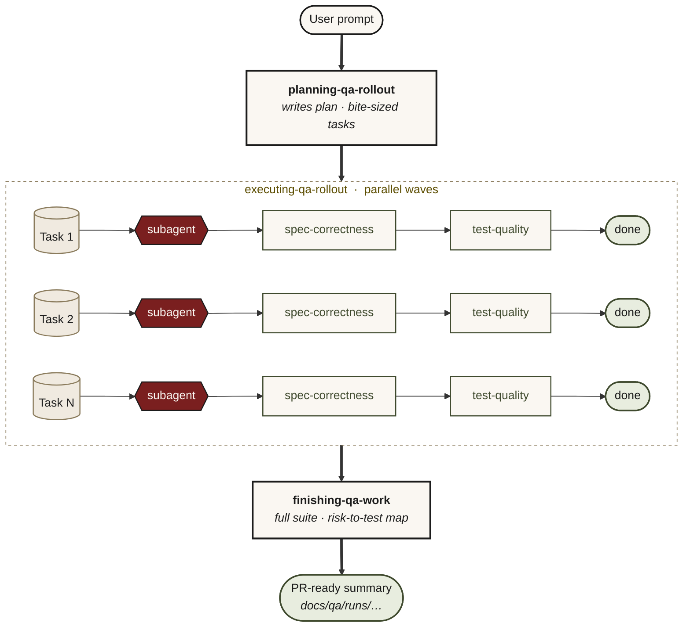

# 5-minute sumo-qa demo

Install in one line. Verify the wiring. Then run the QA loop on your own repo: map it, review a change against the map, and get a QA report backed by evidence.

> [!IMPORTANT]
> sumo-qa is an advisor, not an oracle. Like any AI tool it can be wrong. Your judgment and your team's standards are the final word.

## Prerequisites

- Python 3.10 or newer. Check with `python --version` (or `py --version` on Windows).
- An MCP-capable host. Verified end-to-end: Claude Code, VS Code + GitHub Copilot (Agent mode, Claude Sonnet 4.5 or equivalent), JetBrains AI Assistant, and JetBrains Junie. Other MCP hosts (Cursor, Codex, OpenCode, Gemini CLI) speak the same protocol and should work, but we haven't verified them end-to-end.

## Step 1: install

```bash
pip install sumo-qa && sumo-qa-install
```

Restart your host or open a fresh chat. That's it — `sumo-qa-install` wires every MCP host it detects.

> Windows, targeting one host, the one-command `install.sh` / `install.ps1` wrappers, plugin installs, updating: all in **[docs/INSTALL.md](docs/INSTALL.md)**.

### Verify

```bash
sumo-qa-doctor
```

Green means you're wired — read-only diagnostics, and each failure prints the exact `Fix:` to run. Then ask your host *"load the QA classifications"*; canonical names back confirms it end to end.

---

## Step 2: run the QA loop on your repo — just by asking

Every step below is a plain prompt in your host. The `.sumo-qa/` artifacts appear as a side effect of the conversation — you ask in natural language, sumo-qa writes the files. A few minutes takes you from "unknown repo" to a QA report you can open in a browser.

**1. Understand the repo:**

```
Map this repo for QA — what's here, and which tests cover which sources?
```

sumo-qa walks the repository and writes the schema-validated repo map to `.sumo-qa/repo-map.json`, then summarises what it found. You never told it where the tests live or what framework you use.

**2. Review a change:**

```
Review my changes — is this safe to merge?
```

The review starts from your actual diff impact — the affected modules, the tests most likely to cover them, and the risk surface (changed code with no mapped test) — reusing the map from step 1, or scanning and persisting one on the spot if you skipped it. Your suite still runs fresh in the same turn; the map accelerates the review but never substitutes for evidence. Risks without a covering test are named UNCOVERED with the test to add, not waved through. Ask it to save the risk ledger to `.sumo-qa/risk-ledger.json` so the report can cite the coverage map.

**3. Record coverage and mutation (optional):**

```
Measure coverage and run mutation testing, then record the results for the QA report.
```

sumo-qa runs the repo's configured coverage and mutation tooling (it never installs any), reads whatever output format the tools produce, and persists compact summaries to `.sumo-qa/coverage.json` and `.sumo-qa/mutation.json`. Reported, never gated: the numbers inform the report but never move the readiness verdict on their own.

**4. Open the report:**

```
Generate the QA report.
```

sumo-qa composes the persisted `.sumo-qa` artifacts into a self-contained static page at `.sumo-qa/qa-report.html`: risk-to-test coverage, evidence freshness, a readiness verdict, and honest not-available states for anything not yet produced.

Prefer the terminal? The same loop is wired as CLI commands — `sumo-qa analyze`, `sumo-qa status`, `sumo-qa report` — see [Run it from the terminal](README.md#run-it-from-the-terminal).

---

## Step 3: pick the prompt that matches your situation

Open your repo in the configured host. Every prompt below is copy-paste ready.

---

### 1. Pre-merge safety check

```
Review my changes — is this safe to merge?
```

sumo-qa reads your `git diff` directly (no asking what changed), classifies the change shape, names 3–7 risks tied to file and line, asks one focused question if anything's ambiguous, **runs your test suite right now**, maps each risk to a covering test, then delivers SAFE / NOT SAFE / NEEDS WORK with the evidence.

It refuses to call safe-to-merge from "CI was green earlier" — fresh run only. If a named risk has no covering test, it tells you what test to add by file, function, and assertion shape.

See [worked example 02](tests/scenarios/worked-examples/02-review-my-changes.md).

---

### 2. Pre-coding QA plan, for a fresh story

```
Plan QA for this story before I start coding: <paste the ticket / one-liner>.
Files likely touch <main_module.py> and <related_module.py>.
```

sumo-qa reads the files, names 3–7 risks specific to this change, picks one design technique per risk from the loaded ISTQB-grounded catalogue, proposes the smallest useful test set tied to those risks, and asks you to confirm any open assumptions. No code yet — this is the prep.

Expect risks at the level of *"currency conversion at the GBP→USD boundary rounds incorrectly when the rate is supplied with >6 decimal places"*, not *"input validation breaks"*.

---

### 3. Bug fix the right way, regression-first

```
Fix this bug regression-first: <describe the bug + the likely file>.
```

sumo-qa walks the repo to find the production file and its sibling tests (it picks up your test conventions — it won't ask "what framework do you use?"), picks the smallest failing test idea, confirms the one ambiguous detail, writes the test, runs it, and surfaces the red output verbatim. Then it hands off for you to make it green.

The red phase is mandatory. sumo-qa won't write the test and the fix in the same turn — the proof that the test catches the bug has to come before the fix. Most assistants skip this.

---

### 4. Strengthen tests against mutation survivors

```
Mutation testing left surviving mutants in <module>. Strengthen the tests.
Production code stays unchanged.
```

sumo-qa reads the mutation report, then walks the survivors one at a time (class-by-class where several share a mechanism): triage whether each mutant is real or only killable by a tautological assertion, pick a design technique from the loaded catalogue, write the strengthening test, run it, and confirm the kill before moving on. Production behaviour stays untouched the whole way; equivalent mutants get suppressed with a recorded rationale (tool config where the tool supports it) rather than chased with tautological tests.

See [worked example 05](tests/scenarios/worked-examples/05-strengthen-tests-mutation.md).

---

### 5. Find validated test data

```
Find me a refund-eligible invoice for the partial-refund flow test in staging.
```

(Swap in your own record shape, flow, and environment.)

sumo-qa pins down what the test actually needs from the data (the preconditions that make a record eligible), checks the known-good catalogue first, proposes discovery queries for your stack when nothing registered fits, and validates the candidate fresh before handing it over. Found something good? It offers to register it as known-good for next time.

See [worked example 07](tests/scenarios/worked-examples/07-find-test-data.md) and [docs/TEST-DATA.md](docs/TEST-DATA.md).

---

### 6. Repo-wide audit + QA strategy

```
Audit our test coverage and design a QA strategy.
```

sumo-qa walks the repo with its file tools (services, modules, test directories, CI config), produces a per-area provisional analysis with risks tied to file paths, then walks you through confirmation gates one section at a time: scope → risks → specialty tool fit → prioritisation → target pyramid → phased rollout → residual risks. Offers to write the result to `docs/qa-strategy.md`.

Expect honest findings like *"this service that 'feels well-tested' has 12 unit tests and zero mutation coverage on its highest-branching function"* — with a 3-phase rollout gated by measurable criteria, not a calendar.

---

### 7. Multi-task QA rollout with parallel agents

```
Plan QA for the <feature> across <module1>, <module2>, <module3> — then dispatch
subagents to execute it in parallel.
```



Three skills run in sequence:

1. **`sumo-qa-planning-qa-rollout`** writes `docs/qa/plans/YYYY-MM-DD-<feature>.md` with bite-sized tasks, each tagged with its approach and the named risk it covers.
2. **`sumo-qa-executing-qa-rollout`** dispatches one fresh subagent per task in parallel waves. Each output goes through two-stage review (spec-correctness, then test-quality) before the task counts as done.
3. **`sumo-qa-finishing-qa-work`** runs the full suite once more, builds the risk-to-test coverage map, lists any uncovered risks honestly, and writes a PR-ready summary to `docs/qa/runs/...`.

Watching parallel subagents write tests against different risks at once, each reviewed twice before being marked done, is how senior QA scales. It's the gap most AI assistants don't attempt.

---

### 8. When sumo-qa doesn't fit: discover an external skill

```
Add Playwright end-to-end tests for the checkout flow.
```

Browser E2E isn't a native sumo-qa capability, and that's the point of this prompt: sumo-qa recognises the miss, searches for an external skill through its MCP server, shows you the candidates, and gates the install behind an explicit `[y/N]`. After install it loads the skill into the conversation and carries on. sumo-qa's setup standard stays in force: any global install the external skill suggests is translated to a repo-pinned, CI-reproducible equivalent.

See [README: When sumo-qa doesn't fit](README.md#when-sumo-qa-doesnt-fit).

---

## Going deeper

- [tests/scenarios/SCENARIOS.md](tests/scenarios/SCENARIOS.md) — every scenario sumo-qa handles, with expected shape and anti-patterns
- [tests/scenarios/worked-examples/](tests/scenarios/worked-examples/) — full multi-turn transcripts for each scenario
- [skills/](skills/) — the skills (a router plus sub-skills) with Iron Laws and HARD-GATEs
- [docs/REPO-MAP.md](docs/REPO-MAP.md) — the QA-native repo-map artifact behind `sumo-qa analyze`
- [docs/QA-REPORT.md](docs/QA-REPORT.md) — the local QA report behind `sumo-qa report`
- [docs/ARCHITECTURE.md](docs/ARCHITECTURE.md) — how the layers fit together
