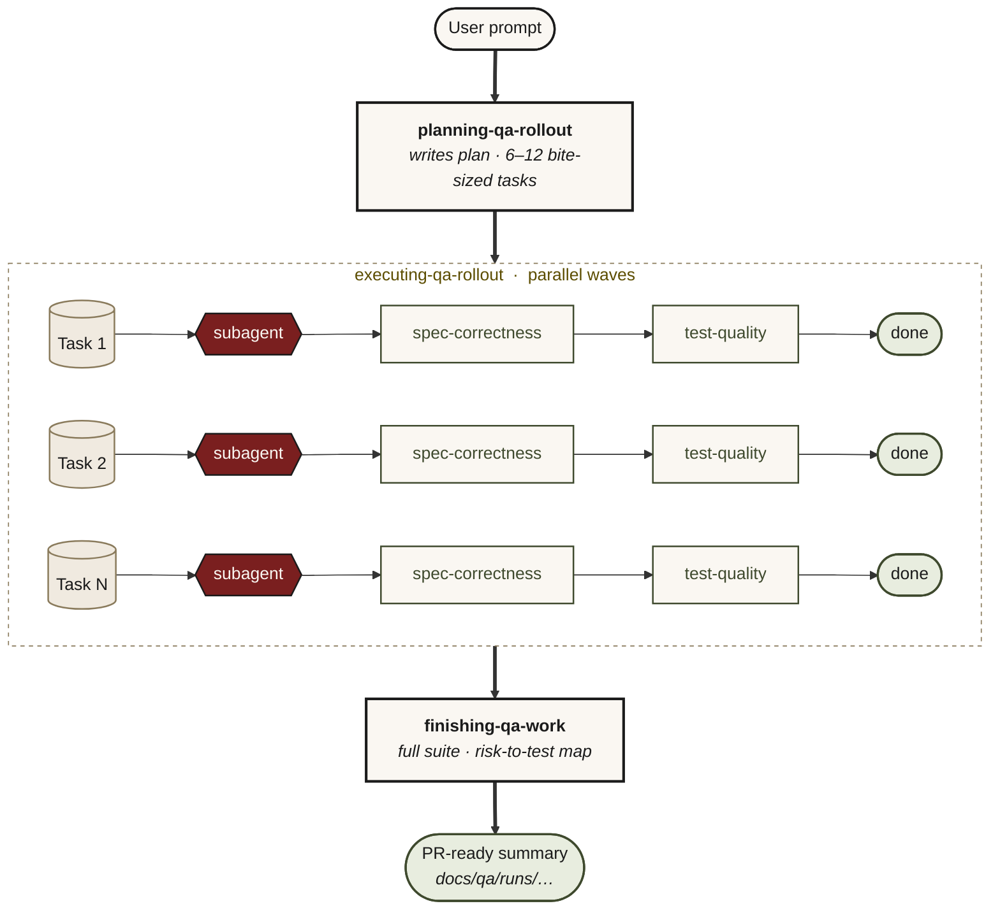

# 5-minute sumo-qa demo

Install in one line. Run one prompt on your repo. Watch the senior-QA workflow happen on real code.

> [!IMPORTANT]
> sumo-qa is an advisor, not an oracle. Like any AI tool it can be wrong. Your judgment and your team's standards are the final word.

## Prerequisites

- Python 3.10 or newer. Check with `python --version` (or `py --version` on Windows).
- An MCP-capable host: Claude Code, Cursor, Codex, OpenCode, JetBrains AI Assistant or Junie, or VS Code + GitHub Copilot (Agent mode, with Claude Sonnet 4.5 or GPT-5 full).

## Step 1: install and wire it

Install and wire every host it detects, or target one:

```bash
# Every host detected on this machine
pip install sumo-qa && sumo-qa-install

# Claude Code only
pip install sumo-qa && sumo-qa-install --claude-code

# VS Code + GitHub Copilot
pip install sumo-qa && sumo-qa-install --vscode --workspace <path-to-your-repo>

# JetBrains AI Assistant
pip install sumo-qa && sumo-qa-install --jetbrains
```

Windows PowerShell (`&&` isn't supported in Windows PowerShell, and pip's script directory is often off PATH, so use the module form):

```powershell
py -m pip install sumo-qa; if ($?) { py -m sumo_qa.installer }
```

`pip install sumo-qa` creates two script wrappers: `sumo-qa` (the MCP server) and `sumo-qa-install` (the configurator). It symlinks skills into `~/.claude/skills/`, writes `claude_desktop_config.json` or `.vscode/mcp.json`, or prints the JetBrains UI steps, whichever the flag asks for. If `sumo-qa-install` isn't on your PATH, the PATH-proof equivalent is `python -m pip install sumo-qa && python -m sumo_qa.installer`.

Restart your host or open a fresh chat afterwards.

**Cursor, Codex, OpenCode and other MCP hosts:** `sumo-qa` is a standard stdio MCP server. Follow your host's MCP-server setup docs and point it at the absolute path of the `sumo-qa` script.

### Updating

```bash
pip install --upgrade sumo-qa && sumo-qa-install
```

Open a fresh chat afterwards. The host re-reads `~/.claude/skills/` (Claude Code) and the MCP tool list on the next session. If you installed sumo-qa as a Claude Code or Cursor plugin, the SessionStart hook re-fires automatically.

---

## Step 2: try one of these prompts

Open your repo in the configured host. Pick the prompt that matches your situation.

---

### 1. Pre-merge safety check

```
Review my changes — is this safe to merge?
```

sumo-qa reads your `git diff` directly (no asking what changed), classifies the change shape, names 3–7 risks tied to file and line, asks one focused question if anything's ambiguous, **runs your test suite right now**, maps each risk to a covering test, then delivers SAFE / NOT SAFE / NEEDS WORK with the evidence.

It refuses to call safe-to-merge from "CI was green earlier" — fresh run only. If a named risk has no covering test, it tells you what test to add by file, function, and assertion shape.

See [worked example 02](tests/scenarios/worked-examples/02-review-my-changes.md).

---

### 2. Pre-coding QA plan, for a fresh story

```
Plan QA for this story before I start coding: <paste the ticket / one-liner>.
Files likely touch <main_module.py> and <related_module.py>.
```

sumo-qa reads the files, names 3–7 risks specific to this change, picks one design technique per risk from the loaded ISTQB-grounded catalogue, proposes the smallest useful test set tied to those risks, and asks you to confirm any open assumptions. No code yet — this is the prep.

Expect risks at the level of *"currency conversion at the GBP→USD boundary rounds incorrectly when the rate is supplied with >6 decimal places"*, not *"input validation breaks"*.

---

### 3. Bug fix the right way, regression-first

```
Fix this bug regression-first: <describe the bug + the likely file>.
```

sumo-qa walks the repo to find the production file and its sibling tests (it picks up your test conventions — it won't ask "what framework do you use?"), picks the smallest failing test idea, confirms the one ambiguous detail, writes the test, runs it, and surfaces the red output verbatim. Then it hands off for you to make it green.

The red phase is mandatory. sumo-qa won't write the test and the fix in the same turn — the proof that the test catches the bug has to come before the fix. Most assistants skip this.

---

### 4. Repo-wide audit + QA strategy

```
Audit our test coverage and design a QA strategy.
```

sumo-qa walks the repo with its file tools (services, modules, test directories, CI config), produces a per-area provisional analysis with risks tied to file paths, then walks you through six confirmation gates one at a time: scope → risks → specialty tool fit → prioritisation → target pyramid → phased rollout → residual risks. Offers to write the result to `docs/qa-strategy.md`.

Expect honest findings like *"this service that 'feels well-tested' has 12 unit tests and zero mutation coverage on its highest-branching function"* — with a 3-phase rollout gated by measurable criteria, not a calendar.

---

### 5. Multi-task QA rollout with parallel agents

```
Plan QA for the <feature> across <module1>, <module2>, <module3> — then dispatch
subagents to execute it in parallel.
```



Three skills run in sequence:

1. **`sumo-qa-planning-qa-rollout`** writes `docs/qa/plans/YYYY-MM-DD-<feature>.md` with 6–12 bite-sized tasks, each tagged with its approach and the named risk it covers.
2. **`sumo-qa-executing-qa-rollout`** dispatches one fresh subagent per task in parallel waves. Each output goes through two-stage review (spec-correctness, then test-quality) before the task counts as done.
3. **`sumo-qa-finishing-qa-work`** runs the full suite once more, builds the risk-to-test coverage map, lists any uncovered risks honestly, and writes a PR-ready summary to `docs/qa/runs/...`.

Watching parallel subagents write tests against different risks at once, each reviewed twice before being marked done, is how senior QA scales. It's the gap most AI assistants don't attempt.

---

## Going deeper

- [tests/scenarios/SCENARIOS.md](tests/scenarios/SCENARIOS.md) — every scenario sumo-qa handles, with expected shape and anti-patterns
- [tests/scenarios/worked-examples/](tests/scenarios/worked-examples/) — full multi-turn transcripts for each scenario
- [skills/](skills/) — the 14 skills (1 router + 13 sub-skills) with Iron Laws and HARD-GATEs
- [docs/ARCHITECTURE.md](docs/ARCHITECTURE.md) — how the layers fit together
