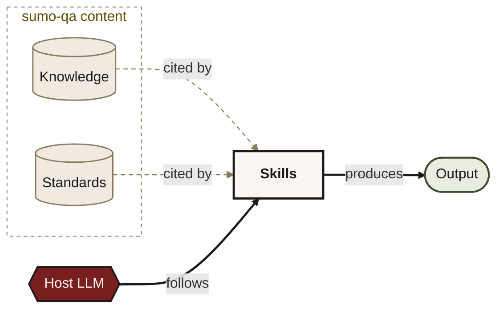
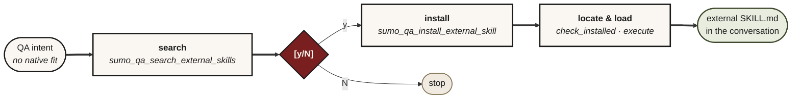

<p align="center">
  
</p>

# sumo-qa MCP

[](https://github.com/sumithr/sumo-qa/actions/workflows/test.yml)
[](https://pypi.org/project/sumo-qa/) <!-- x-release-please-version -->
[](https://pypi.org/project/sumo-qa/) <!-- x-release-please-version -->
[](LICENSE)

An MCP server that brings senior-QA discipline to AI coding assistants — test planning, TDD, mutation testing, code review.

> [!IMPORTANT]
> sumo-qa is an advisor, not an oracle. Like any AI tool it can be wrong. Your judgment and your team's standards are the final word.

> ### 🚀 New here? **[5-minute demo →](DEMO.md)**
> One install line, one prompt on your repo, the workflow runs on real code.

## Why it exists

Ask a stock AI assistant to QA a change and you get the junior answer: "add unit tests, consider edge cases, maybe test performance." That's a checklist.

sumo-qa makes the agent work the way a senior QA does:

- Names 3–7 risks tied to specific files and lines, not categories
- Picks one design technique per risk from an ISTQB-grounded catalogue (boundary-value, decision-table, property-based, mutation)
- Runs your test suite fresh in the current turn before any "safe to merge" claim
- Holds TDD's red phase before any production code is written
- Keeps production code locked while strengthening tests against mutation survivors
- Won't ship a plan without measurable entry and exit criteria

The discipline lives in 14 [skill files](skills/) (1 router + 13 sub-skills). The host LLM follows them literally, and each one has an Iron Law and a HARD-GATE callout the LLM can't talk past. Skills route automatically from natural-language prompts; you don't need to remember to invoke them.

## Install

```bash
python -m pip install sumo-qa && python -m sumo_qa.installer --claude-code
```

Other hosts: swap `--claude-code` for `--vscode --workspace <path-to-repo>`, `--jetbrains`, or drop the flag to configure every host on the machine. The `python -m sumo_qa.installer` form works even when the pip script directory is not on PATH yet.

On Windows PowerShell, use:

```powershell
py -m pip install sumo-qa; if ($?) { py -m sumo_qa.installer --claude-code }
```

Restart your host or open a fresh chat afterwards.

### Plugin install from a local clone (Claude Code, session-scoped)

Prefer the plugin experience over pip? Clone the repo and pass `--plugin-dir` to `claude` on each invocation. This loads the `.claude-plugin/plugin.json` manifest directly — no pip install needed, skills + hooks + MCP server come from this checkout.

**Prerequisite:** `uv` on PATH (Astral's package runner — one-line install, no Python prerequisite). Skip if `uv --version` already resolves:

```bash
# macOS / Linux
curl -LsSf https://astral.sh/uv/install.sh | sh

# Windows PowerShell
powershell -ExecutionPolicy ByPass -c "irm https://astral.sh/uv/install.ps1 | iex"

# Homebrew
brew install uv
```

Then clone and launch:

```bash
git clone https://github.com/sumithr/sumo-qa.git
claude --plugin-dir /path/to/sumo-qa
```

Session-scoped: every `claude` invocation needs the flag — plain `claude` (no flag) starts a session with no sumo-qa loaded. Use `/reload-plugins` inside the session to pick up edits without restarting.

> Persistent marketplace install (one-time setup, no flag on every launch) is on the roadmap — until then, the pip path above is the canonical persistent install. Full architecture + dev-iteration detail: [docs/INSTALL.md#plugin-format-install-claude-code--codex](docs/INSTALL.md#plugin-format-install-claude-code--codex).

### Something not working?

```bash
# pip-install path (after `pip install sumo-qa`)
sumo-qa-doctor                  # or `python -m sumo_qa.doctor` if not on PATH

# plugin-install path (no pip install required) — inside a Claude Code session
!sumo-qa-doctor                 # the plugin ships bin/sumo-qa-doctor on PATH

# plugin-install path from outside Claude Code
uvx --from /path/to/plugin/source sumo-qa-doctor
```

Read-only setup diagnostics — checks Python + sumo-qa version, install mode, the MCP `initialize` + `tools/list` handshake, and every host config the installer touches (Claude Code, Claude Desktop, VS Code workspace, JetBrains detection, Codex plugin). Each failure prints the exact `Fix:` command. `--json` for machine output. Details: [docs/INSTALL.md#diagnosing-setup-with-sumo-qa-doctor](docs/INSTALL.md#diagnosing-setup-with-sumo-qa-doctor).

Per-host flags, schema differences, and troubleshooting: [docs/INSTALL.md](docs/INSTALL.md). Want to install from a local clone — to try an unreleased branch or run with your team's standards / knowledge packs editable in place? See [docs/INSTALL.md#install-from-a-local-clone](docs/INSTALL.md#install-from-a-local-clone). For the pip path use `python scripts/dev_install.py`; for the Claude Code plugin path use `claude --plugin-dir /path/to/sumo-qa` ([Anthropic's documented local-dev mode](https://code.claude.com/docs/en/plugins#test-your-plugins-locally)).

### Verify it's wired

In any host, ask:

> load the QA classifications

You should get 10 names back: api_contract_change, business_logic_change, security_change, performance_change, frontend_change, infrastructure_change, test_change, docs_change, config_change, data_migration. If you do, you're wired.

### Update

```bash
python -m pip install --upgrade sumo-qa && python -m sumo_qa.installer
```

Restart the host. The SessionStart hook re-injects the latest content; skills and knowledge refresh from the upgraded package.

## What's included



| Layer | What |
|---|---|
| **14 skills** ([`skills/`](skills/)) | Iron-Law procedures: deciding approach, preparing for work, TDD scaffolding, diff review, strengthening tests, finding test data, answering testing questions, repo strategy — plus the planning → parallel subagent execution → finishing chain. |
| **28 MCP entry points** | 14 skill tools, 6 knowledge loaders, 4 test-data tools, 4 external-skill lifecycle tools. Thin operations, no inference. |
| **4 knowledge catalogues** ([`knowledge/`](knowledge/)) | Classifications, approaches, principles, techniques. The agent picks from these instead of recalling from training data. Editable as plain markdown. Specialty-tool picks are deliberately not catalogued — the discipline is observe the risk surface, web-search current options for the user's stack, cite when naming a tool. |

## Host support

Every host calls the same MCP server and reads the same SKILL.md files. What differs is how each host exposes them — that's a host-API difference, not a sumo-qa choice.

These hosts are verified end-to-end with `python -m sumo_qa.installer`:

| Host | Slash | Setup |
|---|---|---|
| **Claude Code** | `/sumo-qa-deciding-approach` (hyphens) | `python -m sumo_qa.installer --claude-code` |
| **VS Code + Copilot** (Agent mode, Claude Sonnet 4.5 or equivalent) | Natural language | `python -m sumo_qa.installer --vscode --workspace <repo>` writes `.vscode/mcp.json` |
| **JetBrains AI Assistant** | `/sumo_qa_deciding_approach` (underscores) | One-time UI setup; `python -m sumo_qa.installer --jetbrains` prints the fields to paste |
| **JetBrains Junie** | Natural language | Drop the JSON `python -m sumo_qa.installer --jetbrains` prints into `~/.junie/mcp/sumo-qa.json` (global) or `<repo>/.junie/mcp/` (per project) |

In Claude Code, type `/` then `sumo-qa-` to see all 14 skills as hyphenated entries (symlinked into `~/.claude/skills/`). The same skills are also registered through MCP with underscores (`/sumo_qa_load_classifications`, `/sumo_qa_find_test_data`); both routes call the same SKILL.md.

Natural language works everywhere. *"Review my changes"*, *"plan QA for this story"*, *"load the QA classifications"* — the agent routes by tool description. Slash and natural-language paths produce the same result.

**Other MCP hosts** (Cursor, Codex, OpenCode, etc.): `pip install sumo-qa` ships a standard stdio MCP server, so it should work with anything that speaks MCP. Follow your host's MCP-server setup docs and point it at the absolute path of the `sumo-qa` script. Not verified end-to-end by us, so we don't ship instructions.

### Host adapter folders

`sumo-qa` ships first-class plugin manifest folders for hosts that consume them directly. Both folders are generated from a single canonical source (`pyproject.toml`'s `[tool.sumo-qa.plugin]` overlay) — see [docs/host-adapters.md](docs/host-adapters.md) for the architecture.

| Host | Manifest | Install status today | Source-of-truth contract |
|---|---|---|---|
| Claude Code | `.claude-plugin/plugin.json` (requires `uv` — see [INSTALL.md](docs/INSTALL.md#prerequisite-uv)) | `claude --plugin-dir /path/to/sumo-qa` (session-scoped); marketplace install on roadmap | Schema-validated against the published JSON Schema in CI |
| OpenAI Codex | `.codex-plugin/plugin.json` | Not verified end-to-end yet — treat as TBD | MCP `initialize` handshake smoke in CI (no published schema) |

Adding a new host is one new template under `plugin_packaging/templates/` plus the canonical-source line that describes it. The `plugin-packaging` CI workflow re-runs the generator on every PR and fails if any committed adapter file diverges from the canonical source.

## See it in action

Ten transcripts showing the workflow on real code — diff reviews refusing to call safe-to-merge from stale CI, TDD cycles with the red output surfaced verbatim, mutation survivors walked one at a time, formal test plans gated on entry/exit criteria, and the case where the right answer is "no tests needed, stop here":

- [tests/scenarios/worked-examples/](tests/scenarios/worked-examples/) — start with [02 — review my changes](tests/scenarios/worked-examples/02-review-my-changes.md) for a representative end-to-end
- [tests/scenarios/SCENARIOS.md](tests/scenarios/SCENARIOS.md) — the scenario specs (prompt → expected shape → anti-patterns the skill prevents)

## When sumo-qa doesn't fit

If your QA intent has no native fit (Playwright E2E, accessibility audits, k6 load testing, type checking), sumo-qa searches for an external skill through its MCP server, offers a `[y/N]` install gate, installs through the Skills CLI, then loads the installed `SKILL.md` back into the conversation.



- The host does not run `npx` directly; `sumo_qa_search_external_skills`, `sumo_qa_check_external_skill_installed`, `sumo_qa_install_external_skill`, and `sumo_qa_execute_external_skill` own the lifecycle.
- Search returns the Skills CLI's text output verbatim (ANSI stripped); the host LLM reads it as the user would. No structured parser to drift out of date.
- Node.js is required for the Skills CLI. If `npx` is missing, the MCP tool returns an actionable error and stops. It doesn't elevate via sudo.
- The external skill handles tool-specific setup, while sumo-qa keeps the confirmation gates, test evidence, and risk-to-test mapping.

## Support

Filing a clear issue gets it fixed faster. Pick the template that matches the problem:

| Symptom | Template |
|---|---|
| `pip install` / `sumo-qa-install` failed, or first-run setup is broken | [Install / setup problem](.github/ISSUE_TEMPLATE/install_setup_problem.yml) |
| Install worked, but the host (Claude Code, VS Code + Copilot, JetBrains, Cursor, …) does not surface tools or skills correctly | [Host compatibility problem](.github/ISSUE_TEMPLATE/host_compatibility.yml) |
| The wrong sumo-qa skill ran for a prompt (or none ran when one should have) | [Skill routed wrong](.github/ISSUE_TEMPLATE/skill_routed_wrong.yml) |
| A skill ran, but its QA output was generic, wrong, or missed something | [QA output quality issue](.github/ISSUE_TEMPLATE/qa_output_quality.yml) |
| You want a new workflow, skill, or host integration | [Feature / workflow request](.github/ISSUE_TEMPLATE/feature_request.yml) |
| Reproducible defect that does not fit the above | [Bug report](.github/ISSUE_TEMPLATE/bug_report.yml) |

## License

[Apache 2.0](LICENSE). See [NOTICE](NOTICE) for attribution requirements that apply to forks and redistributors.

## More docs

- [AGENTS.md](AGENTS.md) — AI-agent bootstrap and per-host setup
- [docs/ARCHITECTURE.md](docs/ARCHITECTURE.md) — three layers, host delivery, knowledge authority
- [docs/SKILLS.md](docs/SKILLS.md) — every skill with its Iron Law
- [docs/TOOLS.md](docs/TOOLS.md) — every MCP entry point
- [docs/INSTALL.md](docs/INSTALL.md) — per-host install detail and troubleshooting
- [docs/CONTENT-FORMATS.md](docs/CONTENT-FORMATS.md) — schemas + worked examples for adding team standards, knowledge, change rules, and test data (incl. swapping ISTQB out)
- [docs/CONFIGURATION.md](docs/CONFIGURATION.md) — env vars
- [docs/DEVELOPMENT.md](docs/DEVELOPMENT.md) — local dev
- [docs/TEST-DATA.md](docs/TEST-DATA.md) — known-good test-data catalogue
- [docs/PERSONA.md](docs/PERSONA.md) — optional Sumo-sensei voice (off by default)
