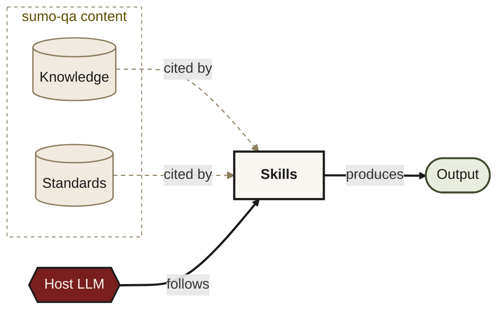
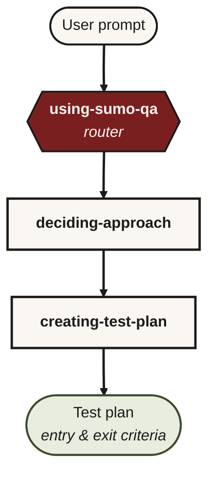

# Architecture

Three layers, clean separation:

MCP tools (Python) are the transport between the Host LLM and the markdown content — omitted here for clarity. See [TOOLS.md](TOOLS.md).

## 1. Skills (markdown) — the orchestration layer

Each skill is a single `skills/<name>/SKILL.md` with:

- YAML frontmatter (`name` + `description`) used by hosts to auto-trigger
- An Iron Law — non-negotiable rule for the skill
- A When-to-Use paragraph
- A Checklist (numbered items the host LLM works through; each becomes a TodoWrite todo)
- A Process Flow (graphviz `dot` block)
- A Red Flags table (rationalisations to reject)
- Good/Bad examples

All senior-QA discipline lives here. There is no Python file that decides
which approach a change needs, or what techniques apply to a risk, or which
specialty tool fits an HTTP surface. The host LLM does that work, guided by
the skill.

## 2. MCP tools (Python) — atomic knowledge providers

28 tools, all thin. Fourteen skill tools (one per SKILL.md), six knowledge loaders (`sumo_qa_load_*`)
return markdown catalogues as text. Four test-data tools read/write the local
known-good catalogue under `knowledge/test_data/`. Four external-skill lifecycle tools search, install, locate, and load external skills through the Skills CLI while preserving the skill-level confirmation gate. The search tool returns ANSI-stripped CLI output verbatim — no structured parsing — so Skills CLI format drift doesn't break the flow.

See [TOOLS.md](TOOLS.md) for the full list.

## 3. Knowledge & data

Plain markdown under `knowledge/`:

- `classifications.md` — 10 canonical change classifications
- `approaches.md` — 8 canonical QA approaches
- `principles.md` — ISTQB Foundation, Advanced, ISO/IEC 25010
- `techniques.md` — black-box / white-box / experience / static / property-based / mutation
- `test_data/` — known-good test data entries

Specialty-tool picks are intentionally NOT catalogued. The discipline (declared in `using-sumo-qa`) is to observe the risk surface, web-search current options for the user's stack, and cite when naming a tool. A static catalogue would anchor toward yesterday's brands and create a false floor where novel surfaces never trigger discovery.

Plus team-loaded `standards/packs/*.yml` and `standards/rules/change_rules.yaml`.

## Host delivery

Different hosts surface MCP entries through different UIs and (in some cases) different config schemas. `sumo-qa-install` (shipped as a console script via `pip install sumo-qa`) handles each correctly; the same MCP server and SKILL.md content reach every host.

| Host | Setup | Slash convention | Schema |
|---|---|---|---|
| **Claude Code** | `sumo-qa-install --claude-code` symlinks each `skills/<name>/` to `~/.claude/skills/<name>/` (per-skill, NOT a wrapper — Claude Code doesn't recurse). Writes `claude_desktop_config.json`. | Skills appear in `/` with hyphens (`/sumo-qa-deciding-approach`, from the native skill loader). MCP tools (knowledge loaders, test-data) appear with underscores (`/sumo_qa_load_classifications`). Skills appear in both forms because they're registered as MCP tools too; calling either form reaches the same SKILL.md. Natural language works universally. | `{ "mcpServers": { ... } }` |
| **JetBrains AI Assistant** | One-time **Settings → Tools → AI Assistant → Model Context Protocol → Add server** with absolute binary path. `sumo-qa-install --jetbrains` prints the exact fields. External XML writes don't reliably register the runtime coroutine in IDEA 2026.1 — must go through the UI. | `/sumo_qa_deciding_approach` (underscores, from MCP tools). Every MCP entry is slash-invocable. | XML at `~/Library/Application Support/JetBrains/<ide>/options/llm.mcpServers.xml` (managed by UI) |
| **JetBrains Junie** | JSON file at `~/.junie/mcp/sumo-qa.json` (global) or `<repo>/.junie/mcp/` (per-project) | Natural language; Junie picks tools by description | `{ "mcpServers": { ... } }` (same as Claude Desktop) |
| **VS Code + Copilot** | `sumo-qa-install --vscode --workspace /path/to/repo` writes `<repo>/.vscode/mcp.json`. Use Agent mode + Claude Sonnet 4.5 or GPT-5 full. | Natural language; Copilot picks tools by description | `{ "servers": { "<name>": { "type": "stdio", "command": "...", "args": [] } } }` — **different from Claude Desktop's schema** |

All routes ultimately call the same `sumo-qa` binary which reads the same `skills/*/SKILL.md` files and the same `knowledge/*.md` catalogues. Skill content is one source of truth.

## Knowledge authority hierarchy

A global rule declared in `using-sumo-qa`:

1. **Loaded knowledge files** (`sumo_qa_load_*` tools). Authoritative.
2. **Training data** — fallback only; must be flagged when used.
3. **Web search** — fallback for post-training-cutoff topics; citation required.
4. **"I don't know"** — the only acceptable answer when 1, 2 and 3 fail. Hallucinating a technique/tool/principle is forbidden.

This means catalogue files are the LLM's source of truth, not its training-data recall.

## Token-weight discipline

A typical end-to-end flow (e.g. `sumo-qa-creating-test-plan`):

| Layer | Typical token cost |
|---|---|
| Skill body (loaded once via MCP prompt or symlink) | ~1500 tokens |
| Catalogue loads (`load_classifications`, `load_approaches`, `load_techniques`) | ~2300 tokens total |
| Total MCP-call surface | ~2300 tokens |
| Old heavy-path single call | ~3000+ tokens of structured JSON (the IntelliJ SSE failure mode) |

The new path is enforced by `tests/test_token_weight_regression.py` and `tests/test_phase3_e2e_skill_path.py`. No single MCP call returns more than ~700 tokens; no full flow exceeds 2600 tokens.

## How a typical request flows

No single MCP call returns a heavy JSON blob. The LLM does the synthesis, guided by the skill's checklist, anchored to catalogue text.

---

Licensed under the Apache License 2.0. See [LICENSE](../LICENSE) and [NOTICE](../NOTICE) at the repo root.
