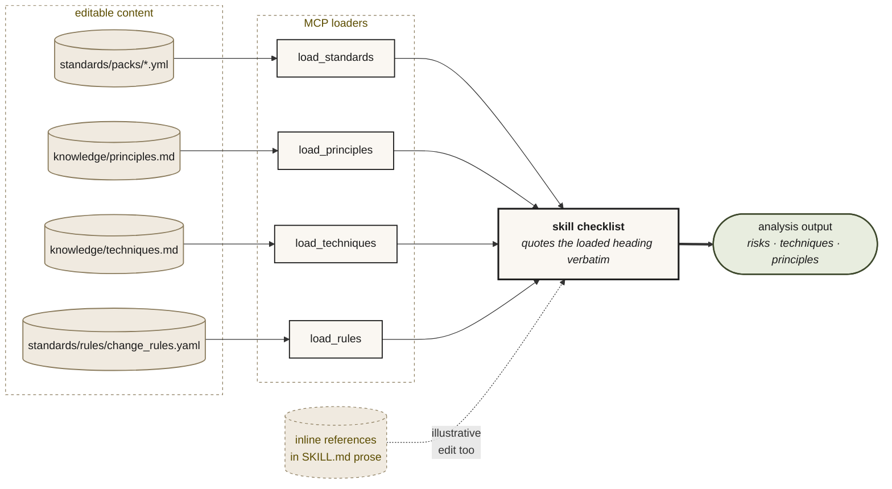

# Content formats

Authoring guide for the editable files a team customises in a [local clone](INSTALL.md#install-from-a-local-clone). Covers what the loaders accept, paste-ready worked examples, the validator, and a recipe for replacing ISTQB with a different body of QA practice.

## Overview

| File / directory | Schema | Behaviour on bad content | Validated by `sumo-qa-validate` |
|---|---|---|---|
| `knowledge/classifications.md` | Free-form markdown — read verbatim | Returned as-is to the host; the LLM scans for headings | Required, non-empty |
| `knowledge/approaches.md` | Free-form markdown | Same | Required, non-empty |
| `knowledge/principles.md` | Free-form markdown | Same | Required, non-empty |
| `knowledge/techniques.md` | Free-form markdown | Same | Required, non-empty |
| `knowledge/repo_walk.md` | Free-form markdown (recipe text) | Referenced by `sumo-qa-strategising` | Optional |
| `standards/packs/*.yml` / `*.yaml` | Any valid YAML — unfiltered loads return verbatim | YAML parse error → silently skipped under classification filtering; `sumo-qa-validate` fails it | YAML parses; warns if no `applies_to_classifications` |
| `standards/rules/change_rules.yaml` | **Strict Pydantic** — see [rules.py](../src/sumo_qa/rules.py); `extra="forbid"` | `from_file` raises `ValueError` at server / validator startup | Hard fail on schema violation |
| `knowledge/test_data/<domain>/<file>.y(a)ml` | **Strict Pydantic** — `TestDataEntry` (`extra="forbid"`) | Loader raises `ValueError` on first invalid entry | Hard fail on schema violation |

> **Permissive ≠ schemaless.** The four `knowledge/*.md` files are read verbatim, but the skills tell the LLM to "pick from the catalogue" by scanning headings. Drift far from the existing shape (top-level `# Title`, `##` section headings, one entry per `###` block) and the LLM stops picking from your file. Keep the existing structure; replace the substance.

## Validator

```bash
sumo-qa-validate                      # validates the repo at cwd (walks up to find knowledge/ + standards/)
sumo-qa-validate /path/to/clone       # validates a specific repo
python -m sumo_qa.validate_content    # equivalent
```

Exit codes: `0` clean (warnings allowed), `1` schema failure, `2` no repo root found.

Output is three sections:

```
OK:
  - knowledge/classifications.md: 54 non-blank lines
  - standards/packs/qa_shift_left_v1.yml: valid YAML
  - standards/rules/change_rules.yaml: 12 change rules
  - knowledge/test_data: 4 test-data entries
WARN:
  - standards/packs/istqb_v1.yml: no 'applies_to_classifications' / 'classifications' key — pack will always load regardless of change type
FAIL:
  - standards/rules/change_rules.yaml: Invalid change rule 'api_contract_change' in …: unsupported suggested_test_types ['banana']; allowed values are ['contract', 'functional', 'integration', 'nonfunctional', 'unit']
```

The validator runs automatically via the pre-commit hook in [`.pre-commit-config.yaml`](../.pre-commit-config.yaml) when any file under `knowledge/` or `standards/` changes; manual invocation is for ad-hoc checks or CI parity.

## Worked examples

### `standards/packs/<pack>.yml` — a team standards pack

A standards pack is whatever YAML you want; the loader returns the file verbatim. The optional `applies_to_classifications` (or legacy `classifications`) top-level key lets sumo-qa surface the pack only when the in-flight change matches one of the listed classifications. Without it, the pack always loads.

```yaml
# standards/packs/my_team_v1.yml
pack: my_team_v1
version: "1.0.0"
name: "My Team — QA standards"
description: >
  What our team enforces in code review and pre-merge QA.
# Optional: limit this pack to specific change classifications.
# Omit to make the pack always-loaded (the `istqb_v1` pack uses this default).
applies_to_classifications:
  - api_contract_change
  - business_logic_change

checks:
  - id: contracts.openapi-pinned
    title: Public endpoint contracts are pinned to OpenAPI
    severity: high
    pass_criteria:
      - Every public endpoint has a contract test loading the current OpenAPI doc.
      - Schema-incompatible changes either bump the version or are gated by a
        feature flag visible to QA.

  - id: logging.no-pii-at-info
    title: PII never logged at INFO or below
    severity: critical
    pass_criteria:
      - Identifiers, payment data, and session tokens are redacted before
        `logger.info` or below.
      - PII redaction has a regression test covering email / postcode / cardholder name.
```

The body shape (`checks`, `pass_criteria`, …) is read by the host LLM, not parsed by sumo-qa. Use whatever vocabulary your team already uses; the LLM follows the catalogue verbatim.

### `standards/rules/change_rules.yaml` — change-class rule entry

**Strict schema.** Top-level keys are classification names (from `knowledge/classifications.md`). Each value is a fixed-shape record validated by [`rules._RawChangeRule`](../src/sumo_qa/rules.py) with `extra="forbid"`.

```yaml
# standards/rules/change_rules.yaml — single entry
api_contract_change:
  must_consider:
    - backward compatibility
    - schema validation
    - consumer impact
  suggested_test_types:
    - contract
    - integration
    - functional
  avoid_testing:
    - broad end-to-end suites that don't exercise the changed contract
  risk_templates:
    - Consumer behaviour can break silently if the payload shape changes.
    - Backward compatibility risk exists until old and new payload examples
      are verified.
  test_design_techniques:
    - boundary value analysis on payload size, field length, numeric ranges
    - decision table for request validation rules
    - pairwise / orthogonal-array combinations of optional fields
  quality_characteristics:
    - functional_correctness
    - compatibility_interoperability
```

| Field | Type | Notes |
|---|---|---|
| `must_consider` | `list[str]` | Free-form prose surfaced to the host as "consider these for this class of change" |
| `suggested_test_types` | `list[str]` | **Closed enum**: `unit`, `integration`, `contract`, `functional`, `nonfunctional`. Anything else raises `ValueError` at load. |
| `avoid_testing` | `list[str]` | Free-form prose |
| `risk_templates` | `list[str]` | Free-form prose surfaced as starter risk statements |
| `test_design_techniques` | `list[str]` | Free-form — but the LLM works best when these match technique headings in `knowledge/techniques.md` |
| `quality_characteristics` | `list[str]` | Free-form — ISO 25010 names are the upstream convention but the loader doesn't enforce it |

Unknown fields fail validation (`extra="forbid"`).

### `knowledge/techniques.md` — extend the technique catalogue

Plain markdown. The TDD and strengthening skills tell the host to pick the verbatim catalogue heading, so the **structure matters** even though there's no schema.

```markdown
## Black-box

### contract testing
Test that the producer's actual response matches the consumer's expected
contract example. Use when integrating across team boundaries.
Worked example: `tests/contract/test_orders_v2.py` loads the published
`orders_v2.yaml` and asserts that real responses validate against it.

### chaos engineering — fault injection
Inject controlled failures (latency, errors, resource starvation) into a
known-good path and assert the system degrades within agreed budgets.
Use when reliability is a stated quality attribute and the change touches
retry, timeout, or circuit-breaker behaviour.
```

The skill then picks `contract testing` (verbatim heading, lower-case) when a risk needs one — see `sumo-qa-implementing-with-tdd/SKILL.md` step 3.

### `knowledge/test_data/<domain>/<file>.yaml` — known-good test-data entry

**Strict Pydantic.** The file must be a top-level mapping with an `entries:` list. Each entry validates against [`TestDataEntry`](../src/sumo_qa/tdm_models.py) (`extra="forbid"`).

```yaml
# knowledge/test_data/orders/happy_path.yaml
entries:
  - id: orders-happy-path-001
    environment: integration
    domain: orders
    product_id: "238920277"          # optional
    sku: "238920277"                 # optional
    scenario_tags:
      - happy_path
      - card_payment
    known_valid_for:
      - order placement smoke tests
      - payment-method coverage matrix
    constraints:
      - Refresh card token before reuse if older than 24h.
    owner: orders-platform
    last_validated_at: "2026-05-15T09:00:00Z"   # ISO-8601 / RFC 3339
    confidence: high                              # low | medium | high
    source: qa-curated
    validation_source: catalogue
    notes: "Use for the standard card-on-file happy path."
```

`extra="forbid"` means a typo like `scenarios_tags:` (missing `o`) fails loudly at validator and server startup.

## Swap ISTQB out for something else

You can replace ISTQB content end-to-end. The schema layer is body-of-knowledge-agnostic — `knowledge/*.md` and `standards/packs/*.yml` are read verbatim, and `change_rules.yaml` only enforces the closed `suggested_test_types` enum, not technique or principle names.



**What actually replaces cleanly:**

| Content | How |
|---|---|
| `standards/packs/istqb_v1.yml` | Delete; drop in your team's pack(s). Loader globs the directory; no registry to update. |
| `knowledge/principles.md` body | Replace the ISTQB Foundation Principles 1–7 + ISO 25010 grounding with your own principle catalogue. Keep the existing heading structure (top-level `# Principles`, `##` per category, `###` per named principle) so skills can still pick from it. |
| `knowledge/techniques.md` body | Replace ISTQB technique entries with your own. Same structural advice: keep `###` headings so the TDD and strengthening skills can quote them verbatim. |
| `standards/rules/change_rules.yaml` `test_design_techniques` / `quality_characteristics` values | Free-form strings — replace the ISTQB / ISO 25010 wording with whatever vocabulary you use. The schema only fails on `suggested_test_types` outside the closed enum. |

**The honest caveat — inline references in SKILL.md files:**

A handful of skills include illustrative ISTQB references in their own prose:

- [`skills/sumo-qa-deciding-approach/SKILL.md`](../skills/sumo-qa-deciding-approach/SKILL.md) — cites "ISTQB Principle 4 (defects cluster)" in a worked example.
- [`skills/sumo-qa-implementing-with-tdd/SKILL.md`](../skills/sumo-qa-implementing-with-tdd/SKILL.md) — example list contains `boundary value analysis`, `equivalence partitioning`, `decision tables`, `state transition testing`, `exploratory testing`, `pairwise testing`.
- [`skills/sumo-qa-strengthening-tests/SKILL.md`](../skills/sumo-qa-strengthening-tests/SKILL.md) — worked example uses `boundary value analysis` on a `>=` mutant.
- [`skills/using-sumo-qa/SKILL.md`](../skills/using-sumo-qa/SKILL.md) — names "ISTQB principles" as an example of catalogue content.

These are **illustrative**, not load-bearing. The skills' actual instruction is "use the verbatim catalogue heading you loaded this turn" — so the LLM will pick from whatever your `techniques.md` says. But the examples in the skill prose will look anachronistic against a non-ISTQB catalogue.

To clean them up:

1. Edit each SKILL.md above and replace the example technique names with names from your new `techniques.md`.
2. Replace the "ISTQB Principle 4" citation with a citation from your new `principles.md`.
3. Skills are symlinked into `~/.claude/skills/` and read on each host invocation — no reinstall needed.
4. Re-run `pytest tests/test_skill_conformance.py` to confirm no structural rules were broken.

### Walk-through: ship your own QA philosophy

```bash
# 1. Replace the standards pack
rm standards/packs/istqb_v1.yml
cat > standards/packs/our_qa_v1.yml <<'EOF'
pack: our_qa_v1
version: "1.0.0"
name: "Our QA philosophy"
description: Replaces the upstream ISTQB-aligned pack.
applies_to_classifications:
  - api_contract_change
  - business_logic_change
  - data_migration
  - security_change
checks:
  - id: our.observability-first
    title: Every prod-bound change has a metric or log assertion
    severity: high
    pass_criteria:
      - The change adds (or proves the existence of) one metric or log line
        that distinguishes "healthy" from "regressed" without re-reading code.
EOF

# 2. Rewrite the principles catalogue (preserve the structural shape)
$EDITOR knowledge/principles.md

# 3. Rewrite the techniques catalogue
$EDITOR knowledge/techniques.md

# 4. Edit example references in the skill prose
$EDITOR skills/sumo-qa-deciding-approach/SKILL.md
$EDITOR skills/sumo-qa-implementing-with-tdd/SKILL.md
$EDITOR skills/sumo-qa-strengthening-tests/SKILL.md

# 5. Validate + run the test suite
sumo-qa-validate
pytest -q

# 6. Restart the host so it spawns a fresh MCP server process; new content is live.
```

After the restart, ask the host *"load the QA principles"* and *"load the QA techniques"* — the responses are your new content verbatim. The skills will then cite from those rather than the ISTQB defaults.

## Related

- [docs/INSTALL.md#install-from-a-local-clone](INSTALL.md#install-from-a-local-clone) — how live editing works (editable install, symlink layout, when reinstall is required).
- [docs/CONFIGURATION.md](CONFIGURATION.md) — `QA_KNOWLEDGE_PATH`, `QA_STANDARDS_PATH`, `QA_RULES_PATH`, `QA_TEST_DATA_PATH` env vars for pointing a *single* host at a different content directory while leaving the clone's defaults alone.
- [docs/ARCHITECTURE.md](ARCHITECTURE.md) — three-layer model (catalogues / engine / skills) and where each content file fits.
