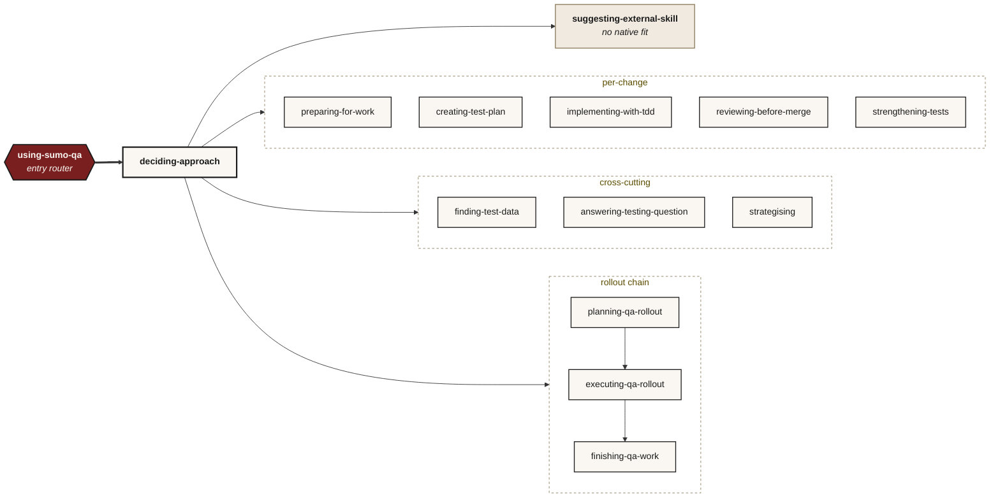

# Skills

The sumo-qa MCP ships 14 skills under [`skills/`](../skills/). Each is a single
`SKILL.md` file the host LLM follows literally: YAML frontmatter, an Iron Law, a
checklist, a graphviz process flow, a Red Flags table, examples.

Each skill is also exposed as an MCP tool with the same name (e.g. `sumo_qa_deciding_approach`). The tool returns the SKILL.md body verbatim, so hosts that don't have a native skill loader (JetBrains AI Assistant, Junie, VS Code Copilot) get the same content.

Slash-menu conventions differ per host:

- **Claude Code**: `/sumo-qa-deciding-approach` (hyphens) — comes from `~/.claude/skills/<name>/SKILL.md` symlinks. MCP tools (atomic + skill-wrapped) are NOT slash-invocable in Claude Code; call them via natural language.
- **JetBrains AI Assistant**: `/sumo_qa_deciding_approach` (underscores) — comes from the MCP tool. Every MCP entry is slash-invocable.
- **JetBrains Junie / VS Code Copilot**: Natural language; the AI picks the tool by description in Agent mode.

All paths invoke the same SKILL.md body.

## The 14 skills

| Skill | When to use | Iron Law |
|---|---|---|
| [using-sumo-qa](../skills/using-sumo-qa/SKILL.md) | Entry router on every QA intent | NO QA WORK WITHOUT FIRST DECIDING THE APPROACH. |
| [sumo-qa-deciding-approach](../skills/sumo-qa-deciding-approach/SKILL.md) | First step on every QA intent — picks the canonical approach | SHAPE FIRST. |
| [sumo-qa-preparing-for-work](../skills/sumo-qa-preparing-for-work/SKILL.md) | Plan QA for a story before coding starts | NO TEST IDEA WITHOUT A NAMED RISK. |
| [sumo-qa-creating-test-plan](../skills/sumo-qa-creating-test-plan/SKILL.md) | Formal test plan with entry/exit criteria | NO PLAN WITHOUT EXPLICIT ENTRY AND EXIT CRITERIA. |
| [sumo-qa-implementing-with-tdd](../skills/sumo-qa-implementing-with-tdd/SKILL.md) | Plan → red → user implements → green → review | RED PHASE FIRST. NO PRODUCTION CODE BEFORE A FAILING TEST. |
| [sumo-qa-reviewing-before-merge](../skills/sumo-qa-reviewing-before-merge/SKILL.md) | "Review my changes / is this safe to merge" | NEVER CLAIM SAFE-TO-MERGE WITHOUT FRESH VERIFICATION EVIDENCE. |
| [sumo-qa-strengthening-tests](../skills/sumo-qa-strengthening-tests/SKILL.md) | Mutation-testing follow-up | PRODUCTION CODE STAYS UNCHANGED. |
| [sumo-qa-finding-test-data](../skills/sumo-qa-finding-test-data/SKILL.md) | Test data discovery / validation / registration | STALE IS A DEFECT. NEVER INVENT ENTRIES NOT IN THE CATALOGUE. |
| [sumo-qa-answering-testing-question](../skills/sumo-qa-answering-testing-question/SKILL.md) | Generic "how do I test this?" / "what should I check for X?" | NO ANSWER WITHOUT A CITED PRINCIPLE OR TECHNIQUE. |
| [sumo-qa-strategising](../skills/sumo-qa-strategising/SKILL.md) | Repo-wide QA strategy / audit / pyramid design | WALK THE REPO FIRST. |
| [sumo-qa-planning-qa-rollout](../skills/sumo-qa-planning-qa-rollout/SKILL.md) | Turn a QA chunk (story, PR, strategy phase) into a written plan with bite-sized, parallel-dispatchable tasks | NO EXECUTION FROM THE PLANNER. THE PLAN IS THE DELIVERABLE. |
| [sumo-qa-executing-qa-rollout](../skills/sumo-qa-executing-qa-rollout/SKILL.md) | Dispatch a signed-off plan task-by-task to fresh subagents with two-stage review | ONE FRESH SUBAGENT PER TASK. TWO-STAGE REVIEW. CONTINUOUS EXECUTION. |
| [sumo-qa-finishing-qa-work](../skills/sumo-qa-finishing-qa-work/SKILL.md) | Close the loop on a multi-task QA rollout — fresh suite run + risk-to-test map + PR-ready summary | NO FINISH WITHOUT FRESH EVIDENCE + WRITTEN SUMMARY. |
| [sumo-qa-suggesting-external-skill](../skills/sumo-qa-suggesting-external-skill/SKILL.md) | Fallback when no native sumo-qa sub-skill fits the user's intent — finds, installs, executes external skills through sumo-qa MCP tools | THE SUMO-QA MCP SERVER OWNS EXTERNAL-SKILL LIFECYCLE. |

## Global discipline (declared in using-sumo-qa, inherited by all sub-skills)

- **Knowledge authority hierarchy:** loaded knowledge files (via `sumo_qa_load_*` tools) are authoritative. Training data is a fallback that must be flagged. Web search is a fallback for post-training-cutoff topics. "I don't know" is acceptable; inventing a technique, tool, or principle is not.
- **Citations live in reasoning, not output:** the LLM thinks in terms of cited evidence (which words in the user's intent, which file paths, which catalogue entries) but the user-facing output omits the citations unless asked.
- **Specialty + tool fit — discovery, not catalogue.** Sumo-qa intentionally does NOT carry a tool catalogue. When a risk needs specialty tooling, observe the surface, reason from first principles about what shape of testing fits, web-search current options for the user's stack, and cite when naming a tool. "I don't know" is acceptable. A static catalogue would anchor toward yesterday's brands and create a false floor where novel surfaces never trigger discovery.
- **Set the tool up, don't narrate the setup.** sumo-qa is the analytical layer (classify, name risks, pick approach + technique + tool category). The tool is just the means to coverage. Once chosen, the AI should install and configure it via the shortest path (package manager / framework CLI / config edit / MCP — whichever is fastest for that tool) and scaffold the first tests against the named risks. Confirm before installing dependencies; default to doing the work once confirmed.

## Conformance

Every SKILL.md is structurally validated by `tests/test_skill_conformance.py`:
frontmatter parses with name matching the directory, description ≥30 chars,
descriptions unique across skills, Iron Law section present, Checklist with ≥4
numbered items, Process Flow with a graphviz `dot` block, Red Flags table
present.

## Editing a skill

Skills are plain markdown. Edit `skills/<name>/SKILL.md`; the change propagates to every host on next reload:

- Claude Code reads the symlinked file (and may cache the skill list at startup — restart Claude Code to refresh).
- JetBrains AI Assistant / Junie / VS Code Copilot fetch the MCP tool body fresh on each invocation (no restart needed), BUT they cache the *tool list* at MCP-server start, so adding a NEW skill requires a host restart.

Conformance tests run in CI to catch structural drift.
