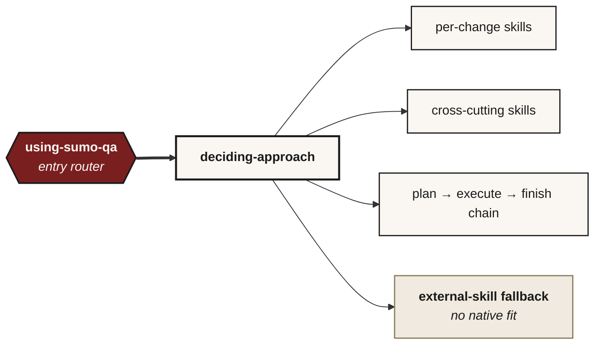

# Skills

The sumo-qa MCP ships a library of skills under [`skills/`](../skills/). Each is a single
`SKILL.md` file the host LLM follows literally: YAML frontmatter, an Iron Law, a
checklist, a Process Flow section, a Red Flags table, examples.

Each skill is also exposed as an MCP tool with the same name (e.g. `sumo_qa_deciding_approach`). The tool returns the SKILL.md body verbatim, so hosts that don't have a native skill loader (JetBrains AI Assistant, Junie, VS Code Copilot) get the same content.

**SKILL.md prose defines host-neutral obligations** — capability contracts like *"maintain an ordered work tracker"* or *"dispatch a fresh delegated worker"*. The same body is exposed to every host through whichever surface that host provides (native slash command, MCP tool, agentic-mode tool selection). Skill bodies and contract docs deliberately avoid naming any one host's tools; see `using-sumo-qa` → *Shared vocabulary* for the canonical capability terms each host adapts, and `tests/test_skill_conformance.py` for the regression guard.

Slash-menu conventions differ per host:

- **Claude Code**: `/sumo-qa-deciding-approach` (hyphens) — comes from `~/.claude/skills/<name>/SKILL.md` symlinks. MCP tools (atomic + skill-wrapped) are NOT slash-invocable in Claude Code; call them via natural language.
- **JetBrains AI Assistant**: `/sumo_qa_deciding_approach` (underscores) — comes from the MCP tool. Every MCP entry is slash-invocable.
- **JetBrains Junie / VS Code Copilot**: Natural language; the AI picks the tool by description in Agent mode.

All paths invoke the same SKILL.md body.

## The skills

Each skill is a single `SKILL.md` under [`skills/`](../skills/), carrying its own Iron Law and HARD-GATE. Browse that directory for the current set and per-skill detail — it is the source of truth, so this page deliberately does not re-list them.

## Global discipline (declared in using-sumo-qa, inherited by all sub-skills)

- **Knowledge authority hierarchy:** loaded knowledge files (via `sumo_qa_load_*` tools) are authoritative. Training data is a fallback that must be flagged. Web search is a fallback for post-training-cutoff topics. "I don't know" is acceptable; inventing a technique, tool, or principle is not.
- **Citations live in reasoning, not output:** the LLM thinks in terms of cited evidence (which words in the user's intent, which file paths, which catalogue entries) but the user-facing output omits the citations unless asked.
- **Specialty + tool fit — discovery, not catalogue.** Sumo-qa intentionally does NOT carry a tool catalogue. When a risk needs specialty tooling, observe the surface, reason from first principles about what shape of testing fits, web-search current options for the user's stack, and cite when naming a tool. "I don't know" is acceptable. A static catalogue would anchor toward yesterday's brands and create a false floor where novel surfaces never trigger discovery.
- **Set the tool up, don't narrate the setup.** sumo-qa is the analytical layer (classify, name risks, pick approach + technique + tool category). The tool is just the means to coverage. Once chosen, the AI should install and configure it via the shortest path (package manager / framework CLI / config edit / MCP — whichever is fastest for that tool) and scaffold the first tests against the named risks. Confirm before installing dependencies; default to doing the work once confirmed.

## Conformance

Every SKILL.md is structurally validated by `tests/test_skill_conformance.py`:
frontmatter parses with name matching the directory, description ≥30 chars,
descriptions unique across skills, Iron Law section present, Checklist with ≥4
numbered items, a Process Flow section, Red Flags table
present.

## Editing a skill

Skills are plain markdown. Edit `skills/<name>/SKILL.md`; the change propagates to every host on next reload:

- Claude Code reads the symlinked file (and may cache the skill list at startup — restart Claude Code to refresh).
- JetBrains AI Assistant / Junie / VS Code Copilot fetch the MCP tool body fresh on each invocation (no restart needed), BUT they cache the *tool list* at MCP-server start, so adding a NEW skill requires a host restart.

Conformance tests run in CI to catch structural drift.
