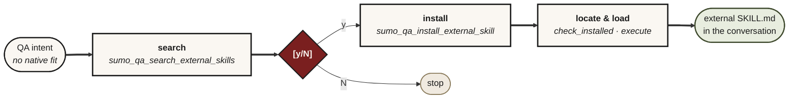

# MCP Tools

The sumo-qa MCP exposes a small, thin tool surface: skill tools, knowledge loaders, a capabilities-discovery tool, repo-map tools, a risk-to-test ledger formatter, a context-bundle formatter, a QA-artifact export tool, test-data tools, an ingestion tool, and external-skill lifecycle tools. Each is file IO, small deterministic logic, or a Skills CLI subprocess — no inference, no host-LLM sampling. The host LLM reasons over what they return. For the live tool surface, see your host's MCP tool list; the skills live under [`skills/`](../skills/). (`sumo_qa_capabilities` is a compact map of the core QA workflows — discovery, not the full tool inventory.)

## Skill tools

Each returns the full body of a `skills/<name>/SKILL.md` file. The host LLM treats the returned markdown as the procedure to follow (Iron Law + checklist + flowchart + Red Flags + examples).

The skill bodies are host-neutral: they declare capability obligations (ordered work tracker, structured user-choice prompt, fresh delegated worker — see `using-sumo-qa` → *Shared vocabulary*) rather than naming any one host's specific tools. Adapters surface the same bodies through host-specific UIs (Claude Code slash commands, JetBrains MCP slash commands, Copilot agentic-mode tool selection, etc.).

Each skill registers as a tool named after its directory with hyphens turned to underscores (`using-sumo-qa` → `using_sumo_qa`, `sumo-qa-deciding-approach` → `sumo_qa_deciding_approach`).

In JetBrains AI Assistant these are slash commands (`/sumo_qa_deciding_approach`). In Claude Code the equivalent slash commands come from the native skill files (`/sumo-qa-deciding-approach`, hyphens) — the MCP tools are still callable but only via natural language ("decide the QA approach for this refactor"). VS Code Copilot and Junie pick them by description in Agent / agentic mode.

See [SKILLS.md](SKILLS.md) for the Iron Law per skill.

## Progressive skill loading

A read-only, deterministic, local-only pair of tools that lets a host fetch just the slice of a skill it needs (the routing summary, one section, or one module) instead of the whole `SKILL.md` body. The zero-argument skill tools above are unchanged — `mode="full"` returns the same body byte-for-byte. No extraction, no network, no caching.

| Tool | What it returns |
|---|---|
| `sumo_qa_list_skill_manifests(detail="compact")` | A JSON string of metadata for every bundled skill. The default `detail="compact"` returns routing metadata only — `skill_name`, `tool_name`, `description`, `content_hash` (sha256), `estimated_tokens_full` — with **no** `sections[]`/`modules[]` arrays (the cheap all-skill routing slice). `detail="full_index"` adds each skill's `sections[]` (id, heading, level, estimated_tokens, required) and `modules[]` (id, path, estimated_tokens) index arrays. Section ids are stable heading slugs (duplicates get `-2`/`-3` suffixes); `required` flags the structural sections (frontmatter, Iron Law, Checklist, Flow, Red Flags, HARD-GATE) when present. An unrecognised `detail` returns a JSON error envelope listing the valid values — it never raises. Once routing has chosen one skill, fetch that skill's section/module index via `load_skill_context(skill_name, "manifest")`. |
| `sumo_qa_load_skill_context(skill_name, mode, section=None, module=None, known_hash=None)` | A JSON string for one slice. `mode` is `manifest` (routing summary + section/module lists), `section` (one section's text), `module` (one module's text), or `full` (the whole body, identical to the skill tool). The `section`/`module`/`full` slices each carry `content_hash` (sha256 of the returned text) and `estimated_tokens`. Pass `known_hash` to ask "has this slice changed since hash X?": a match returns `changed: false` with the body omitted (saving the re-send), a mismatch returns `changed: true` with the body. Invalid skill/mode/section/module, a missing required arg, or a path-traversal attempt returns a JSON error envelope listing the valid choices — it never raises. |

### Which path to use — canonical vs compact

The four modes form a retrieval ladder. Climb only as far as the work needs:

| Path | Mode | Canonical? | Use it when |
|---|---|---|---|
| **Manifest (all skills)** | `sumo_qa_list_skill_manifests(detail="compact")` | No — routing aid | Choosing which skill applies. The default `detail="compact"` returns per-skill metadata for every skill at once — but **not** the `sections[]`/`modules[]` arrays, so it stays cheap (~2,176 approx tokens, guarded under a 2,500 budget). `detail="full_index"` adds each skill's `sections[]`/`modules[]` *index* arrays (ids + token weights, never the bodies) — ~11,219 approx tokens, guarded under a 13,000 ceiling. Once a skill is chosen, fetch its section/module index via `load_skill_context(skill, "manifest")` rather than carrying every skill's index up front. |
| **Manifest (one skill)** | `load_skill_context(skill, "manifest")` | No — routing aid | You've chosen a skill and want its section/module map (ids, token weights, which sections are `required`) before pulling any body. |
| **Section / Module** | `load_skill_context(skill, "section"/"module", …)` | **Yes** — verbatim slice | You need one part of a skill (its Iron Law, one checklist, one lazy module) and not the rest. The returned text is byte-for-byte from the file. |
| **Full** | `load_skill_context(skill, "full")` or the zero-arg skill tool | **Yes** — verbatim body | You are about to **execute** the skill. When exact procedure wording matters — Iron Law, HARD-GATE, the operational checklist a workflow follows step-by-step — load the full body. |

**Canonical means verbatim.** `section`, `module`, and `full` return text copied straight from `SKILL.md` (or a module file); a host may cite or follow them as the authoritative instruction. The two **manifest** paths are *compact navigation aids* — they summarise structure and token weights to help a host route, and are **not** a substitute for the procedure text. Do not treat a manifest description or section list as the instruction to follow; once a skill is actually being executed, load the section(s) or the full body so the model has the exact wording. The same rule governs the knowledge catalogues: a compact summary is for recall, the loaded catalogue text is what you cite.

**Cumulative-cost win.** The point of the ladder is session-cumulative cost. A host that revisits a skill many times pays the routing slice (manifest + a required section or two) on each visit instead of the whole body every time — for the heaviest skills the manifest-plus-routing slice is well over 50% lighter than the full body, and across a mixed session the cumulative saving is large. The `tests/test_token_weight_regression.py` and `tests/test_skill_modules.py` budgets lock that in. Two distinct all-skill-manifest budgets exist, for two distinct artifacts: the **shipped default `sumo_qa_list_skill_manifests` output** (`detail="compact"` — per-skill metadata *without* the `sections[]`/`modules[]` arrays, the payload hosts fetch to route) is ~2,176 approx tokens and guarded under a **2,500** budget; the explicit **`detail="full_index"` opt-in** (the full index *with* every skill's `sections[]`/`modules[]` arrays) is ~11,219 approx tokens and guarded under a **13,000** full-index ceiling. Modules stay under 1,500, and the partial path must stay below the full-body cumulative cost.

### MCP resources (additive)

The same skill index is also exposed as MCP resources/resource-templates, for hosts that let the user (or the application) select context as resources. These are **additive** — the model-callable tools above stay the primary, unchanged path; no tool is removed or renamed, and no per-section/per-module tool is added. Each resource body is byte-for-byte the matching loader output (`application/json`):

| URI | Equivalent loader call |
|---|---|
| `sumoqa://skills` | `sumo_qa_list_skill_manifests()` (compact default) |
| `sumoqa://skills/{skill_name}/manifest` | `load_skill_context(skill_name, "manifest")` |
| `sumoqa://skills/{skill_name}/sections/{section_id}` | `load_skill_context(skill_name, "section", section=…)` |
| `sumoqa://skills/{skill_name}/modules/{module_id}` | `load_skill_context(skill_name, "module", module=…)` |
| `sumoqa://skills/{skill_name}/full` | `load_skill_context(skill_name, "full")` |

`{skill_name}`, `{section_id}` and `{module_id}` are the stable ids from the manifest. An unknown skill/section/module — or a path-traversal attempt in a template parameter — returns the loader's JSON error envelope as the resource content (never a transport error).

**Host compatibility.** MCP resources are application-driven: the host decides whether and how to surface them, and several clients require the user to explicitly attach a resource before the model can read it. The model-callable tool path is therefore the canonical route in every host; resources are an optional convenience where the client supports them.

| Host | Resource behaviour |
|---|---|
| Claude Code | Resources and resource-templates are listed; the user attaches a resource (e.g. via `@`) to bring its content into context. The tool path works with no user step. |
| Codex plugin | Resource exposure depends on the plugin's MCP client; where resources are unsupported, the tool path is used. |
| VS Code / Copilot | MCP resources surface where the client implements `resources/list` + `resources/read`; otherwise fall back to the tools. |
| JetBrains | Resource support tracks the IDE's MCP client; tools remain the reliable path. |

Because support varies and is user-selection-driven, treat resources as additive and keep using the tools as the primary interface.

### Change detection without a session cache

The `known_hash` affordance is **derived per call** — the loader re-reads the live slice, re-hashes it, and compares to the caller-supplied hash. There is no hidden session cache: nothing is retained between calls, so the answer is identical regardless of whether the host preserves MCP session identity. A true server-side session cache was deliberately **not** implemented, because MCP session identity is not reliable across the supported hosts (some clients reconnect per request or do not expose a stable session id), and a cache keyed on an unstable identity would either leak across sessions or silently miss — both worse than re-hashing a small local slice. Content hashes give callers a cheap, safe way to skip re-sending unchanged text while keeping every load deterministic and stateless.

## Knowledge loaders

Each returns a markdown catalogue as plain text. The host LLM reasons over the returned content. The classification-filter tools (`load_standards`, `load_rules`) accept a single classification or comma-separated classifications. Standards filtering is metadata-based from pack frontmatter; rules filtering returns matching entries. No keyword matching.

| Tool | Returns |
|---|---|
| `sumo_qa_load_classifications()` | The canonical change classifications |
| `sumo_qa_load_approaches()` | The canonical QA approaches |
| `sumo_qa_load_principles()` | ISTQB Foundation principles, Advanced certifications, ISO/IEC 25010 quality characteristics |
| `sumo_qa_load_techniques()` | Test design techniques (black-box, white-box, experience-based, static, property-based, mutation) |
| `sumo_qa_load_standards(classification?)` | Team's loaded standards packs; optional metadata-based filter by one or more classifications |
| `sumo_qa_load_rules(classification?)` | Team's loaded change rules; optional filter by one or more classifications |
| `sumo_qa_load_catalogue_entry(catalogue, name?, format?)` | One entry from a prose catalogue (`classifications`, `approaches`, `principles`, `techniques`), or the whole catalogue in compact form when `name` is omitted; a lighter alternative to the full-text loaders |

`sumo_qa_load_catalogue_entry` is a progressive-loading aid: pass `name` (a slug id like `api_contract_change` / `equivalence-partitioning`, or the verbatim heading) to fetch a single entry, or omit it to fetch the whole catalogue. `format="full"` (default) returns verbatim text marked `canonical=true` — **safe to cite**. `format="compact"` returns a truncated lead-line summary marked `canonical=false` — **a navigation/recall aid, NOT a citation replacement**; load the full form (or the zero-argument `sumo_qa_load_*` loader) when exact wording matters. An unknown catalogue, name, or format — or a missing/unreadable catalogue file (e.g. a bad `QA_KNOWLEDGE_PATH` or a broken bundle) — returns a JSON error envelope listing the valid choices; the tool never raises. The zero-argument `sumo_qa_load_*` loaders are unchanged.

Specialty-tool picks are intentionally NOT catalogued — the discipline (in `using-sumo-qa`) is to observe the risk surface, web-search current options for the user's stack, and cite when naming a tool. A static catalogue would anchor toward yesterday's brands and create a false floor where novel surfaces never trigger discovery.

## Capabilities discovery

A compact, read-only "what can sumo-qa do?" map: the core QA workflows, each with a sample prompt, the skill it routes to, and a one-line outcome. Typed output (`CapabilitiesOutput`), under 500 approximate tokens. Discovery only — it does **not** replace the `using-sumo-qa` entry router or `sumo_qa_deciding_approach`, and carries no internal classification labels.

| Tool | What it returns |
|---|---|
| `sumo_qa_capabilities()` | The core QA workflows, each as `{workflow, sample_prompt, target_skill, outcome}` routing to an existing skill |

## Repo-map tools

A QA-native map of the repo (`.sumo-qa/repo-map.json`) plus the consumers that turn it into review/planning/strategy signal. All return compact, typed summaries — never the full artifact. See [REPO-MAP.md](REPO-MAP.md) for the schema and the diff vs live-scan semantics. The review / preparing-for-work / strategising skills prefer the map when present and fall back to a repo walk when absent.

| Tool | What it returns |
|---|---|
| `sumo_qa_scan_repo(root, generator_version=None, write_to=None)` | Compact per-type node / edge / command / warning counts for the repo; optionally writes the full `.sumo-qa/repo-map.json` artifact (`RepoMapScanOutput`). Writer; read-only when `write_to` is omitted. |
| `sumo_qa_analyze_diff_impact(root, base_ref=None, changed_files=None, ...)` | Maps changed files onto the map: changed/affected nodes, likely related tests, the risk surface (changed sources with no mapped test), `probable_mapping_gap` (risk surface is a missed convention, not zero coverage), unmapped files, and staleness vs HEAD (`DiffImpactOutput`). On the first run of an unmapped repo it persists a repo-map to `artifact_path` (`persisted_map_path`) unless that is `None`; also writes a `diff-impact.json` overlay when `write_overlay=True`. |
| `sumo_qa_query_repo_map(root, query, limit=10, types=None, ...)` | Bounded, ranked search of the map by path / node id / component / tag / category / evidence type / command, each match carrying id, path, type, tags, and a match reason plus an artifact freshness summary (`RepoMapQueryOutput`). Read-only. |

## Risk-to-test ledger

A deterministic formatter for the risk-to-test traceability ledger — a structured appendix to the markdown-first verdict, not a replacement. The host LLM identifies the risks (the skills already require this); this tool only validates the supplied rows and renders them. No inference. See [RISK-LEDGER.md](RISK-LEDGER.md) for the row schema, the evidence-status vocabulary, and when not to use it.

| Tool | What it returns |
|---|---|
| `sumo_qa_format_risk_ledger(rows, max_rows=25)` | Validates host-supplied risk rows (`risk_id`, `risk`, `source_anchor`, `test`, `evidence_status`, `residual`, optional `repo_map_node_id`) and renders the markdown ledger table plus a one-line compact summary, the row count, and the uncovered-blocker count (`FormatRiskLedgerOutput`). Read-only; the table truncates past `max_rows` to stay inside the host token budget. |

## Context bundle

A deterministic formatter/validator for the host-neutral issue/PR context bundle — an optional *input* contract that hands review/planning a compact record of issue/PR summary, changed files, test/CI evidence, and user constraints. It is never a network requirement and never a GitHub dependency: every field can be filled from manual text, local git state, or an optional host integration, and a partial/empty bundle is first-class (the skill falls back to direct repo inspection). Go-stale facts (CI, tests) carry their own source + freshness; only a *fresh pass* is safety-supporting, and a stale/unknown/absent fact is rendered with an explicit "do not claim safety from it" warning. The review / preparing-for-work skills prefer the bundle when present. See [CONTEXT-BUNDLE.md](CONTEXT-BUNDLE.md) for the schema, the freshness vocabulary, and the conflict semantics.

| Tool | What it returns |
|---|---|
| `sumo_qa_format_context_bundle(bundle, local_head_sha=None, max_files=40)` | Validates a host-supplied bundle (`issue_summary`, `pr_summary`, `head_sha`, `changed_files`, `test_evidence`/`ci_status` with `result`/`freshness`/`source`, `user_constraints` — all optional but `schema_version`) and renders a host-neutral markdown brief plus a one-line summary, the changed-file count, the stale and not-safety-supporting evidence fields, and a bundle-vs-local-state conflict message when `head_sha` differs from `local_head_sha` (`FormatContextBundleOutput`). Read-only; no inference, no network call. |

## QA-artifact export

A deterministic exporter for already-structured QA test cases — markdown prose stays the default human-facing output; export only happens on an explicit user request. The host LLM identifies the cases; this tool only validates the supplied cases and renders them into one documented, machine-readable shape. No inference, no vendor lock-in, no new mandatory dependency (`json`/`csv` are stdlib), and side-effect free (it returns text, it never writes a file). See [EXPORT.md](EXPORT.md) for the case schema, the format set, and the import-mapping caveat.

| Tool | What it returns |
|---|---|
| `sumo_qa_export_test_cases(test_cases, format="markdown", title=None)` | Validates host-supplied test cases (`id`, `title`, `preconditions`, `steps`, `expected_result`, optional `linked_risk_id`, `priority`, `evidence_status`) and renders them deterministically as `markdown` (the default table), versioned key-sorted `json`, or `csv` (only for a flat outline — one precondition + one step per case), returning the rendered `content`, the chosen `format`, the stamped `schema_version`, and the `test_case_count` (`ExportTestCasesOutput`). Read-only and side-effect free; an unsupported format, or CSV for a non-flat export, returns an error envelope naming the supported formats. |

## Test-data tools

Manage the local known-good test data catalogue under `knowledge/test_data/`. File IO + validation against source systems where applicable.

| Tool | Purpose |
|---|---|
| `sumo_qa_explain_test_data_requirements(question, environment, domain)` | Returns deterministic test-data requirements (entity / state / preconditions / edges / what-not); enriches existing fields with scenario-specific items when the question contains obvious signals (`locked`, `refund`, `discontinued`, `due-date`, `stale`, …) |
| `sumo_qa_find_test_data(question, environment, domain, criteria)` | Looks up matching catalogue entries |
| `sumo_qa_validate_test_data(path)` | Checks a known-good entry against its source system |
| `sumo_qa_register_known_good_test_data(...)` | Writes a new known-good entry |

## Ingestion

Add or replace team QA knowledge/standards/rules at runtime, without cloning the repo. Validates native files and writes a normalized copy into a user-writable pack (`project` = `<cwd>/.sumo-qa`, `global` = XDG data dir). Loader precedence: explicit env var > project > global > bundled > repo. See [CONFIGURATION.md](CONFIGURATION.md#adding-custom-knowledge-without-cloning-the-repo). Also exposed as the `sumo-qa-ingest` console script.

| Tool | Purpose |
|---|---|
| `sumo_qa_ingest_knowledge_pack(source, scope, content_type?)` | Validate + materialize a native pack; non-native sources (PDF/PPTX/URL) return an `unsupported_source` result routing through the `sumo-qa-suggesting-external-skill` flow to convert + re-ingest |

## External-skill lifecycle

When no native sumo-qa fit is found, `sumo-qa-suggesting-external-skill` searches, installs, and executes external skills through sumo-qa MCP tools:

| Tool | Purpose |
|---|---|
| `sumo_qa_search_external_skills` | Run `skills find <query>` and return ANSI-stripped CLI output verbatim — no structured parsing, so Skills CLI format drift doesn't break the flow |
| `sumo_qa_check_external_skill_installed` | Locate an installed `SKILL.md` in project or global agent skill paths |
| `sumo_qa_install_external_skill` | Install a named skill through `npx skills add` after explicit user confirmation |
| `sumo_qa_execute_external_skill` | Load the installed `SKILL.md` and return the execution handoff payload |

Install still requires a user `[y/N]` gate in the skill. The host does not shell out to `npx` directly for this flow.

## Why the surface is so small

The discipline (when to ask the user, when to call which tool, what to assert, how to cite a principle) lives in the [skill files](../skills/). The host LLM follows the skill literally. The MCP tools just provide the source of truth.

This is the architectural difference from the pre-restructure version, which had 10 heavy MCP tools each producing 1500-token structured JSON output via host-LLM sampling. That model broke on hosts with smaller token caps or less robust SSE handling — the thin-tool design above replaced it.
