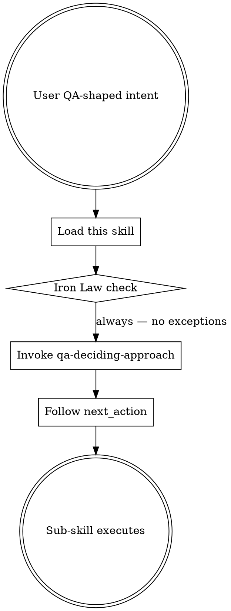
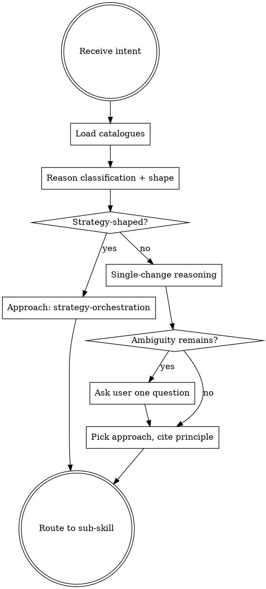
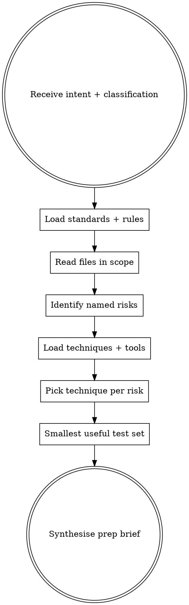
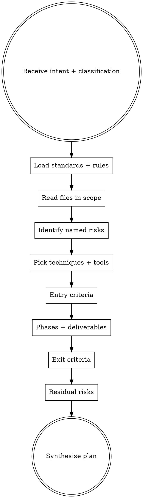
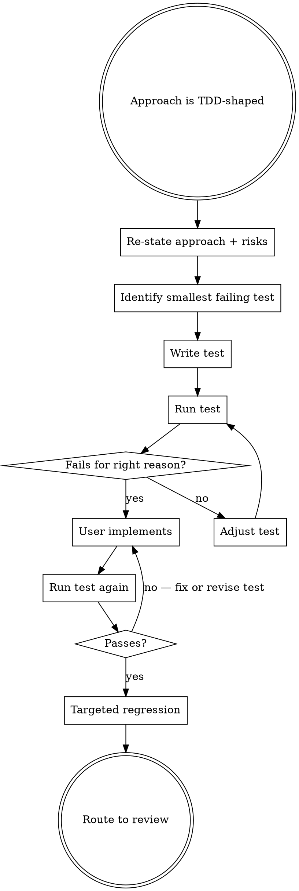
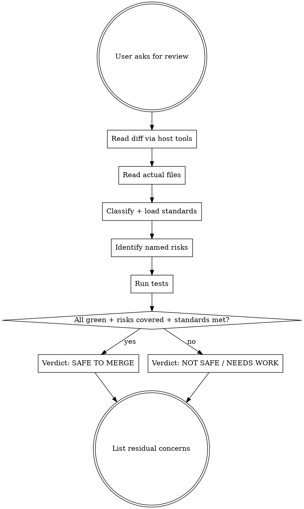
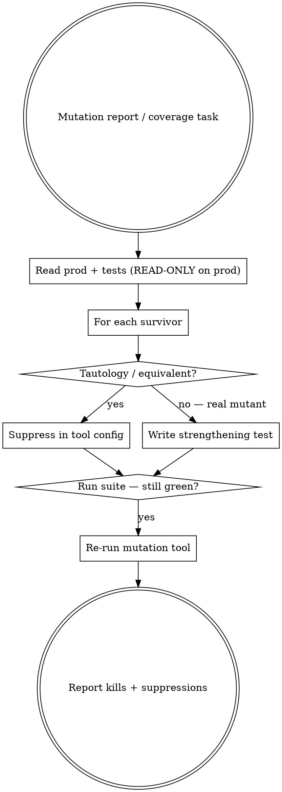
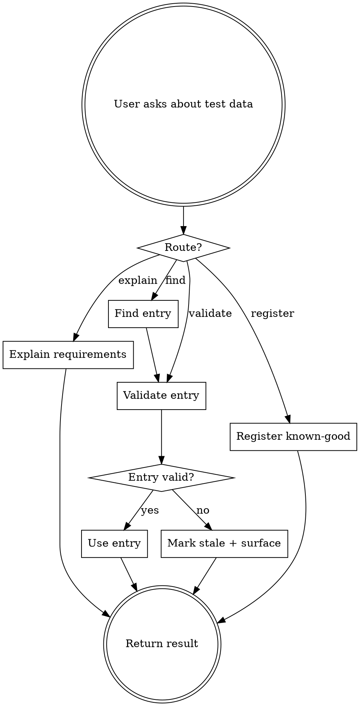
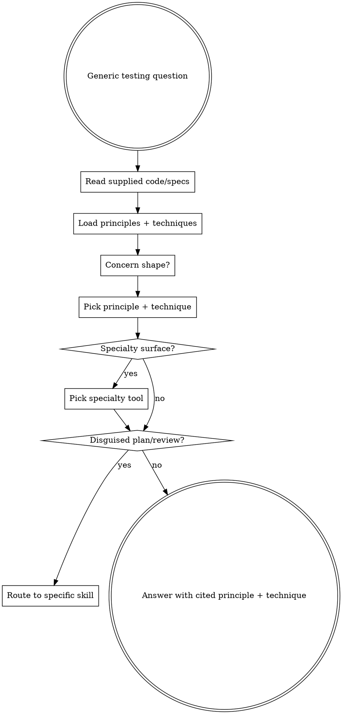
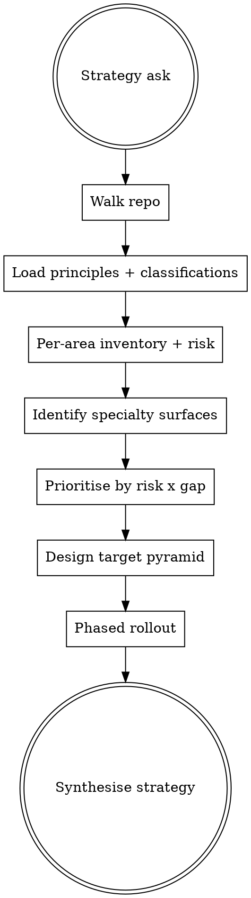

# Superpowers Restructure — Phase 2 (Skills) Implementation Plan

> **For agentic workers:** REQUIRED SUB-SKILL: Use superpowers:subagent-driven-development (recommended) or superpowers:executing-plans to implement this plan task-by-task. Steps use checkbox (`- [ ]`) syntax for tracking.

**Goal:** Replace all 10 `skills/*/SKILL.md` files with full superpowers-style content (YAML frontmatter, Iron Law, When-to-use, Checklist, Process Flow, Red Flags, Examples), then un-skip the 4 conformance structure checks and annotate standards packs with classification metadata so the filtered `load_standards` path returns useful results.

**Architecture:** Each SKILL.md is a self-contained markdown file the host LLM follows literally. The procedural discipline (Iron Laws, checklists, decision flowcharts, Red Flags tables) lives entirely in skill markdown — Python tools stay thin knowledge providers. After Phase 2, hosts (Claude Code via auto-load, IntelliJ + Copilot via MCP prompts) have everything they need to drive senior-QA flows without the heavy Python tools.

**Tech Stack:** Markdown, YAML frontmatter, graphviz `dot` notation, pytest (un-skipping existing tests).

**Spec:** [`docs/superpowers/specs/2026-05-08-superpowers-restructure-design.md`](../specs/2026-05-08-superpowers-restructure-design.md)

**Branch:** `feat/superpowers-restructure` (continues from Phase 1, commit `1a62012`).

---

## File Structure

### Modified (Phase 1 stubs / existing thin content → full content)

| Path | Current state | After Phase 2 |
|---|---|---|
| `skills/using-sumo-qa/SKILL.md` | thin (Phase 1) | Full entry router with global rules |
| `skills/qa-deciding-approach/SKILL.md` | thin | Decides shape + approach + routes |
| `skills/qa-preparing-for-work/SKILL.md` | stub (Phase 1) | Full prep-for-work flow |
| `skills/qa-creating-test-plan/SKILL.md` | stub | Full test-plan flow |
| `skills/qa-implementing-with-tdd/SKILL.md` | thin | Full TDD walk |
| `skills/qa-reviewing-before-merge/SKILL.md` | thin | Full review flow |
| `skills/qa-strengthening-tests/SKILL.md` | thin | Mutation-testing follow-up |
| `skills/qa-finding-test-data/SKILL.md` | thin | Test-data discovery/validation |
| `skills/qa-answering-testing-question/SKILL.md` | stub | Generic "how do I test this?" |
| `skills/sumo-qa-strategising/SKILL.md` | thin | Repo-wide strategy |

### Modified (un-skip conformance checks)

| Path | Change |
|---|---|
| `tests/test_skill_conformance.py` | Remove `@pytest.mark.skip` from 4 structure tests |

### Modified (standards pack metadata)

| Path | Change |
|---|---|
| `standards/packs/istqb_v1.yml` | Add `applies_to_classifications:` frontmatter field |
| `standards/packs/qa_shift_left_v1.yml` | Add `applies_to_classifications:` frontmatter field |

### Untouched

All Python source files. The 5 knowledge catalogues. The 4 test-data tools. The 6 heavy MCP tools (deleted in Phase 4).

---

## Skill template (every skill MUST follow this exact structure)

```markdown
---
name: <skill-name>
description: <when to use this skill — phrased so the host LLM auto-triggers correctly. 30+ chars.>
---

# <Title in title case>

## The Iron Law
<ONE LINE, ALL CAPS, NO X WITHOUT Y SHAPE>

## When to Use
<one paragraph describing user intents that should trigger this skill>

## Checklist
You MUST create a TodoWrite item per checklist item and complete in order:

1. <action>
2. <action>
3. <action>
4. <action>
...

## Process Flow

```dot
digraph <name> {
    rankdir=TB;
    "<node>" [shape=box];
    ...
    "<node>" -> "<node>";
}
```

## Red Flags
| Thought | Reality |
|---|---|
| "<rationalisation>" | <reality check> |
| "<rationalisation>" | <reality check> |
...

## Examples

### Good
<short example of correct application>

### Bad
<short example showing the anti-pattern this skill prevents>
```

Conformance test (currently skipped) enforces: Iron Law section present, Checklist with ≥4 items, ```dot block present, Red Flags table present.

---

## Setup

### Task 0: Confirm starting state

- [ ] **Step 0.1: Confirm branch and clean state.**

```bash
git branch --show-current
git status --short
```

Expected: branch `feat/superpowers-restructure`, no uncommitted Phase 1 state.

- [ ] **Step 0.2: Run baseline tests.**

```bash
uv run pytest -q 2>&1 | tail -3
```

Expected: `304 passed, 40 skipped, 2 xfailed`.

---

## Group A: Rewrite the 10 skill files (one task per skill, one commit per skill)

For each skill, the implementer **overwrites** the existing `skills/<name>/SKILL.md` with the full content shown below verbatim. Do not edit, abridge, or improve the content. The skill conformance test is the gate.

### Task 1: `skills/using-sumo-qa/SKILL.md`

**Files:**
- Modify: `skills/using-sumo-qa/SKILL.md` (replace entire content)

- [ ] **Step 1.1: Overwrite the file with this exact content:**

````markdown
---
name: using-sumo-qa
description: Use whenever a user asks anything QA-shaped — testing, code review, scaffolding tests, planning QA for a story, finding test data, fixing a bug. Entry router for all sumo-qa work. Establishes the global discipline that every sub-skill inherits.
---

# Using sumo-qa

## The Iron Law
NO QA WORK WITHOUT FIRST DECIDING THE APPROACH.

You may not produce test ideas, scaffolds, plans, reviews, or strategies without first invoking `qa-deciding-approach`. Skipping the approach decision routes wrong-shaped output to the user.

## When to Use

This skill is the entry router for every QA-shaped request. Any of these intents triggers it:

- "review my changes / is this safe to merge"
- "how should I test X"
- "create a test plan for X"
- "plan QA for this story"
- "scaffold the failing tests for X"
- "what test data do I need"
- "audit our test coverage"
- "design our QA strategy"

It does not produce QA output itself. Its job is to enforce the Iron Law, set up global discipline that every sub-skill inherits, then route to `qa-deciding-approach`.

## Global discipline (inherited by every sub-skill)

### Knowledge authority hierarchy

Source priority — NEVER skip a level without flagging it:

1. **Loaded knowledge files** (`sumo_qa_load_*` tools). Authoritative. Pick from these without blending in training-data recall.
2. **Training data** — fallback only when the catalogue is silent. When used, explicitly flag: "This isn't in the loaded catalogue, but my training data suggests …"
3. **Web search** — fallback when training is uncertain or the topic is post-training-cutoff. Citation required.
4. **"I don't know"** — the only acceptable answer when 1, 2 and 3 all fail. Never invent a technique, tool, principle, or specialty fit that doesn't exist in any of those three sources.

### Internal reasoning vs user output

Reason internally with citations (which words in intent, which file paths, which catalogue entries grounded the inference). Do NOT echo the citation rationale in the user-facing output unless asked. Citations belong to `SUMO_QA_DEBUG_DIR` capture, not to chat output.

### Specialty + tool fit

When recommending a specialty tool, pick from `sumo_qa_load_specialty_tools()`. The fit applies to any quality improvement — Pitest on pure functions, Hypothesis for property-based tests, Pact for REST contracts, OWASP ZAP for HTTP DAST, axe-core for a11y. Empty selection is acceptable when nothing genuinely fits.

## Checklist
You MUST create a TodoWrite item per checklist item and complete in order:

1. Read the user's intent verbatim.
2. Load and re-read this Iron Law to anchor the response.
3. Invoke the `qa-deciding-approach` skill immediately. Do NOT answer the user before the approach is decided.
4. After `qa-deciding-approach` returns, follow its `next_action` (route to the named sub-skill or stop).
5. Apply the global discipline (knowledge authority, internal-only citations, specialty+tool fit) for every sub-skill that runs.

## Process Flow



## Red Flags

| Thought | Reality |
|---|---|
| "I already know what they want — let me just answer" | Iron Law violated. Approach decision is non-negotiable. |
| "This question is too simple to need the approach skill" | Simple intents still need shape (no-tests-recommended is a valid approach). Skip the decision and you skip the safety net. |
| "I'll cite the principles myself from training data" | Loaded catalogue is authoritative. Use `sumo_qa_load_principles()`. |
| "Let me echo the citation reasoning in the answer for transparency" | Citations belong to debug capture, not user output. They burn tokens. |
| "Specialty tools are only for non-functional surfaces" | Wrong. Pitest, Hypothesis, Pact all fit functional surfaces. Pick from the catalogue. |

## Examples

### Good
User: "review my changes". Skill response (internal): load Iron Law, invoke `qa-deciding-approach`, get `verify-existing` or `regression-first`, route to `qa-reviewing-before-merge`. User sees the routed skill's output, not the routing trace.

### Bad
User: "review my changes". Skill response: "Sure! Looking at your diff, the main concerns are …" — skipping the approach decision, going straight to review. Iron Law violated. The reviewer might be the wrong shape for the change (e.g. a docs-only change doesn't need a code review skill).
````

- [ ] **Step 1.2: Commit.**

```bash
git add skills/using-sumo-qa/SKILL.md
git commit -m "skills(using-sumo-qa): full superpowers-style content"
```

---

### Task 2: `skills/qa-deciding-approach/SKILL.md`

- [ ] **Step 2.1: Overwrite with this exact content:**

````markdown
---
name: qa-deciding-approach
description: Use as the FIRST step on any QA intent. Loads classifications, approaches, rules, and standards via the sumo_qa_load_* tools, then reasons over the user's intent to pick the canonical approach. Routes to the matching sub-skill.
---

# Deciding the QA approach

## The Iron Law
SHAPE FIRST.

Decide single-change vs repo-wide vs no-tests-recommended *before* picking a per-change approach. Wrong shape = wrong-shaped tests.

## When to Use

`using-sumo-qa` routes to this skill on every QA-shaped intent. This skill ALWAYS runs before any other QA skill. Even simple intents pass through it — the canonical approaches include `no-tests-recommended` and `verify-existing` for cases that don't merit new tests.

## Checklist
You MUST create a TodoWrite item per checklist item and complete in order:

1. Read the user's intent verbatim and any supplied target paths.
2. Call `sumo_qa_load_classifications()` and `sumo_qa_load_approaches()`. Read both catalogues.
3. Call `sumo_qa_load_principles()` if a principle citation is needed in the output.
4. Reason about classification: which of the 10 catalogue entries apply to this intent? Cite the words / paths internally.
5. Reason about shape: single change vs repo-wide / strategy ask vs config tweak vs docs-only? Strategy-shaped asks ("audit", "strategy", "pyramid", "rollout") route to `strategy-orchestration` — do NOT force per-change output.
6. Pick the approach. The catalogue is authoritative; describe a new one only when none fits, with rationale.
7. If a real ambiguity remains (e.g. user said "test the thing" with no paths and no domain), ask ONE clarifying question to the user. Otherwise, do not ask.
8. Return: `{approach, classification, rationale (1-3 sentences citing one ISTQB principle), next_action: {skill: <name>}}`. Route to the named sub-skill.

## Process Flow



## Routing table (approach → next skill)

| Approach | Next skill |
|---|---|
| strategy-orchestration | sumo-qa-strategising |
| tdd-scaffold | qa-implementing-with-tdd |
| regression-first | qa-implementing-with-tdd |
| coverage-first-then-refactor | qa-implementing-with-tdd |
| strengthen-test-coverage | qa-strengthening-tests |
| verify-existing | qa-reviewing-before-merge |
| no-tests-recommended | (stop — no sub-skill needed) |
| spike-first-then-tests | qa-preparing-for-work (deliverable mode) |

For "create a test plan" / "plan QA for this story" intents, after approach is picked, route to `qa-creating-test-plan` or `qa-preparing-for-work` per user phrasing. For "how do I test this?" intents that don't fit any specific approach, route to `qa-answering-testing-question`.

## Red Flags

| Thought | Reality |
|---|---|
| "This is obviously TDD" | Maybe. Read the user's words and inferred classification first. "Refactor" implies behaviour-preserving — that's `coverage-first-then-refactor`, not `tdd-scaffold`. |
| "I'll skip loading the catalogues this once" | Catalogue is the source of truth. Inventing approaches from training data is the failure mode this skill exists to prevent. |
| "User said 'design our strategy' — I'll still scaffold tests" | Strategy asks route to `strategy-orchestration`. Don't force per-change output. |
| "Description says docs-only change but I'll add tests anyway" | `no-tests-recommended` is honest senior-QA. Adding tests where none are needed wastes signal. |
| "Mutation testing follow-up needs new prod code" | No — that's `strengthen-test-coverage`. Production code stays unchanged. |
| "I'll ask the user 3 clarifying questions to be sure" | Ask ONE if needed. More than one means the skill is hoarding context; the LLM should infer. |

## Examples

### Good

User: "create a test plan for refactoring the pricing pipeline". 
- Load classifications + approaches.
- Classification: `business_logic_change` (cited word: "pricing"). Modifier: refactor (cited word: "refactoring").
- Shape: single change. Not strategy.
- Approach: `coverage-first-then-refactor` — refactor implies behaviour-preserving; characterization tests must pin behaviour BEFORE the refactor.
- Cite: ISTQB Principle 4 (defects cluster — refactor risks introducing bugs at extraction boundaries).
- `next_action.skill: "qa-creating-test-plan"`.

### Bad

User: "create a test plan for refactoring the pricing pipeline".
Pick `tdd-scaffold` because "test plan" sounds like adding tests. Wrong — refactor needs characterization tests first, not new behaviour scaffolding. The Iron Law (`SHAPE FIRST`) was violated by ignoring "refactoring" in the intent.
````

- [ ] **Step 2.2: Commit.**

```bash
git add skills/qa-deciding-approach/SKILL.md
git commit -m "skills(qa-deciding-approach): full superpowers-style content"
```

---

### Task 3: `skills/qa-preparing-for-work/SKILL.md`

- [ ] **Step 3.1: Overwrite with this exact content:**

````markdown
---
name: qa-preparing-for-work
description: Use when the user asks to plan QA for a story, ticket, or piece of work before coding starts. Identifies named risks anchored in the change shape, then proposes a smallest useful test set tied to those risks. Lighter-weight than qa-creating-test-plan; no formal entry/exit criteria.
---

# Preparing for QA work

## The Iron Law
NO TEST IDEA WITHOUT A NAMED RISK.

Every test you propose ties to a specific risk you identified. Generic "add edge case tests", "test happy and sad paths", "check for null inputs" are senior-QA failure modes — they tell the user nothing they didn't already know.

## When to Use

User intents that trigger this skill:

- "plan QA for this story"
- "I'm starting work on X — what should I test?"
- "what could break with this change?"
- "QA prep for ticket ABC-123"

Distinct from `qa-creating-test-plan` (formal entry/exit criteria, phases, deliverables) and from `qa-deciding-approach` (which only picks the approach). This skill produces a risk-shaped prep brief: named risks + smallest useful test set + named techniques + specialty fits if relevant.

## Checklist
You MUST create a TodoWrite item per checklist item and complete in order:

1. Read the user's intent and target paths.
2. Call `sumo_qa_load_standards(classification=...)` and `sumo_qa_load_rules(classification=...)` using the classification the previous `qa-deciding-approach` step settled on.
3. Read the actual files in scope using the host's file tools. Do NOT ask the user for file content the host can read directly.
4. Identify 3-7 named risks. Each risk MUST be specific (not "input validation breaks" but "currency conversion at the GBP→USD boundary rounds incorrectly when the rate is supplied with >6 decimal places"). Anchor each in a file path or domain term from the user's words.
5. Call `sumo_qa_load_techniques()`. Pick one technique per named risk. Use the catalogue's wording.
6. Call `sumo_qa_load_specialty_tools()`. Pick tools that fit the actual risks — any quality improvement, not only non-functional. Empty list is acceptable.
7. Produce a smallest useful test set: 3-7 tests, each tied to a named risk. No generic "test happy path".
8. Output: conversational prose, sectioned (risks, tests, techniques, specialty tools, open assumptions). No JSON blob.

## Process Flow



## Red Flags

| Thought | Reality |
|---|---|
| "Add tests for edge cases" | What edge cases? Name them with specific values. |
| "Test happy path and sad path" | Generic. Every change has a happy path. Name the specific behaviour and the specific failure mode. |
| "I'll list 15 risks to be thorough" | 3-7 is the senior-QA bar. More means you're confabulating, not reasoning. |
| "I don't need to read the files — I can infer from the intent" | You can infer the SHAPE; you can't infer the actual data flow, domain terms, or edge cases without reading. |
| "The user didn't ask for techniques — I'll skip those" | Every named risk gets a named technique. The technique is what makes the test actionable. |
| "Mutation testing for a UI tweak" | Wrong tool fit. Pick from the catalogue based on the actual risk surface. |

## Examples

### Good

User: "I'm adding a refund endpoint to the payments service. What should I test?"
- Classification: `api_contract_change` + `business_logic_change`.
- Risks (anchored): (1) refund amount exceeds original charge (boundary risk on `amount` vs original `charge.amount`). (2) refund issued twice for the same charge (idempotency risk on `charge_id` parameter). (3) partial refund recorded but downstream ledger update fails (atomicity risk crossing payment-processor / internal-ledger boundary). (4) refund of an already-refunded charge isn't blocked (state-machine risk on `charge.status`).
- Techniques: (1) boundary value analysis. (2) state transition testing. (3) decision table. (4) state transition testing.
- Tools: Pact (consumer-driven contract test for the new endpoint shape) + Hypothesis (property-based test that idempotency holds across many input orderings).

### Bad

Same user.
"Test that the endpoint returns 200 on success. Test that it handles invalid amounts. Test edge cases. Test the happy path. Consider adding security testing."
- No named risks, no anchors, no specific values, generic technique calls, no specialty fits. Senior QA bar failed.
````

- [ ] **Step 3.2: Commit.**

```bash
git add skills/qa-preparing-for-work/SKILL.md
git commit -m "skills(qa-preparing-for-work): full superpowers-style content"
```

---

### Task 4: `skills/qa-creating-test-plan/SKILL.md`

- [ ] **Step 4.1: Overwrite with this exact content:**

````markdown
---
name: qa-creating-test-plan
description: Use when the user asks for a formal test plan, entry/exit criteria, or a phased QA approach for a piece of work. Heavier than qa-preparing-for-work — produces explicit entry criteria, phased deliverables, exit criteria, and residual risks. Use for tracked / formally reviewed work.
---

# Creating a Test Plan

## The Iron Law
NO PLAN WITHOUT EXPLICIT ENTRY AND EXIT CRITERIA.

A document missing either is a wishlist, not a plan. Senior QA writes plans that say what must be true to start testing and what must be true to ship.

## When to Use

User intents that trigger this skill:

- "create a test plan for X"
- "draft the formal QA plan I should follow"
- "give me entry/exit criteria for X"
- "I'm starting a major feature, plan QA properly"

Distinct from `qa-preparing-for-work` (lighter prep brief) — use this when the work is tracked, formally reviewed, or large enough to warrant phased execution.

## Checklist
You MUST create a TodoWrite item per checklist item and complete in order:

1. Read the user's intent and target paths.
2. Call `sumo_qa_load_standards(classification=...)` and `sumo_qa_load_rules(classification=...)` for the classification settled in `qa-deciding-approach`.
3. Read the actual files in scope using the host's file tools.
4. Identify 3-7 named risks, anchored in evidence (paths, classifications, domain terms).
5. Call `sumo_qa_load_techniques()`. Pick one technique per risk.
6. Call `sumo_qa_load_specialty_tools()`. Pick tools that fit (any quality improvement). Empty list acceptable.
7. Define entry criteria — what MUST be true before testing starts (e.g. "API spec frozen", "test data set X available", "feature flag default off in non-prod").
8. Define phases — analysis / design / execution / completion — each with concrete deliverables.
9. Define exit criteria — what MUST be true to ship (e.g. "all named risks have at least one passing test", "no Sev-1 or Sev-2 open defects", "performance budget under 200ms p95").
10. List residual risks accepted at exit (every plan has them; naming them is honest senior-QA).
11. Synthesise the plan inline. Conversational, sectioned. No JSON blob.

## Process Flow



## Red Flags

| Thought | Reality |
|---|---|
| "Skip exit criteria — they'll know when it's done" | Then it's not a plan. Iron Law violated. |
| "Entry criteria: 'tests are green'" | Tautology. Entry criteria are about the world before testing — feature complete, data available, environments stand up. |
| "Add a phase called 'edge cases'" | Phases are analysis / design / execution / completion. "Edge cases" is a phase only in a junior QA's plan. |
| "Residual risks: 'none'" | Every plan has residual risks. Naming "none" means you didn't think about what could still go wrong post-ship. |
| "Mutation testing on a UI redesign" | Wrong tool fit. Pick from the catalogue based on the actual risk surface. |
| "Tests cover all behaviour" | "All behaviour" is not measurable. Exit criteria must be observable (coverage %, named risks covered, defect counts). |

## Examples

### Good

User: "create a test plan for the new tax-calculation feature."
- Classification: `business_logic_change` (cited word: "tax-calculation").
- Risks: (1) regional tax rate not applied for new jurisdictions. (2) compound tax (tax-on-tax) double-counted. (3) refund recalc on a partially-refunded order uses stale rates. (4) decimal precision loss on currency conversion before tax. (5) audit trail missing for tax recalculation events.
- Techniques: decision table (1), boundary value analysis (4), state transition testing (3), checklist-based testing (5).
- Entry: tax rules v2 signed off; test data set for new jurisdictions loaded; audit logging endpoint stub deployed.
- Phases: analysis (review tax rules with finance), design (test data per jurisdiction), execution (run scenarios), completion (sign-off with finance).
- Exit: all 5 named risks have at least one passing test; no Sev-1/2 open defects; audit-log entries verified against finance's spec; performance under 50ms per calculation.
- Residual: tax-law changes mid-quarter aren't covered — accepted because feature flag gates rollout.

### Bad

Same user.
"Phases: planning, testing, deployment. Tests: cover all behaviour. Exit: tests pass."
- Generic phases, no risks named, exit criteria not observable. Iron Law violated.
````

- [ ] **Step 4.2: Commit.**

```bash
git add skills/qa-creating-test-plan/SKILL.md
git commit -m "skills(qa-creating-test-plan): full superpowers-style content"
```

---

### Task 5: `skills/qa-implementing-with-tdd/SKILL.md`

- [ ] **Step 5.1: Overwrite with this exact content:**

````markdown
---
name: qa-implementing-with-tdd
description: Use after qa-deciding-approach picks tdd-scaffold, regression-first, or coverage-first-then-refactor. Walks the host through plan → scaffold red tests → user implements → green → review, with verification between every step.
---

# Implementing with TDD

## The Iron Law
RED PHASE FIRST. NO PRODUCTION CODE BEFORE A FAILING TEST.

Tests that pass on first run prove nothing. A test that has never failed has never tested anything.

## When to Use

`qa-deciding-approach` routes here when the approach is one of:

- `tdd-scaffold` (greenfield-ish behaviour being added)
- `regression-first` (bug fix on existing code; reproduce as failing test first)
- `coverage-first-then-refactor` (behaviour-preserving refactor; characterization tests pin behaviour BEFORE the refactor)

For `strengthen-test-coverage` (mutation follow-up), route to `qa-strengthening-tests` instead — that has different discipline.

## Checklist
You MUST create a TodoWrite item per checklist item and complete in order:

1. Re-state the approach (tdd-scaffold / regression-first / coverage-first-then-refactor) and the named risks from prep.
2. Identify the SMALLEST test that fails for the right reason. For regression-first: the test reproduces the bug. For tdd-scaffold: the test asserts the new behaviour. For coverage-first-then-refactor: the test pins existing behaviour.
3. Write the failing test. Use the host's edit tool — do NOT ask the user to write the test.
4. Run the test. CONFIRM IT FAILS for the expected reason (e.g. "function not defined", "assertion error: got X, expected Y"). A test that doesn't fail is NOT a red test.
5. Hand off to the user (or, if the user has asked you to also write production code, proceed). Say: "test is red — implement to make it green." Show the failing output.
6. After production code lands: run the test again. Confirm it passes for the right reason.
7. Run the targeted regression suite around the changed code. Confirm no green-to-red elsewhere.
8. Route to `qa-reviewing-before-merge` if the user wants verification before merge.

## Process Flow



## Red Flags

| Thought | Reality |
|---|---|
| "I'll write the test and the production code at the same time" | Iron Law violated. Tests must fail before code exists. |
| "Test passed on first run — must have already been implemented" | The test is wrong. It's not testing what you think it's testing. Adjust until you can see it fail. |
| "Failed with the wrong error (import error, syntax error)" | Not a red test. A red test fails on its assertion, not on a precondition. |
| "Regression check is overkill for a small change" | Targeted regression is cheap and catches nasty surprises. Run it. |
| "User asked for the test, not the prod code — I'll write both" | Confirm with user. The TDD discipline only works if the user owns the green-making step (or asks you to do it explicitly). |
| "Mutation testing here" | Wrong skill. Mutation follow-up is `qa-strengthening-tests`. This skill is about new behaviour or pinning behaviour. |

## Examples

### Good

User has a bug: "the discount stacks twice for VIP customers."
- Approach: regression-first.
- Smallest failing test: `test_vip_discount_does_not_stack(order_with_two_discounts)` asserting final price equals one-discount price.
- Run: AssertionError: got 80.0, expected 90.0 — confirmed red, reproducing the bug.
- User fixes the stacking logic.
- Run: PASS. Run targeted regression on `pricing/discount_calculator.py` neighbours: 47 tests, all green.
- Route to review.

### Bad

Same bug.
"Let me fix the stacking logic in `apply_discounts()` and add a test afterwards."
- Iron Law violated. No red phase, no proof the test catches the bug. The "test" added afterwards may pass without ever having failed.
````

- [ ] **Step 5.2: Commit.**

```bash
git add skills/qa-implementing-with-tdd/SKILL.md
git commit -m "skills(qa-implementing-with-tdd): full superpowers-style content"
```

---

### Task 6: `skills/qa-reviewing-before-merge/SKILL.md`

- [ ] **Step 6.1: Overwrite with this exact content:**

````markdown
---
name: qa-reviewing-before-merge
description: Use when the user asks "review my changes" / "is this safe to merge" / "what could break". Reads the local diff with the host's file tools, runs tests, names risks, surfaces the verdict. Refuses to claim safe-to-merge without fresh verification evidence.
---

# Reviewing before merge

## The Iron Law
NEVER CLAIM SAFE-TO-MERGE WITHOUT FRESH VERIFICATION EVIDENCE.

"Looks good to me" is not evidence. Tests passing in CI 2 days ago is not fresh. The verdict comes from running the suite right now and reading the actual diff.

## When to Use

User intents that trigger this skill:

- "review my changes"
- "is this safe to merge"
- "what could break with these changes"
- "code review please"
- "anything I missed in this diff"

`qa-deciding-approach` routes here for `verify-existing` approach (config-only / trivial). For larger reviews, this skill still runs but with broader scope.

## Checklist
You MUST create a TodoWrite item per checklist item and complete in order:

1. Use the host's git/file tools to read the current diff (`git diff`, `git diff --staged`, or `git diff <base>...HEAD` depending on the user's intent — uncommitted vs branch).
2. Identify the actual files changed. Read each one (not just the diff hunk — the surrounding code matters).
3. Call `sumo_qa_load_classifications()` and infer the classification(s) of the change. Cite words/paths internally.
4. Call `sumo_qa_load_standards(classification=...)` and `sumo_qa_load_rules(classification=...)`. Apply the team's loaded standards.
5. Identify 3-7 named risks specific to THIS diff. Anchor each in a file and line.
6. Run the test suite. Use the host's test runner (likely `uv run pytest` for Python; whatever the project uses). Capture the actual output — number passed, failed, skipped.
7. Run targeted tests for the changed files if the project supports it (e.g. `pytest tests/test_<changed_module>.py`).
8. Surface the verdict: SAFE TO MERGE | NOT SAFE | NEEDS WORK with concrete evidence. SAFE only if (a) tests are green right now, (b) no named risk lacks coverage, (c) no team standard or rule is violated.
9. List residual concerns even if verdict is SAFE.

## Process Flow



## Red Flags

| Thought | Reality |
|---|---|
| "Looks good to me, ship it" | Not evidence. Run the tests. |
| "CI was green an hour ago" | Not fresh. Run them now. |
| "Trivial change, no need to review carefully" | Trivial changes break prod regularly. The Iron Law doesn't have a trivial-change exemption. |
| "I'll skip running tests — they're slow" | Then you can't claim safe-to-merge. Slow tests are still the verdict source. |
| "All tests pass, so safe to merge" | Tests passing is necessary, not sufficient. Named risks must also have coverage. |
| "No standards apply to this change" | Re-classify. Every change has at least one applicable classification with loaded rules. |

## Examples

### Good

User: "review my changes, is this safe to merge?"
- `git diff main...HEAD --stat`: 3 files, 47 insertions, 12 deletions.
- Read the 3 files. Classification: `business_logic_change` + `api_contract_change`.
- Loaded rules say: API change requires contract test update. Looked — contract test not updated.
- Risks: (1) consumer X depends on the old response shape (cited file path); (2) idempotency on retry not preserved by new error path.
- Ran tests: 268 passed, 2 failed in `tests/test_api_contract.py`.
- Verdict: NOT SAFE. Fix contract tests; verify consumer X compatibility; address idempotency risk.

### Bad

Same diff.
"Looks straightforward — should be fine to merge. Maybe run the tests in CI."
- No fresh test evidence. No risk anchoring. No standards check. Iron Law violated.
````

- [ ] **Step 6.2: Commit.**

```bash
git add skills/qa-reviewing-before-merge/SKILL.md
git commit -m "skills(qa-reviewing-before-merge): full superpowers-style content"
```

---

### Task 7: `skills/qa-strengthening-tests/SKILL.md`

- [ ] **Step 7.1: Overwrite with this exact content:**

````markdown
---
name: qa-strengthening-tests
description: Use after qa-deciding-approach picks strengthen-test-coverage. Mutation-testing follow-up, raise-coverage tasks, killing weak assertions. Production code STAYS UNCHANGED — only test code moves.
---

# Strengthening tests

## The Iron Law
PRODUCTION CODE STAYS UNCHANGED.

Only test code moves. Equivalent mutants get suppressed in tool config — not "killed" by tautological tests that re-state the production code. If a mutant survives because the production code is wrong, that's a separate `regression-first` task, not this one.

## When to Use

`qa-deciding-approach` routes here for `strengthen-test-coverage`. User intents:

- "raise coverage on module X"
- "Pitest shows N surviving mutants — kill them"
- "Stryker / mutmut surfaced weak assertions"
- "strengthen the tests on the order calculator"

Production code is locked. The job is to make the EXISTING tests stronger.

## Checklist
You MUST create a TodoWrite item per checklist item and complete in order:

1. Read the user's intent. Identify the target module/file.
2. Read the existing test file and the production file. Do NOT edit the production file.
3. If user supplied a mutation-testing report: read it. Identify which mutants survived.
4. For each surviving mutant: ask "would killing this be a meaningful assertion, or just a tautology?" If tautology (e.g. mutation changed `+` to `-` in an addition that's already covered by an assertion on the result), it's an EQUIVALENT mutant — suppress in tool config, don't write a test.
5. For genuine surviving mutants: write a strengthening test that asserts the behaviour the mutant violates. ONE new test per real mutant.
6. Call `sumo_qa_load_techniques()`. Pick the technique that fits each strengthening test (often boundary value analysis or decision table).
7. Run the existing test suite. CONFIRM IT'S STILL GREEN — your changes are additive only.
8. If user is running a mutation tool: re-run it. Confirm survivor count dropped by the number of real mutants you addressed.
9. Output: a list of strengthening tests added + a list of equivalent mutants suppressed in config + the new survivor count.

## Process Flow



## Red Flags

| Thought | Reality |
|---|---|
| "I'll tweak the prod code to make the mutant easier to kill" | Iron Law violated. Production code stays still. |
| "Write a test that asserts the exact code: `assert x == y + 1 if condition else y`" | Tautology. Re-stating the production logic. Suppress the mutant in tool config instead. |
| "All surviving mutants need a test" | No. Equivalent mutants are noise; suppressing them is correct. Only real mutants get tests. |
| "Coverage went from 85% to 92% — done" | Line coverage isn't assertion strength. The right measure is "did the mutation survivor count drop?" |
| "I'll add property-based testing for everything" | Pick from the catalogue based on the actual mutant. Property-based fits some risks, not all. |

## Examples

### Good

User: "Pitest report shows 8 surviving mutants on `discount_calculator.py`."
- Read prod (no edits) and the existing test file.
- Of the 8 mutants: 3 are tautological (e.g. mutated `i++` to `i--` in a loop that's checked by the final-value assertion). Suppress in `pitest.xml` `mutators` exclusion.
- 5 are real (e.g. mutated `>` to `>=` on a discount-threshold check — the existing tests don't cover the boundary).
- Add 5 boundary-value strengthening tests.
- Run existing suite: still green (additive change).
- Re-run Pitest: survivors dropped from 8 to 0.

### Bad

Same user.
"I'll edit `discount_calculator.py` to make the logic clearer, then add tests."
- Iron Law violated. Production code changes turn this into `regression-first`, not strengthen-test-coverage.
````

- [ ] **Step 7.2: Commit.**

```bash
git add skills/qa-strengthening-tests/SKILL.md
git commit -m "skills(qa-strengthening-tests): full superpowers-style content"
```

---

### Task 8: `skills/qa-finding-test-data/SKILL.md`

- [ ] **Step 8.1: Overwrite with this exact content:**

````markdown
---
name: qa-finding-test-data
description: Use when the user asks about test data — what data to test X, find a known-good record, validate an entry, register new known-good data. Routes between sumo_qa_explain_test_data_requirements, sumo_qa_find_test_data, sumo_qa_validate_test_data, and sumo_qa_register_known_good_test_data.
---

# Finding test data

## The Iron Law
STALE IS A DEFECT. NEVER INVENT ENTRIES NOT IN THE CATALOGUE.

A known-good record the catalogue can't validate is a defect, not a usable test data point. Inventing a SKU "that should work" is junior-QA failure mode — when it doesn't work mid-test, you've wasted time and possibly corrupted state.

## When to Use

User intents that trigger this skill:

- "what test data do I need for X"
- "find me a known-good record for X"
- "is this SKU still valid"
- "save this as known-good test data"
- "I need a fulfilment-eligible order for the refund test"

## Checklist
You MUST create a TodoWrite item per checklist item and complete in order:

1. Read the user's intent. Identify which of the four routes applies:
   - **Explain requirements:** "what data do I need" → `sumo_qa_explain_test_data_requirements`
   - **Find:** "find me a record" → `sumo_qa_find_test_data`
   - **Validate:** "is this still valid" → `sumo_qa_validate_test_data`
   - **Register:** "save this as known-good" → `sumo_qa_register_known_good_test_data`
2. For explain: provide the question, environment, and domain. Return the requirements as text.
3. For find: provide the question, environment, domain, criteria. Return matching entries. If none match, say so — do NOT invent.
4. For validate: provide the entry path. Run validation against the source system if reachable. Report fresh state — never assume.
5. For register: only after the user confirms the entry is genuinely known-good and validated. Write to the catalogue.
6. If a found entry fails validation, mark it stale. Surface the failure. Do not silently use it.

## Process Flow



## Red Flags

| Thought | Reality |
|---|---|
| "I'll just make up a SKU that probably works" | Iron Law violated. Catalogue entries only. |
| "Validation is expensive — assume it's still good" | Stale is a defect. Always validate before use, especially for shared catalogues. |
| "User said 'find me one' — I'll skip validation" | Validate. The whole point of the catalogue is freshness. |
| "Register this as known-good without testing it first" | Don't. Register only after the user confirms it's been used successfully. |
| "If no entry matches, I'll fabricate one" | Surface the gap. The user might need to register a new entry — let them decide. |

## Examples

### Good

User: "find me a refund-eligible order for the refund-flow test."
- Route: find.
- Call `sumo_qa_find_test_data(question="refund-eligible order", environment="staging", domain="orders", criteria=...)`.
- Returns: 2 entries.
- For each, call `sumo_qa_validate_test_data` against staging. Entry A: still valid. Entry B: stale (order has been refunded).
- Return entry A with timestamp + validation evidence. Flag entry B as stale.

### Bad

Same user.
"Try order ID 12345 — that should work for refund testing."
- Inventing an entry. Iron Law violated. If 12345 doesn't exist or is already refunded, the test fails for the wrong reason and the user loses trust.
````

- [ ] **Step 8.2: Commit.**

```bash
git add skills/qa-finding-test-data/SKILL.md
git commit -m "skills(qa-finding-test-data): full superpowers-style content"
```

---

### Task 9: `skills/qa-answering-testing-question/SKILL.md`

- [ ] **Step 9.1: Overwrite with this exact content:**

````markdown
---
name: qa-answering-testing-question
description: Use when the user asks a generic testing question — "how do I test this?", "what should I check for X?" — that doesn't fit a more specific QA skill. Cites a principle or technique from the loaded catalogue rather than producing generic advice.
---

# Answering a testing question

## The Iron Law
NO ANSWER WITHOUT A CITED PRINCIPLE OR TECHNIQUE.

Generic "you should test that" / "add edge case coverage" / "consider security" advice fails the senior-QA bar. Every answer ties to a named ISTQB principle, a named test design technique, or a named specialty tool from the loaded catalogue.

## When to Use

`qa-deciding-approach` routes here when the user's intent is question-shaped but doesn't fit a more specific skill:

- "how do I test this service?"
- "what should I check for X feature?"
- "any QA suggestions for this design?"
- "what's the right test type for this?"

For "create a plan" / "prep for work" / "review my changes" → use the more specific skills.

## Checklist
You MUST create a TodoWrite item per checklist item and complete in order:

1. Read the user's question verbatim.
2. Read any code/paths/specs the user supplied (host's file tools).
3. Call `sumo_qa_load_principles()` and `sumo_qa_load_techniques()`. Read both catalogues.
4. Identify the QA shape the question implies: what's the actual concern (correctness / regression / coverage / risk surface)?
5. Pick at least one principle that shapes the answer (cite by number or name). Pick at least one technique that fits the concern.
6. Call `sumo_qa_load_specialty_tools()` if the question implies a specialty surface (security, performance, contract, etc.). Pick a tool from the catalogue.
7. Synthesise the answer: 3-7 sentences, naming the principle/technique/tool. Conversational, not a JSON blob.
8. If the question is actually a prep/plan/review/strategy in disguise, escalate: stop, route to the matching skill.

## Process Flow



## Red Flags

| Thought | Reality |
|---|---|
| "Just say 'add unit tests and integration tests'" | Generic. Pick a technique from the catalogue (boundary value, decision table, etc.). |
| "Mention security as a consideration" | Pick a specialty tool from the catalogue if a security surface is implied (OWASP ZAP for HTTP, Semgrep for SAST, JJWT for token TTL). Bare "consider security" is not senior-QA. |
| "I'll cite a principle by paraphrasing — saves loading the catalogue" | Catalogue is authoritative. Use its wording. |
| "User asked a planning question — I'll answer inline" | Route to `qa-preparing-for-work` or `qa-creating-test-plan`. Don't reinvent. |
| "Answer should be 20+ sentences for completeness" | 3-7 sentences. Senior QA answers concisely. |

## Examples

### Good

User: "how should I test a new feature that re-orders user feeds?"
- Concern: business_logic_change + frontend_change. Risk shapes: correctness of ordering rules, regression on existing ordering, performance under high feed volume.
- Principle: ISTQB Principle 4 (defects cluster — feed ordering is a hotspot for regressions).
- Technique: decision table for the ordering rules; equivalence partitioning for feed sizes.
- Specialty: k6 if performance matters at scale.
- Answer: 4 sentences citing Principle 4, naming decision-table and equivalence-partitioning techniques, suggesting k6 if scale is a concern, asking the user to confirm scale before adding performance work.

### Bad

Same user.
"You should add unit tests, integration tests, and consider edge cases. Maybe test performance too."
- No cited principle. No named technique. No specialty tool from the catalogue. Senior-QA bar failed.
````

- [ ] **Step 9.2: Commit.**

```bash
git add skills/qa-answering-testing-question/SKILL.md
git commit -m "skills(qa-answering-testing-question): full superpowers-style content"
```

---

### Task 10: `skills/sumo-qa-strategising/SKILL.md`

- [ ] **Step 10.1: Overwrite with this exact content:**

````markdown
---
name: sumo-qa-strategising
description: Use for repo-wide / policy-shaped asks — "audit our test coverage", "design our QA strategy from scratch", "where should we invest QA effort first", "design our test pyramid". Walks the repo with the host's file tools first, then produces a prioritised, risk-based strategy.
---

# Strategising sumo-qa work

## The Iron Law
WALK THE REPO FIRST.

No repo-wide plan without using the host's file tools to map the actual codebase. Strategy advice that doesn't anchor to the actual repo is generic consulting nonsense.

## When to Use

`qa-deciding-approach` routes here on `strategy-orchestration`. User intents:

- "design our QA strategy"
- "audit our test coverage"
- "design our test pyramid"
- "where should we invest QA effort first"
- "rollout our QA approach to other services"
- "minimum viable QA setup for a new service"

NOT for single-change asks. If the user says "review my changes" or "create a test plan for X" → wrong skill.

## Checklist
You MUST create a TodoWrite item per checklist item and complete in order:

1. Walk the repo with the host's file tools. Inventory: services / modules / test directories / CI config / coverage reports if any.
2. Call `sumo_qa_load_principles()` and `sumo_qa_load_classifications()`. Read both.
3. For each major area: classify it (which of the 10 classifications dominate? which classifications are entirely absent?), estimate current coverage shape (unit-heavy / integration-heavy / e2e-heavy / no tests), name the top 2-3 risks.
4. Call `sumo_qa_load_specialty_tools()`. Identify which specialty surfaces exist in the repo (HTTP endpoints → DAST candidates, pure-function logic → mutation/property-based candidates, async events → contract candidates, etc.).
5. Prioritise: rank areas by risk × current-coverage-gap. High risk + low coverage = invest first. Low risk + good coverage = leave alone.
6. Design the target pyramid shape: how many unit / component / integration / e2e / contract / performance / security tests, scaled to the actual risk surface. Reference ISTQB Principle 2 (exhaustive testing is impossible — prioritise).
7. Produce a phased rollout: which areas first, what's the "minimum viable" QA setup for each, what gates land at each phase.
8. Output: prose strategy document, sectioned (inventory, prioritisation, target pyramid, phased rollout, residual risks). No JSON blob.

## Process Flow



## Red Flags

| Thought | Reality |
|---|---|
| "I'll skip walking the repo — the user already described it" | Walk the repo. The user's description and the actual code rarely match. |
| "Recommend more unit tests everywhere" | Generic. The target pyramid is risk-shaped, not uniform. Different areas need different mixes. |
| "Use Cypress for everything frontend" | Pick from the catalogue per actual surface. Pure-frontend visual → Playwright; a11y → axe-core; cross-app journey → Cypress. |
| "Rollout phase 1: add tests everywhere" | Phases are risk-shaped. Phase 1 hits highest risk × biggest gap, not "everywhere". |
| "Performance testing for the whole repo" | Only where performance is a quality characteristic at risk. Generic perf tests are theatre. |
| "Strategy is just 'aim for 80% coverage'" | Coverage % isn't a strategy. Risk-prioritised coverage IS a strategy. |

## Examples

### Good

User: "design our QA strategy for the order-service monorepo."
- Walked repo: 12 modules, 4 services. Inventory: orders (HTTP), pricing (pure-function-heavy), fulfilment (event-driven), payments (HTTP + critical-path).
- Risks: pricing has no mutation testing (high risk × low coverage → Phase 1 invest). Payments has good integration coverage but no contract tests with downstream processor (high risk × medium coverage → Phase 2). Fulfilment has good unit tests but no end-to-end against real queue (medium risk × medium coverage → Phase 3).
- Target pyramid: heavy unit + property-based on pricing; Pact contracts on payments + downstream; k6 perf on orders (≥200 RPS expected); axe-core on the order-status UI.
- Phased rollout: Phase 1 (3 weeks) = Pitest on pricing + property-based with Hypothesis. Phase 2 (4 weeks) = Pact on payments. Phase 3 (3 weeks) = Schemathesis on fulfilment queue contracts + k6 baseline on orders.
- Residual: real-money-end-to-end stays manual (cost too high to automate).

### Bad

Same user.
"Add more unit tests across all services. Aim for 80% coverage. Maybe add Cypress."
- No repo walk, no risk anchoring, no specialty fit, no phased rollout. Iron Law violated.
````

- [ ] **Step 10.2: Commit.**

```bash
git add skills/sumo-qa-strategising/SKILL.md
git commit -m "skills(sumo-qa-strategising): full superpowers-style content"
```

---

## Group B: Un-skip conformance structure checks

### Task 11: Un-skip the 4 conformance structure checks

**Files:**
- Modify: `tests/test_skill_conformance.py`

The 4 structure tests (`test_skill_has_iron_law_section`, `test_skill_has_checklist_section_with_at_least_four_items`, `test_skill_has_process_flow_dot_block`, `test_skill_has_red_flags_section`) are marked `@pytest.mark.skip` in Phase 1. Tasks 1-10 above populate all 10 skills with the required structure. This task removes the skips, runs the tests, and verifies all 10 skills pass.

- [ ] **Step 11.1: Open `tests/test_skill_conformance.py` and remove the 4 skip decorators.**

Find each of these and DELETE only the `@pytest.mark.skip(reason="...")` line (keep `@pytest.mark.parametrize` and the test function):

```python
@pytest.mark.skip(reason="Phase 2 skill content; un-skip when full content lands")
@pytest.mark.parametrize("skill_path", SKILL_PATHS, ids=lambda p: p.parent.name)
def test_skill_has_iron_law_section(skill_path):
    ...

@pytest.mark.skip(reason="Phase 2 skill content")
@pytest.mark.parametrize("skill_path", SKILL_PATHS, ids=lambda p: p.parent.name)
def test_skill_has_checklist_section_with_at_least_four_items(skill_path):
    ...

@pytest.mark.skip(reason="Phase 2 skill content")
@pytest.mark.parametrize("skill_path", SKILL_PATHS, ids=lambda p: p.parent.name)
def test_skill_has_process_flow_dot_block(skill_path):
    ...

@pytest.mark.skip(reason="Phase 2 skill content")
@pytest.mark.parametrize("skill_path", SKILL_PATHS, ids=lambda p: p.parent.name)
def test_skill_has_red_flags_section(skill_path):
    ...
```

Delete only the `@pytest.mark.skip(...)` lines. Leave parametrize and function bodies untouched.

- [ ] **Step 11.2: Run the conformance tests.**

```bash
uv run pytest tests/test_skill_conformance.py -v
```

Expected: ALL conformance tests pass (was 31 active + 40 skipped; now 71 active, all passing).

If a structure check fails for a specific skill, the fix goes in that skill's SKILL.md (revert to Task N for that skill — likely the Iron Law section heading or the dot block is malformed).

- [ ] **Step 11.3: Run the full suite.**

```bash
uv run pytest 2>&1 | tail -3
```

Expected: 344 passed, 0 skipped, 2 xfailed (was 304 passed / 40 skipped / 2 xfailed; the 40 skipped are now 40 active passing).

- [ ] **Step 11.4: Commit.**

```bash
git add tests/test_skill_conformance.py
git commit -m "test(skills): un-skip conformance structure checks now that Phase 2 skills land"
```

---

## Group C: Annotate standards packs

### Task 12: Add classification metadata to `standards/packs/*.yml`

**Files:**
- Modify: `standards/packs/istqb_v1.yml`
- Modify: `standards/packs/qa_shift_left_v1.yml`

Phase 1 discovered that `sumo_qa_load_standards(classification=...)` returns empty because no pack carries `applies_to_classifications` metadata. This task adds the metadata so the filter returns useful packs.

- [ ] **Step 12.1: Inspect both packs.**

```bash
head -20 standards/packs/istqb_v1.yml
head -20 standards/packs/qa_shift_left_v1.yml
```

Note the top-level structure of each pack (likely starts with `name:` / `version:` / `checks:` or similar).

- [ ] **Step 12.2: Add `applies_to_classifications:` to `istqb_v1.yml`.**

The ISTQB v1 pack is general — applies to most classifications. Edit the top-level YAML to add (after `name`, before `checks` or whatever the next key is):

```yaml
applies_to_classifications:
  - api_contract_change
  - business_logic_change
  - security_change
  - performance_change
  - frontend_change
  - test_change
  - config_change
  - data_migration
```

Excluded: `infrastructure_change` and `docs_change` — those don't typically warrant ISTQB-shaped test design.

- [ ] **Step 12.3: Add `applies_to_classifications:` to `qa_shift_left_v1.yml`.**

The shift-left pack focuses on early testing — applies broadly. Edit similarly:

```yaml
applies_to_classifications:
  - api_contract_change
  - business_logic_change
  - security_change
  - performance_change
  - frontend_change
  - test_change
  - config_change
  - data_migration
```

- [ ] **Step 12.4: Verify the filter now returns matching packs.**

```bash
uv run python -c "
from sumo_qa.knowledge_loaders import sumo_qa_load_standards
result = sumo_qa_load_standards(classification='business_logic_change')
print('Length:', len(result))
print('First 500 chars:')
print(result[:500])
"
```

Expected: result length > 0 (both packs should match). First chars show pack contents.

- [ ] **Step 12.5: Run the filtered-standards regression test.**

```bash
uv run pytest tests/test_token_weight_regression.py::test_filtered_standards_and_rules_stay_under_per_call_budget -v
```

Expected: still passes (the filtered result is now larger but should still be under the 1500-token budget; if it exceeds budget, that's a real signal to split the packs).

- [ ] **Step 12.6: Run the full suite.**

```bash
uv run pytest 2>&1 | tail -3
```

Expected: 344 passed, 0 skipped, 2 xfailed.

- [ ] **Step 12.7: Commit.**

```bash
git add standards/packs/istqb_v1.yml standards/packs/qa_shift_left_v1.yml
git commit -m "standards(packs): annotate with applies_to_classifications metadata so load_standards filter works"
```

---

## Group D: Final verification

### Task 13: Phase 2 completion verification

- [ ] **Step 13.1: Confirm full test suite green.**

```bash
uv run pytest 2>&1 | tail -3
```

Expected: 344 passed, 0 skipped, 2 xfailed (the 2 remaining xfails are unfiltered standards/rules + create-test-plan flow — both Phase 4 concerns).

- [ ] **Step 13.2: Confirm eval still passes.**

```bash
uv run sumo-qa-eval 2>&1 | tail -3
```

Expected: 28/28.

- [ ] **Step 13.3: Spot-check skill loading.**

```bash
uv run python -c "
from sumo_qa.server import build_mcp_server
mcp = build_mcp_server()
prompts = sorted(mcp._prompt_manager._prompts.keys())
print('Skill prompts registered:')
for p in prompts:
    if p.startswith(('using_', 'qa_', 'sumo_qa_strategising')):
        print(f'  {p}')
"
```

Expected: all 10 skill prompts listed (using_sumo_qa, qa_deciding_approach, qa_preparing_for_work, qa_creating_test_plan, qa_implementing_with_tdd, qa_reviewing_before_merge, qa_strengthening_tests, qa_finding_test_data, qa_answering_testing_question, sumo_qa_strategising).

- [ ] **Step 13.4: Confirm skill content reads correctly.**

```bash
uv run python -c "
from sumo_qa.server import build_mcp_server
import asyncio
mcp = build_mcp_server()

async def fetch():
    result = await mcp.get_prompt('using_sumo_qa', {})
    body = result.messages[0].content.text
    print('First 600 chars of using_sumo_qa prompt body:')
    print(body[:600])
    print()
    print('Contains \"## The Iron Law\":', '## The Iron Law' in body)
    print('Contains \"## Checklist\":', '## Checklist' in body)
    print('Contains \"```dot\":', '\`\`\`dot' in body)
    print('Contains \"## Red Flags\":', '## Red Flags' in body)

asyncio.run(fetch())
"
```

Expected: all 4 section markers present, first 600 chars show the Iron Law + opening checklist content.

- [ ] **Step 13.5: Reinstall the MCP so Claude Code picks up the new skill content via symlink.**

```bash
uv tool install --from . sumo-qa-mcp --reinstall
```

- [ ] **Step 13.6: Document Phase 2 completion.**

Write `docs/superpowers/iteration-runs/round-9-phase-2-skills.md`:

```markdown
# Phase 2 — Skills (complete)

Branch: `feat/superpowers-restructure`. 13 new commits since Phase 1 completion (`1a62012`).

## What landed

- 10 SKILL.md files rewritten with full superpowers-style content:
  - 7 rewrites: using-sumo-qa, qa-deciding-approach, qa-implementing-with-tdd,
    qa-reviewing-before-merge, qa-strengthening-tests, qa-finding-test-data,
    sumo-qa-strategising.
  - 3 stubs filled in: qa-preparing-for-work, qa-creating-test-plan,
    qa-answering-testing-question.
- Each skill carries: frontmatter, Iron Law, When-to-Use, Checklist,
  Process Flow (graphviz dot), Red Flags table, Good/Bad examples.
- 4 conformance structure checks un-skipped — all 10 skills pass all 4.
- Standards packs annotated with `applies_to_classifications` metadata —
  `sumo_qa_load_standards(classification=...)` now returns useful results.

## Test gate

- `uv run pytest`: 344 passed, 0 skipped, 2 xfailed.
- `uv run sumo-qa-eval`: 28/28.

## Iron Laws (one per skill)

| Skill | Iron Law |
|---|---|
| using-sumo-qa | NO QA WORK WITHOUT FIRST DECIDING THE APPROACH. |
| qa-deciding-approach | SHAPE FIRST. |
| qa-preparing-for-work | NO TEST IDEA WITHOUT A NAMED RISK. |
| qa-creating-test-plan | NO PLAN WITHOUT EXPLICIT ENTRY AND EXIT CRITERIA. |
| qa-implementing-with-tdd | RED PHASE FIRST. NO PRODUCTION CODE BEFORE A FAILING TEST. |
| qa-reviewing-before-merge | NEVER CLAIM SAFE-TO-MERGE WITHOUT FRESH VERIFICATION EVIDENCE. |
| qa-strengthening-tests | PRODUCTION CODE STAYS UNCHANGED. |
| qa-finding-test-data | STALE IS A DEFECT. NEVER INVENT ENTRIES NOT IN THE CATALOGUE. |
| qa-answering-testing-question | NO ANSWER WITHOUT A CITED PRINCIPLE OR TECHNIQUE. |
| sumo-qa-strategising | WALK THE REPO FIRST. |

## What's still pending (Phase 3+)

- Phase 3: cross-host verification (Claude Code 11/11 ISTQB scenarios; manual
  IntelliJ + Copilot smoke tests).
- Phase 4: delete the 6 heavy MCP tools and their supporting Python.
- Phase 5: docs + cross-platform install polish.

Ready for Phase 3.
```

- [ ] **Step 13.7: Commit the completion doc.**

```bash
git add docs/superpowers/iteration-runs/round-9-phase-2-skills.md
git commit -m "docs(iteration): Phase 2 skills complete"
```

---

## Phase 2 done

After Task 13:
- 10 SKILL.md files carry full superpowers discipline.
- Conformance gate active for every skill.
- Standards filter returns useful results.
- 344 tests pass; eval still 28/28.

**Next:** Phase 3 (cross-host verification) — running the 11 ISTQB scenarios end-to-end through the new skill-driven path on Claude Code, with manual IntelliJ + VS Code Copilot smoke tests. Plan 3 is written after Phase 2 is reviewed.
