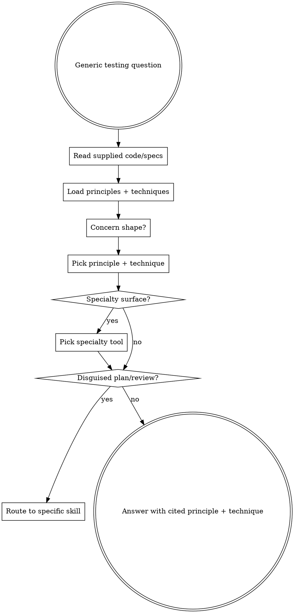

# Answering a testing question

## The Iron Law
NO ANSWER WITHOUT A CITED PRINCIPLE OR TECHNIQUE.

Generic "you should test that" / "add edge case coverage" / "consider security" advice fails the senior-QA bar. Every answer ties to a named ISTQB principle, a named test design technique, or a named specialty tool from the loaded catalogue.

## When to Use

`qa-deciding-approach` routes here when the user's intent is question-shaped but doesn't fit a more specific skill:

- "how do I test this service?"
- "what should I check for X feature?"
- "any QA suggestions for this design?"
- "what's the right test type for this?"

For "create a plan" / "prep for work" / "review my changes" → use the more specific skills.

## Checklist
You MUST create a TodoWrite item per checklist item and complete in order:

1. Read the user's question verbatim.
2. Read any code/paths/specs the user supplied (host's file tools).
3. Call `sumo_qa_load_principles()` and `sumo_qa_load_techniques()`. Read both catalogues.
4. Identify the QA shape the question implies: what's the actual concern (correctness / regression / coverage / risk surface)?
5. Pick at least one principle that shapes the answer (cite by number or name). Pick at least one technique that fits the concern.
6. Call `sumo_qa_load_specialty_tools()` if the question implies a specialty surface (security, performance, contract, etc.). Pick a tool from the catalogue.
7. Synthesise the answer: 3-7 sentences, naming the principle/technique/tool. Conversational, not a JSON blob.
8. If the question is actually a prep/plan/review/strategy in disguise, escalate: stop, route to the matching skill.

## Process Flow

## Red Flags

| Thought | Reality |
|---|---|
| "Just say 'add unit tests and integration tests'" | Generic. Pick a technique from the catalogue (boundary value, decision table, etc.). |
| "Mention security as a consideration" | Pick a specialty tool from the catalogue if a security surface is implied (OWASP ZAP for HTTP, Semgrep for SAST, JJWT for token TTL). Bare "consider security" is not senior-QA. |
| "I'll cite a principle by paraphrasing — saves loading the catalogue" | Catalogue is authoritative. Use its wording. |
| "User asked a planning question — I'll answer inline" | Route to `qa-preparing-for-work` or `qa-creating-test-plan`. Don't reinvent. |
| "Answer should be 20+ sentences for completeness" | 3-7 sentences. Senior QA answers concisely. |

## Examples

### Good

User: "how should I test a new feature that re-orders user feeds?"
- Concern: business_logic_change + frontend_change. Risk shapes: correctness of ordering rules, regression on existing ordering, performance under high feed volume.
- Principle: ISTQB Principle 4 (defects cluster — feed ordering is a hotspot for regressions).
- Technique: decision table for the ordering rules; equivalence partitioning for feed sizes.
- Specialty: k6 if performance matters at scale.
- Answer: 4 sentences citing Principle 4, naming decision-table and equivalence-partitioning techniques, suggesting k6 if scale is a concern, asking the user to confirm scale before adding performance work.

### Bad

Same user.
"You should add unit tests, integration tests, and consider edge cases. Maybe test performance too."
- No cited principle. No named technique. No specialty tool from the catalogue. Senior-QA bar failed.
