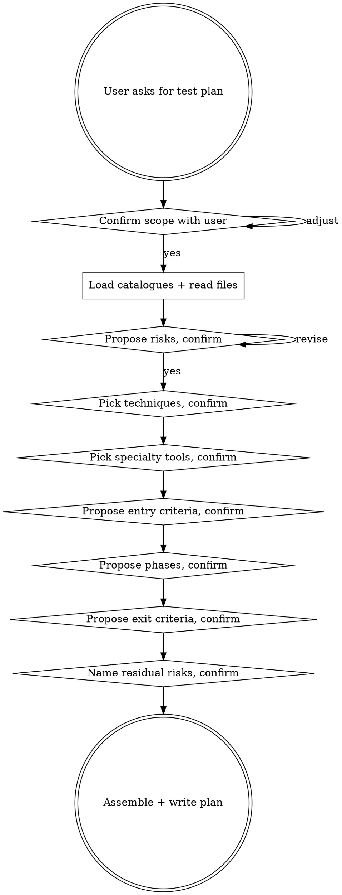

# Creating a Test Plan

Help the user turn a piece of upcoming work into a phased ISTQB-style test plan through natural collaborative dialogue. Walk through scope, risks, criteria, and phases one section at a time, confirming with them after each, until the full plan is on the page. The user has domain context the AI can't infer — surface it through questions, don't assume it.

**Announce at start:** *"I'm using qa-creating-test-plan to walk scope → entry → phases → exit one section at a time. No plan ships without entry AND exit criteria."*

<HARD-GATE>
Do NOT emit a test plan in a single message. Walk through the sections one at a time, getting the user's confirmation or correction between each. A test plan dumped in one turn is a wishlist; a test plan built collaboratively is reviewable.
</HARD-GATE>

## The Iron Law

**NO PLAN WITHOUT EXPLICIT ENTRY AND EXIT CRITERIA.**

A document missing either is a wishlist, not a plan. Senior QA writes plans that say what must be true to start testing and what must be true to ship.

## Anti-Pattern: "This Change Is Too Small To Need A Plan"

Every formal test-plan request goes through this process. A new validation rule, a refactor with a contract surface, a feature flag rollout — all of them. "Small" changes are where unexamined assumptions ship as production defects. The plan can be short (a paragraph per section for genuinely small work), but you MUST present each section and get confirmation.

## When to Use

User intents that trigger this skill:

- "create a test plan for X"
- "draft the formal QA plan I should follow"
- "give me entry/exit criteria for X"
- "I'm starting a major feature — plan QA properly"

Distinct from `qa-preparing-for-work` (lighter prep brief, no formal entry/exit gates) — use this when the work is tracked, formally reviewed, or large enough to warrant phased execution.

## Checklist

You MUST work through these in order. Steps 1–3 are AI-only homework (no user questions). The user's confirmation gates steps 4 onward.

1. **Extract scope hints from intent** *(no user question)* — re-read the user's intent verbatim. Identify the keywords / paths / domain terms that point at where the work lives (e.g. "bundle validation" → look for bundle validator code; "refund endpoint" → look for refund routes).

2. **Walk the repo for the scope** *(no user question)* — use the host's file tools. Find (a) where the relevant production code lives (file paths, class names), (b) existing tests around it, (c) related callers / consumers, (d) any obvious classification signal (HTTP surface? pure logic? config? data migration?). Don't ask the user where things are — find them yourself.

3. **Load the catalogues** *(no user question)* — call `sumo_qa_load_standards(classification=...)`, `sumo_qa_load_rules(classification=...)`, `sumo_qa_load_techniques()`, `sumo_qa_load_specialty_tools()`. Internal only; don't dump the raw catalogues to the user.

4. **Confirm scope, only for the AMBIGUOUS parts** — present a short paragraph of what you FOUND (e.g. *"I found the bundle validator at `domain/services/BundleVariantValidator.kt` with existing tests in `domain/services/BundleVariantValidatorTest.kt`; it's invoked by `CatalogueUpdateMessageProcessor`. Looks like the validation lives in `by-variant-data-feeder`, not upstream."*). Then ask ONE focused question for whatever the code DIDN'T make clear (e.g. *"is this scope correct, or should I also cover the upstream catalogue-service path?"*). If exploration left nothing genuinely ambiguous, skip the question entirely and move to step 5.

5. **Propose named risks (one message, ask after)** — present 3–7 named risks, each anchored in evidence you actually saw (file path, class name, domain term from the user's words). NOT generic ("edge cases"). Ask: *"do these match how you'd describe the risks? add / remove / refine?"* Wait for the user.

6. **Pick technique per risk** — for each confirmed risk, name one technique from `techniques.md` (boundary value, decision table, state transition, property-based, etc.). Present as a table: risk → technique. Ask: *"do these technique choices fit?"*

7. **Recommend specialty tools (if any), and offer to set them up** — for each confirmed risk, pick the best-fit tool from your knowledge of the ecosystem anchored to the user's stack. The `specialty_tools.md` primer is a category check (does mutation testing actually fit? does DAST apply?), NOT a brand whitelist — recommend whatever genuinely fits, even if not listed. Verify currency with web search if you're unsure a tool still exists or hasn't been renamed. The tool is just the means to coverage — **offer to install and set it up yourself** (package manager install, framework init, config edit, scaffolded first tests against the named risks), via whichever path is shortest for that tool (an MCP server for the tool if one makes setup easier, otherwise the project's package manager / CLI). Confirm before installing dependencies. Empty list is acceptable. Ask: *"any tools I should drop or add? if you want, I can install [tool] and scaffold the first tests against [risk] now."*

8. **Entry criteria — what must be true to START testing** — propose 3–5 observable preconditions (API spec frozen, test data loaded, feature flag default off, etc.). Ask: *"any I'm missing? any that don't apply?"*

9. **Phases + deliverables** — propose analysis / design / execution / completion phases with concrete deliverables per phase. Ask: *"phase shape look right? anything to add or split?"*

10. **Exit criteria — what must be true to SHIP** — propose observable exit criteria (all named risks have ≥1 passing test, no Sev-1/2 open, perf under p95 budget, etc.). Tautologies like "tests pass" are forbidden. Ask: *"do these match what you'd defend in a release review?"*

11. **Residual risks accepted at exit** — every plan has them. Name 1–3 risks you're NOT covering and why (out of scope, accepted cost, mitigated elsewhere). Ask: *"is this honest? add anything?"*

12. **Final plan** — assemble the confirmed sections into one document. Offer to write to a file (e.g. `docs/qa-plans/<topic>.md`) or surface inline. Confirm with the user before writing.

## Process Flow

## Key Principles

- **Explore before you ask.** Never ask the user a question whose answer is in the code. Walk the repo first, then ask only what exploration genuinely couldn't surface.
- **One section per turn.** Do NOT bundle multiple sections into one message. The user's confirmation gates the next.
- **One primary question per turn.** Batching multiple questions overwhelms the user. Ask the most important one; the next follows after their answer.
- **Ask only for what the AI can't infer.** Process / business / team-policy context (e.g. "are we shipping behind a flag?", "what's our p95 budget?") — yes, ask. Code structure ("where does X live?") — find it yourself.
- **Anchor every risk to evidence.** A risk that doesn't cite a file path, classification, or domain term you actually read is generic; rewrite it.
- **Prefer multiple-choice when possible.** *"Should this be boundary value or property-based testing?"* is easier than open-ended *"what technique do you want?"*.
- **Techniques are catalogue-authoritative; tool brands are training-primary.** Test design techniques come from `techniques.md` (boundary value, decision table, property-based, mutation — stable concepts). Tool brand recommendations come from your knowledge of the ecosystem anchored to the user's stack — `specialty_tools.md` is a category-fit primer, not a brand whitelist. If a needed technique isn't catalogued, flag it as a gap; if a needed tool isn't in the primer, just recommend it (and verify it exists via web search if uncertain).
- **The tool is just the means to coverage — set it up, don't narrate the steps.** Once a tool is chosen, offer to install and set it up yourself (package manager / framework CLI / config edit / MCP server — whichever path is shortest) and write the first tests against the named risks. Confirm before installing dependencies; default to doing the actual work once confirmed.

## Red Flags — STOP and rework

| Thought | Reality |
|---|---|
| "I'll draft the whole plan and they can react" | Iron-Law-adjacent failure. Walk through one section at a time. |
| "I'll ask the user where the code lives instead of looking" | The code is in the repo. Read it. Ask only for what the code didn't make clear. |
| "I'll list 4 clarifying questions in one message to be thorough" | Overwhelming. ONE primary question per turn. The next follows their answer. |
| "Skip exit criteria — they'll know when it's done" | Then it's not a plan. Iron Law violated. |
| "Entry criteria: 'tests are green'" | Tautology. Entry criteria are about the world before testing — feature complete, data available, environments stand up. |
| "Add a phase called 'edge cases'" | Phases are analysis / design / execution / completion. "Edge cases" is a phase only in a junior QA's plan. |
| "Residual risks: 'none'" | Every plan has residual risks. Naming "none" means you didn't think about what could still go wrong post-ship. |
| "Mutation testing on a UI redesign" | Wrong tool fit. Pick from the catalogue based on the actual risk surface. |
| "Tests cover all behaviour" | "All behaviour" is not measurable. Exit criteria must be observable (coverage %, named risks covered, defect counts). |
| "User said create a plan — I'll just create it without asking" | The user has context you don't. Walk through the sections; their corrections shape the plan. |
| "I'll surface 'Classification: X' / 'Approach: Y' / 'Anchored to evidence I read' in the output" | Internal scaffolding. Burns tokens, adds noise. Translate to natural English when useful; keep file:line citations the user can verify. |

## Examples

### Good (explore first, ask only what's ambiguous)

> **User:** "Create a test plan for the new tax-calculation feature."
>
> **AI (steps 1–3, internal — no user question):** searches the repo for "tax", finds `tax/TaxEngine.kt`, `tax/jurisdictions/*.kt`, existing `TaxEngineTest.kt`, upstream `pricing/Calculator.kt` invokes it, downstream `invoicing/InvoiceBuilder.kt` consumes it. Loads classifications + techniques + specialty-tools catalogues.
>
> **AI (step 4, scope confirmation):** *"Found the tax engine at `tax/TaxEngine.kt` with jurisdiction handlers under `tax/jurisdictions/`. It's called from `pricing/Calculator.kt` upstream, and `invoicing/InvoiceBuilder.kt` consumes the result downstream. Existing tests in `tax/TaxEngineTest.kt` cover 4 jurisdictions. **Is the plan scope just the tax engine, or should it also cover the upstream pricing-pipeline integration and downstream invoicing?**"*
>
> **User:** *"Tax engine and upstream pricing pipeline. Invoicing is out of scope."*
>
> **AI (step 5, named risks):** *"5 named risks: (1) regional rate not applied for the 3 new jurisdictions added in this change; (2) compound tax double-counted in DE/AT where stacking applies; (3) refund recalc on a partially-refunded order uses a stale rate (cited: TaxEngine.refundRate path); (4) decimal precision loss converting EUR→GBP→USD before tax (cited: Calculator.currencyConvert); (5) audit trail missing for tax-recalc events (no logger in TaxEngine.recalculate currently). **Add / remove / refine?**"*
>
> *(continues through techniques, entry, phases, exit, residual — one section per turn)*

### Bad (asking what's in the code)

> **User:** "Create a test plan for the new tax-calculation feature."
>
> **AI:** *"Before I can plan, I have some clarifying questions: (1) Where in the codebase does the tax calculation live? (2) What service handles it? (3) Are there existing tests? (4) Is it called from upstream or only internally?"*
>
> All four questions are answerable by reading the repo. The AI should have explored first and surfaced what it found, then asked only the genuinely-ambiguous *"is invoicing in scope or out?"* question.

### Bad (single-shot dump)

> **User:** "Create a test plan for the new tax-calculation feature."
>
> **AI:** *"Here's a plan: Phases — planning, testing, deployment. Tests — happy path, edge cases, integration. Entry criteria — code complete. Exit — tests pass. Done."*
>
> Generic phases, no risks named, tautological exit, no user collaboration. Iron Law violated.

## Next skill in the chain

When the plan is signed off → `qa-planning-qa-rollout` to break the phases into bite-sized, dispatchable tasks ready for subagent execution.

If the user wants to act on a single phase directly rather than dispatch it → route to the matching execution skill instead (`qa-implementing-with-tdd` for new behaviour / regressions, `qa-strengthening-tests` for mutation follow-up, `qa-reviewing-before-merge` for review-shaped phases).
