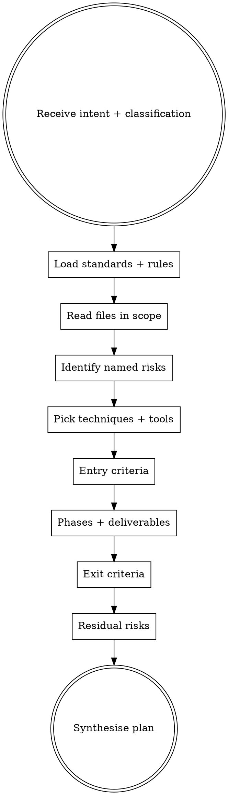

# Creating a Test Plan

## The Iron Law
NO PLAN WITHOUT EXPLICIT ENTRY AND EXIT CRITERIA.

A document missing either is a wishlist, not a plan. Senior QA writes plans that say what must be true to start testing and what must be true to ship.

## When to Use

User intents that trigger this skill:

- "create a test plan for X"
- "draft the formal QA plan I should follow"
- "give me entry/exit criteria for X"
- "I'm starting a major feature, plan QA properly"

Distinct from `qa-preparing-for-work` (lighter prep brief) — use this when the work is tracked, formally reviewed, or large enough to warrant phased execution.

## Checklist
You MUST create a TodoWrite item per checklist item and complete in order:

1. Read the user's intent and target paths.
2. Call `sumo_qa_load_standards(classification=...)` and `sumo_qa_load_rules(classification=...)` for the classification settled in `qa-deciding-approach`.
3. Read the actual files in scope using the host's file tools.
4. Identify 3-7 named risks, anchored in evidence (paths, classifications, domain terms).
5. Call `sumo_qa_load_techniques()`. Pick one technique per risk.
6. Call `sumo_qa_load_specialty_tools()`. Pick tools that fit (any quality improvement). Empty list acceptable.
7. Define entry criteria — what MUST be true before testing starts (e.g. "API spec frozen", "test data set X available", "feature flag default off in non-prod").
8. Define phases — analysis / design / execution / completion — each with concrete deliverables.
9. Define exit criteria — what MUST be true to ship (e.g. "all named risks have at least one passing test", "no Sev-1 or Sev-2 open defects", "performance budget under 200ms p95").
10. List residual risks accepted at exit (every plan has them; naming them is honest senior-QA).
11. Synthesise the plan inline. Conversational, sectioned. No JSON blob.

## Process Flow

## Red Flags

| Thought | Reality |
|---|---|
| "Skip exit criteria — they'll know when it's done" | Then it's not a plan. Iron Law violated. |
| "Entry criteria: 'tests are green'" | Tautology. Entry criteria are about the world before testing — feature complete, data available, environments stand up. |
| "Add a phase called 'edge cases'" | Phases are analysis / design / execution / completion. "Edge cases" is a phase only in a junior QA's plan. |
| "Residual risks: 'none'" | Every plan has residual risks. Naming "none" means you didn't think about what could still go wrong post-ship. |
| "Mutation testing on a UI redesign" | Wrong tool fit. Pick from the catalogue based on the actual risk surface. |
| "Tests cover all behaviour" | "All behaviour" is not measurable. Exit criteria must be observable (coverage %, named risks covered, defect counts). |

## Examples

### Good

User: "create a test plan for the new tax-calculation feature."
- Classification: `business_logic_change` (cited word: "tax-calculation").
- Risks: (1) regional tax rate not applied for new jurisdictions. (2) compound tax (tax-on-tax) double-counted. (3) refund recalc on a partially-refunded order uses stale rates. (4) decimal precision loss on currency conversion before tax. (5) audit trail missing for tax recalculation events.
- Techniques: decision table (1), boundary value analysis (4), state transition testing (3), checklist-based testing (5).
- Entry: tax rules v2 signed off; test data set for new jurisdictions loaded; audit logging endpoint stub deployed.
- Phases: analysis (review tax rules with finance), design (test data per jurisdiction), execution (run scenarios), completion (sign-off with finance).
- Exit: all 5 named risks have at least one passing test; no Sev-1/2 open defects; audit-log entries verified against finance's spec; performance under 50ms per calculation.
- Residual: tax-law changes mid-quarter aren't covered — accepted because feature flag gates rollout.

### Bad

Same user.
"Phases: planning, testing, deployment. Tests: cover all behaviour. Exit: tests pass."
- Generic phases, no risks named, exit criteria not observable. Iron Law violated.
