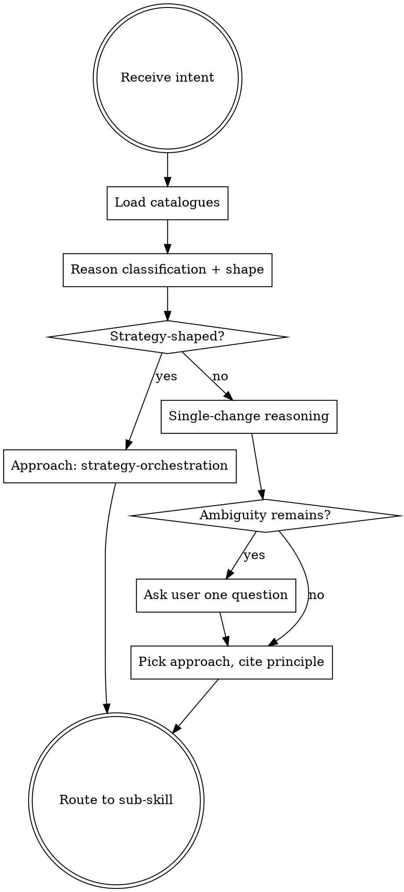

# Deciding the QA approach

**Announce at start:** *"I'm using qa-deciding-approach to pick the right approach for this change shape."*

## The Iron Law
SHAPE FIRST.

Decide single-change vs repo-wide vs no-tests-recommended *before* picking a per-change approach. Wrong shape = wrong-shaped tests.

## When to Use

`using-sumo-qa` routes to this skill on every QA-shaped intent. This skill ALWAYS runs before any other QA skill. Even simple intents pass through it — the canonical approaches include `no-tests-recommended` and `verify-existing` for cases that don't merit new tests.

## Checklist
You MUST create a TodoWrite item per checklist item and complete in order:

1. Read the user's intent verbatim and any supplied target paths.
2. Call `sumo_qa_load_classifications()` and `sumo_qa_load_approaches()`. Read both catalogues.
3. Call `sumo_qa_load_principles()` if a principle citation is needed in the output.
4. Reason about classification: which of the 10 catalogue entries apply to this intent? Cite the words / paths internally.
5. Reason about shape: single change vs repo-wide / strategy ask vs config tweak vs docs-only? Strategy-shaped asks ("audit", "strategy", "pyramid", "rollout") route to `strategy-orchestration` — do NOT force per-change output.
6. Pick the approach. The catalogue is authoritative; describe a new one only when none fits, with rationale.
7. If a real ambiguity remains (e.g. user said "test the thing" with no paths and no domain), ask ONE clarifying question to the user. Otherwise, do not ask.
8. Return INTERNALLY: `{approach, classification, rationale (1-3 sentences citing one ISTQB principle), next_action: {skill: <name>}}` — this is routing data the next skill consumes, NOT user output. Route to the named sub-skill silently; the sub-skill produces what the user sees. Do NOT echo "Classification: X" or "Approach: Y" to the user — the taxonomy is internal. If the user genuinely needs to know the shape of the work, translate to natural English in one sentence (e.g. *"this is a refactor — characterization tests first"*, not *"Approach: coverage-first-then-refactor"*).

## Process Flow

## Routing table (approach → next skill)

| Approach | Next skill |
|---|---|
| strategy-orchestration | sumo-qa-strategising |
| tdd-scaffold | qa-implementing-with-tdd |
| regression-first | qa-implementing-with-tdd |
| coverage-first-then-refactor | qa-implementing-with-tdd |
| strengthen-test-coverage | qa-strengthening-tests |
| verify-existing | qa-reviewing-before-merge |
| no-tests-recommended | (stop — no sub-skill needed) |
| spike-first-then-tests | qa-preparing-for-work (deliverable mode) |

For "create a test plan" / "plan QA for this story" intents, after approach is picked, route to `qa-creating-test-plan` or `qa-preparing-for-work` per user phrasing. For "how do I test this?" intents that don't fit any specific approach, route to `qa-answering-testing-question`.

## Red Flags

| Thought | Reality |
|---|---|
| "This is obviously TDD" | Maybe. Read the user's words and inferred classification first. "Refactor" implies behaviour-preserving — that's `coverage-first-then-refactor`, not `tdd-scaffold`. |
| "I'll skip loading the catalogues this once" | Catalogue is the source of truth. Inventing approaches from training data is the failure mode this skill exists to prevent. |
| "User said 'design our strategy' — I'll still scaffold tests" | Strategy asks route to `strategy-orchestration`. Don't force per-change output. |
| "Description says docs-only change but I'll add tests anyway" | `no-tests-recommended` is honest senior-QA. Adding tests where none are needed wastes signal. |
| "Mutation testing follow-up needs new prod code" | No — that's `strengthen-test-coverage`. Production code stays unchanged. |
| "I'll ask the user 3 clarifying questions to be sure" | Ask ONE if needed. More than one means the skill is hoarding context; the LLM should infer. |
| "I'll show the user 'Classification: X, Approach: Y, Rationale: …' so they know what I decided" | Internal scaffolding. Route silently. If the work-shape genuinely needs surfacing, translate to one natural-English sentence. |

## Examples

### Good

User: "create a test plan for refactoring the pricing pipeline". 
- Load classifications + approaches.
- Classification: `business_logic_change` (cited word: "pricing"). Modifier: refactor (cited word: "refactoring").
- Shape: single change. Not strategy.
- Approach: `coverage-first-then-refactor` — refactor implies behaviour-preserving; characterization tests must pin behaviour BEFORE the refactor.
- Cite: ISTQB Principle 4 (defects cluster — refactor risks introducing bugs at extraction boundaries).
- `next_action.skill: "qa-creating-test-plan"`.

### Bad

User: "create a test plan for refactoring the pricing pipeline".
Pick `tdd-scaffold` because "test plan" sounds like adding tests. Wrong — refactor needs characterization tests first, not new behaviour scaffolding. The Iron Law (`SHAPE FIRST`) was violated by ignoring "refactoring" in the intent.

## Next skill in the chain

Routes to exactly ONE of the following, based on the approach picked:

- When the intent is *"plan QA for this story"* → `qa-preparing-for-work` to name the risks and propose the smallest useful test set before any code is written.
- When the approach is `tdd-scaffold`, `regression-first`, or `coverage-first-then-refactor` → `qa-implementing-with-tdd` to walk red → hand-off → green with confirmation gates.
- When the approach is `strengthen-test-coverage` → `qa-strengthening-tests` to kill mutation survivors one at a time (production code stays unchanged).
- When the approach is `verify-existing` or the intent is review-shaped → `qa-reviewing-before-merge` to read the diff, name risks, run the suite, deliver the verdict.
- When the user asks for a formal test plan with entry/exit criteria → `qa-creating-test-plan`.
- When the intent is test-data-shaped → `qa-finding-test-data` to route between explain / find / validate / register.
- When the intent is a generic testing question → `qa-answering-testing-question` to cite a principle and technique.
- When the approach is `strategy-orchestration` → `sumo-qa-strategising` to walk the repo and design a phased rollout.
- When the work has 3+ independent tasks needing dispatch → `qa-planning-qa-rollout` to turn the work into a bite-sized, dispatchable plan.
- When the approach is `no-tests-recommended` → stop. No next-skill handoff.
