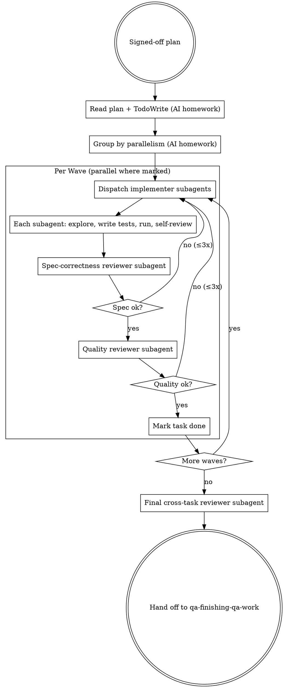

# Executing a QA rollout with subagents

Take a written plan from `qa-planning-qa-rollout` (or a hand-written equivalent at `docs/qa/plans/...`) and execute it by dispatching one fresh subagent per task, then walking each subagent's output through a two-stage review.

**Announce at start:** *"I'm using qa-executing-qa-rollout to dispatch the plan with subagents."*

<HARD-GATE>
Do NOT execute tasks inline. Every task goes to a fresh subagent. The orchestrator (you) does dispatch + review + coordination only — it never edits test files directly. If a subagent fails three times, escalate to the user.
</HARD-GATE>

## The Iron Law

**ONE FRESH SUBAGENT PER TASK. TWO-STAGE REVIEW. CONTINUOUS EXECUTION.**

Fresh subagent because context pollution from previous tasks corrupts judgment. Two-stage review because the implementer is the wrong reviewer of its own work — separate one agent that checks the test catches the right risk (spec/correctness) from another that checks the test is well-shaped (quality). Continuous because *"should I continue?"* between tasks burns the user's attention for no signal.

## Anti-Pattern: "I'll Just Run Task 1 Myself, Subagents Are Overkill"

Subagents are not overkill. They're the discipline that prevents one task's mistakes from poisoning the next. A planner-turned-executor accumulates context, ad-hoc choices, and rationalisations across tasks; a fresh subagent doesn't. Even for a 2-task plan, dispatch them — the cost is small and the reliability gain is real.

## When to Use

Routes here from:
- `qa-planning-qa-rollout` when a plan is signed off
- Direct user invocation: *"execute the QA plan at `docs/qa/plans/...`"*, *"run through the test rollout"*, *"dispatch the QA work"*

For a single-task piece of work, skip this skill — go straight to `qa-implementing-with-tdd` or the matching individual skill.

## Checklist

You MUST work through these in order. Steps 1–2 are AI-only homework. The dispatch loop in step 3 is **continuous**: do NOT pause for user check-ins between tasks. Step 4 only fires when all tasks are done or one is genuinely blocked.

1. **Read the plan** *(no user question)* — load `docs/qa/plans/<plan>.md`. Extract every task verbatim, its approach tag, files, `[parallel]`/`[sequential]` marker, and "done when" criteria. Create a `TodoWrite` entry per task.

2. **Group by parallelism** *(no user question)* — bucket tasks into parallel waves. All `[parallel]` tasks with no upstream dependency form wave 1. Sequential or dependency-blocked tasks form wave 2, 3, etc. Most QA plans collapse to 1–2 waves.

3. **Dispatch loop (per wave, continuous):**
   - **3a. Dispatch implementer subagents** — for each task in the wave, dispatch a fresh subagent using `prompts/implementer-prompt.md` as the system prompt, filling in the task spec. Wave dispatches go in parallel (single message with multiple Agent tool uses).
   - **3b. Spec-correctness review** — after each subagent returns, dispatch a spec-reviewer subagent using `prompts/spec-reviewer-prompt.md`. It checks: does the test cover the named risk? Does it run? Did the red phase happen (if approach was TDD)? Did production code stay unchanged (if approach was strengthen / verify-existing)?
   - **3c. If spec review fails:** dispatch the implementer again with the reviewer's findings. Loop until spec review passes or 3 rounds elapsed (then escalate to user).
   - **3d. Test-quality review** — once spec review passes, dispatch a quality-reviewer subagent using `prompts/quality-reviewer-prompt.md`. It checks: is the assertion observable (not implementation-coupled)? Is the test deterministic? Tautology check?
   - **3e. If quality review fails:** dispatch the implementer with quality findings. Loop until pass or 3 rounds (escalate).
   - **3f. Mark task complete in TodoWrite.** Move to next task / wave. **Do NOT ask the user "continue?".**

4. **Final cross-task review** — when all tasks are done, dispatch a final reviewer subagent with the entire plan + all task outputs, checking: do the tests collectively cover all named risks in the plan? Are there gaps where two tasks overlap but neither covers the seam? Run the full suite; surface counts.

5. **Hand off to `qa-finishing-qa-work`** — pass the plan, the task outputs, and the cross-task review. That skill captures evidence, produces the PR-ready summary, and closes the loop.

## Process Flow

## Model Selection

Match the subagent model to the task shape — cheaper models for mechanical work, capable models for review:

- **Test-writing subagents** (clear spec, 1–2 files): fast/cheap model (e.g., haiku). Most plan tasks are mechanical when the plan is bite-sized.
- **Spec-correctness reviewer**: standard model. Needs to read code AND assess whether the test catches the named risk.
- **Quality reviewer**: capable model. Tautology checks and observability judgments need real reasoning.
- **Final cross-task reviewer**: capable model. Most important review — guards the whole plan's integrity.

The Agent tool's `model` parameter (`haiku` / `sonnet` / `opus`) is your dial.

## Key Principles

- **Fresh subagent per task** — no context inheritance. The implementer subagent gets only: the one task spec, the plan's "files" + "risks" context, and the implementer prompt template. Nothing else from your session.
- **Two-stage review, not one** — spec (catches the right risk?) and quality (well-shaped test?) are different questions. One reviewer doing both is two reviewers doing neither well.
- **Continuous execution** — do not pause to ask the user "continue?" between tasks. The plan is the user's pre-authorisation. Stop only on: (a) genuine blocker the orchestrator cannot resolve, (b) all tasks complete, (c) 3 failed review cycles on the same task.
- **Parallel where the plan says so** — `[parallel]` tasks dispatch in one message with multiple Agent tool uses. Sequential ones go one after another. Don't manufacture sequencing where the plan didn't.
- **Production code stays clean (when the approach says so)** — `strengthen-test-coverage` and `verify-existing` tasks must NOT edit production. The spec reviewer enforces this — if it sees prod edits in a strengthen-task, fail it.

## Red Flags — STOP and rework

| Thought | Reality |
|---|---|
| "I'll just do task 1 inline — subagents are overkill for 3 tasks" | Iron Law violated. Even small plans get fresh subagents per task. The discipline matters more than the savings. |
| "I'll combine spec + quality into one review subagent to save time" | Two reviews because they ask different questions. One agent doing both inevitably skimps on one. |
| "Task 3 mentioned task 2's fixture; I'll inherit context to skip re-explanation" | No. Fresh subagent. Re-explain via the prompt template; the small repetition cost beats the context-pollution risk. |
| "Let me pause after task 2 and ask the user if the direction's right" | Continuous execution. The user signed off the plan; mid-plan check-ins waste their attention. |
| "Spec review came back with 2 issues; I'll fix one, push the other to task 5" | Don't. The reviewer found 2 issues in this task — fix both before moving on. |
| "Production code changed in a strengthen-test-coverage task — it was a tiny refactor" | Reject the subagent's output. The Iron Law of `qa-strengthening-tests` is non-negotiable; production stays clean. |
| "All tasks done; I'll just summarise and finish" | Cross-task review first, then route to `qa-finishing-qa-work`. Don't skip the final integrity check. |

## Examples

### Good (parallel wave 1, then sequential wave 2)

> **User:** *"Execute the plan."*
>
> **AI (announce):** *"I'm using qa-executing-qa-rollout to dispatch the plan with subagents."*
>
> **AI (steps 1–2, internal):** reads `docs/qa/plans/2026-05-12-billing-refund-coverage.md`. 6 tasks. Tasks 1–5 marked `[parallel]`; task 6 marked `[sequential]` depending on task 1's fixture module.
>
> **AI (step 3a, wave 1 — single message with 5 parallel Agent tool calls):** dispatches 5 implementer subagents, one per task. Each gets only its task spec + the plan's "files" + "risks" header + the `implementer-prompt.md` template. None inherit conversation context.
>
> **AI (per returning subagent, steps 3b–3f):**
> - Task 1 returns. Dispatch spec-reviewer → passes (covers R1, red phase happened). Dispatch quality-reviewer → flags assertion as `_internal_state`-coupled. Dispatch implementer with quality feedback. Returns. Quality passes. Mark done.
> - Tasks 2, 3, 5 follow the same pattern. Task 4's spec review fails on first round (test missed R4's seam case); re-dispatched implementer fixes it; passes round 2.
>
> **AI (wave 2):** task 6 dispatches now that task 1's fixture is committed. Two-stage review runs as before.
>
> **AI (step 4):** dispatches final cross-task reviewer with all 6 task outputs + the plan. Reviewer confirms: all 5 risks covered, no two tasks overlap on the same risk, full suite green (47 passed, 1 xfailed).
>
> **AI (step 5):** *"All 6 tasks complete with two-stage review. Cross-task reviewer signed off. Routing to `qa-finishing-qa-work` for evidence capture + PR-ready summary."*

### Bad (inline execution + skipped reviews)

> **User:** *"Execute the plan."*
>
> **AI:** edits `tests/billing/test_refund.py` directly with the first 3 tasks' tests; runs pytest; reports green.
>
> Iron Law violated three ways: no fresh subagents, no spec/quality reviews, context-polluted execution. The work might look done but there's no evidence the tests catch the named risks, and the next person picking up the plan has no audit trail.

## Next skill in the chain

After cross-task review passes → `qa-finishing-qa-work` to capture evidence, write the PR-ready summary, and close the loop.
