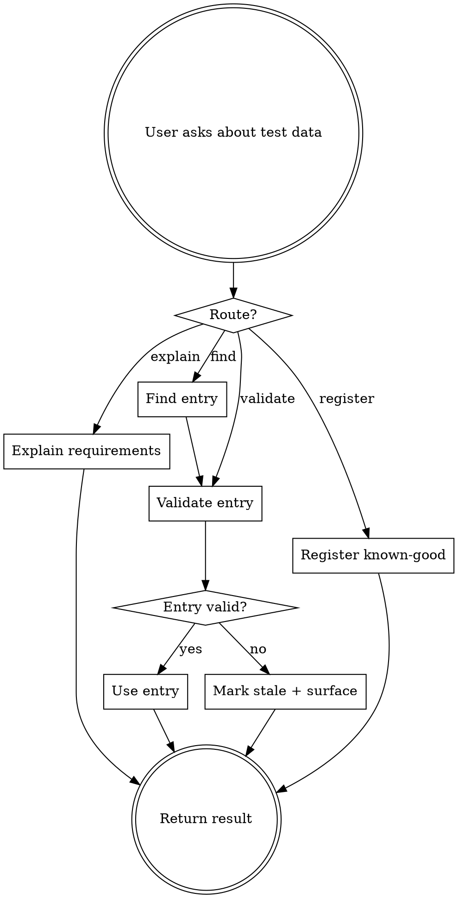

# Finding test data

## The Iron Law

**STALE IS A DEFECT. NEVER INVENT ENTRIES NOT IN THE CATALOGUE.**

A known-good record the catalogue can't validate is a defect, not a usable test data point. Inventing a SKU "that should work" is junior-QA failure mode — when it doesn't work mid-test, you've wasted time and possibly corrupted state. Validation is the proof, not ceremony: a catalogued entry that hasn't been re-validated against the source system in this turn is no better than an invented one.

## When to Use

User intents that trigger this skill:

- "what test data do I need for X"
- "find me a known-good record for X"
- "is this record / account / fixture still valid"
- "save this as known-good test data"
- "I need a locked account for the failed-login test"
- "I need a pending invoice for the due-date boundary test"

## Checklist

You MUST create a TodoWrite item per checklist item and complete in order. Steps 1–2 are AI-only homework (route the request, gather inputs from prior conversation). The user's confirmation gate only applies to **register** (step 5b) — writing to the shared catalogue is a side effect that should always pause for confirmation.

1. **Pick the route** *(no user question — derive from intent)*. The four routes are routing data the LLM consumes, NOT a label to echo at the user:
   - **Explain requirements:** "what data do I need" → `sumo_qa_explain_test_data_requirements`
   - **Find:** "find me a record" → `sumo_qa_find_test_data`
   - **Validate:** "is this still valid" → `sumo_qa_validate_test_data`
   - **Register:** "save this as known-good" → `sumo_qa_register_known_good_test_data`
2. **Gather inputs from intent + prior conversation** *(no user question if the conversation has them)*. Question, environment, domain, criteria, entry path — pull from what's already been said. Only ask if a genuinely required field is missing, and ask ONCE.
3. **For explain:** call the tool. Return the requirements as text in natural English.
4. **For find:** call the tool with the gathered criteria. If matches: pipe each into validate (step 5a). If no matches: say so explicitly — do NOT invent and do NOT silently broaden the criteria.
5. **For validate:**
   - **5a (from find or direct):** call `sumo_qa_validate_test_data` against the source system in this turn. A cached or memorised result is not fresh. Report state with timestamp + the validation evidence.
   - **5b (register):** confirm with the user before writing to the catalogue. Show the entry, the validation evidence, and ask: *"Register this as known-good?"* Only write on explicit yes.
6. **If an entry fails validation:** mark it stale, surface the failure to the user, do NOT silently substitute another entry. The user decides whether to find an alternative or register a new one.

## Process Flow

## Red Flags

| Thought | Reality |
|---|---|
| "I'll just make up a SKU that probably works" | Iron Law violated. Catalogue entries only. |
| "Validation is expensive — assume it's still good" | Stale is a defect. Always validate against the source system in this turn, especially for shared catalogues. |
| "User said 'find me one' — I'll skip validation" | Validate. The whole point of the catalogue is freshness. |
| "Register this as known-good without testing it first" | Don't. Register only after the user has confirmed the entry was used successfully — and confirm again before writing to the catalogue. |
| "If no entry matches, I'll fabricate one" | Surface the gap. The user might need to register a new entry — let them decide. |
| "I'll surface 'Route: validate' / 'Step 3 of checklist' to the user so they know what I'm doing" | Internal scaffolding. Route labels are how the LLM dispatches; the user sees the WORK (the entry found + validation evidence + freshness timestamp). Translate to natural English when surfacing is genuinely useful — *"checking the catalogue for refund-eligible orders…"* not *"Route: find"*. |
| "Found entry failed validation — let me silently grab the next one" | No. Surface the failure to the user with the entry that went stale; let them pick the alternative. Silent substitution hides drift in the catalogue. |

## Examples

### Good (find → validate → surface)

> **User:** *"find me a refund-eligible order for the refund-flow test."*
>
> **AI (internal — steps 1–2):** route=find; question="refund-eligible order"; environment=staging (from prior turn); domain=orders.
>
> **AI (step 4):** calls `sumo_qa_find_test_data(question="refund-eligible order", environment="staging", domain="orders", criteria=...)`. Returns 2 entries: A (`ORD-77821`) and B (`ORD-77900`).
>
> **AI (step 5a):** validates each against staging now. A: still refund-eligible (timestamp `2026-05-12T09:14Z`). B: stale — already refunded on 2026-05-10.
>
> **AI (user-facing):** *"Found `ORD-77821` — refund-eligible, validated against staging just now (2026-05-12 09:14). `ORD-77900` is in the catalogue too but is now stale (already refunded on 2026-05-10); flagging it so we can register a replacement later."*

Note what's NOT in the user-facing message: "Route: find", "Step 5a", "Per the checklist". The user sees the result + the freshness evidence, not the dispatch labels.

### Good (register pauses for confirmation — different domain shape)

> **User:** *"save invoice `INV-44120` as known-good for the due-date boundary test."*
>
> **AI (step 5b):** validates `INV-44120` against staging — pending invoice, due date `2026-05-20`, amount `$320.00`, status matches the boundary scenario. Captures evidence.
>
> **AI (user-facing):** *"Validated `INV-44120` against staging just now — pending invoice, due date 2026-05-20, amount $320.00, status fits the boundary scenario. **Register this as known-good for the due-date boundary test?** I'll write to `knowledge/test_data/billing/` only on your yes."*

Validation happens automatically; the catalogue write pauses for explicit confirmation. Note this works for any domain — the previous example was order-shaped, this one is billing-shaped, the tool doesn't care.

### Bad (inventing)

> **User:** *"find me a refund-eligible order."*
>
> **AI:** *"Try `ORD-12345` — that should work for refund testing."*

Inventing an entry. Iron Law violated. If `ORD-12345` doesn't exist or has already been refunded, the test fails for the wrong reason and the user loses trust in everything else the AI says.

### Bad (silent substitution)

> **User:** *"validate `ORD-77900` and use it for the refund test."*
>
> **AI:** *(internally finds `ORD-77900` is stale, silently substitutes `ORD-77821` from the catalogue without telling the user)* *"Here you go — order ready for the refund test."*

The substitution hides drift in the catalogue. The user should hear *"`ORD-77900` is stale (refunded on 2026-05-10); `ORD-77821` is fresh — use that one?"* and decide.
