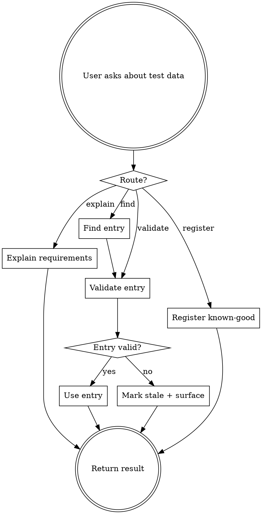

# Finding test data

## The Iron Law
STALE IS A DEFECT. NEVER INVENT ENTRIES NOT IN THE CATALOGUE.

A known-good record the catalogue can't validate is a defect, not a usable test data point. Inventing a SKU "that should work" is junior-QA failure mode — when it doesn't work mid-test, you've wasted time and possibly corrupted state.

## When to Use

User intents that trigger this skill:

- "what test data do I need for X"
- "find me a known-good record for X"
- "is this SKU still valid"
- "save this as known-good test data"
- "I need a fulfilment-eligible order for the refund test"

## Checklist
You MUST create a TodoWrite item per checklist item and complete in order:

1. Read the user's intent. Identify which of the four routes applies:
   - **Explain requirements:** "what data do I need" → `sumo_qa_explain_test_data_requirements`
   - **Find:** "find me a record" → `sumo_qa_find_test_data`
   - **Validate:** "is this still valid" → `sumo_qa_validate_test_data`
   - **Register:** "save this as known-good" → `sumo_qa_register_known_good_test_data`
2. For explain: provide the question, environment, and domain. Return the requirements as text.
3. For find: provide the question, environment, domain, criteria. Return matching entries. If none match, say so — do NOT invent.
4. For validate: provide the entry path. Run validation against the source system if reachable. Report fresh state — never assume.
5. For register: only after the user confirms the entry is genuinely known-good and validated. Write to the catalogue.
6. If a found entry fails validation, mark it stale. Surface the failure. Do not silently use it.

## Process Flow

## Red Flags

| Thought | Reality |
|---|---|
| "I'll just make up a SKU that probably works" | Iron Law violated. Catalogue entries only. |
| "Validation is expensive — assume it's still good" | Stale is a defect. Always validate before use, especially for shared catalogues. |
| "User said 'find me one' — I'll skip validation" | Validate. The whole point of the catalogue is freshness. |
| "Register this as known-good without testing it first" | Don't. Register only after the user confirms it's been used successfully. |
| "If no entry matches, I'll fabricate one" | Surface the gap. The user might need to register a new entry — let them decide. |

## Examples

### Good

User: "find me a refund-eligible order for the refund-flow test."
- Route: find.
- Call `sumo_qa_find_test_data(question="refund-eligible order", environment="staging", domain="orders", criteria=...)`.
- Returns: 2 entries.
- For each, call `sumo_qa_validate_test_data` against staging. Entry A: still valid. Entry B: stale (order has been refunded).
- Return entry A with timestamp + validation evidence. Flag entry B as stale.

### Bad

Same user.
"Try order ID 12345 — that should work for refund testing."
- Inventing an entry. Iron Law violated. If 12345 doesn't exist or is already refunded, the test fails for the wrong reason and the user loses trust.
