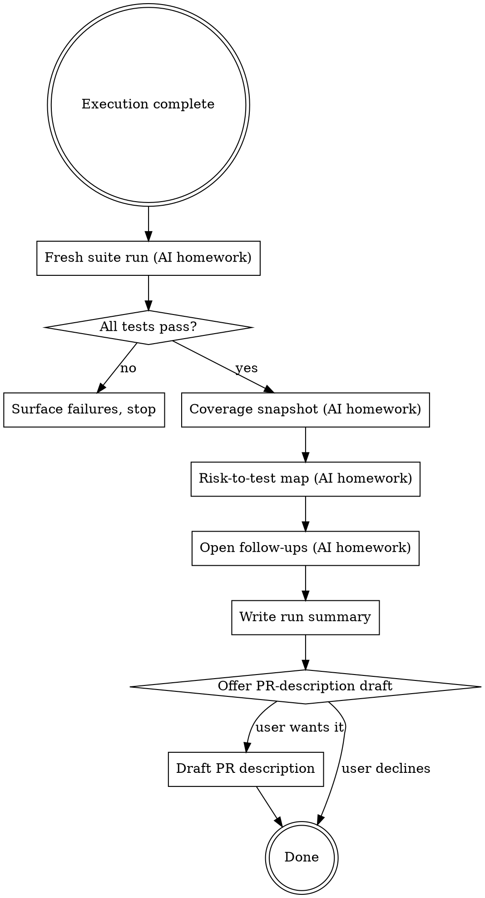

# Finishing QA work

Close the loop on a QA rollout. The execution is done; now the user needs evidence they can show their team / their reviewer / their PR.

**Announce at start:** *"I'm using qa-finishing-qa-work to capture evidence and write the PR-ready summary."*

<HARD-GATE>
Do NOT mark the work finished or claim "QA done" without a fresh test run in this turn. Stale "CI was green when I dispatched" is not finishing evidence.
</HARD-GATE>

## The Iron Law

**NO FINISH WITHOUT FRESH EVIDENCE + WRITTEN SUMMARY.**

A QA rollout that ends with *"I think it's good"* is not finished — it's abandoned. The deliverable is a written summary another engineer could read tomorrow and know: what was covered, what wasn't, what to do next.

## When to Use

Routes here from:
- `qa-executing-qa-rollout` after cross-task review passes
- Direct invocation: *"wrap this up"*, *"give me the PR summary"*, *"finish the QA work"*, *"what evidence do I have"*

Don't use for a single-test piece of work — there's nothing to wrap up.

## Checklist

You MUST work through these in order. Steps 1–4 are AI-only homework. Step 5 is the user-facing summary; step 6 gates the optional PR-description drafting.

1. **Fresh full suite run** *(no user question)* — host's test runner (`uv run pytest`, `npm test`, `mvn test`, whatever this repo uses). Capture: total, passed, failed, skipped, duration. If any fail: surface the failures, do NOT proceed to summary. The user must address failures before finishing.

2. **Coverage snapshot** *(if a coverage tool exists)* — run `pytest --cov` / `jest --coverage` / equivalent and capture the per-file numbers for files in the plan's "files touched". If no coverage tool is configured, skip; don't fabricate numbers.

3. **Risk-to-test map** *(no user question)* — for each risk in the plan, identify the covering test(s) (file + test name). Flag any risk with no covering test. A risk with no test is a `KNOWN GAP` line in the summary — surface it honestly.

4. **Open follow-ups** *(no user question)* — anything the plan flagged for later, anything the cross-task review surfaced, any stale `xfail` markers that should now pass / be removed. List them; don't hide them.

5. **Write the run summary** — to `docs/qa/runs/YYYY-MM-DD-<feature-slug>.md`. Use the template in **Summary Document Template** below. Then surface it to the user verbatim with: *"Run summary at `docs/qa/runs/...`. Suite green; N tests added; M risks covered; K known gaps. Anything to add before this is the record?"*

6. **Offer to draft the PR description** — only if the user signals they want it. Don't push it. The PR description is a re-shape of the summary into the team's PR template (read `.github/PULL_REQUEST_TEMPLATE.md` if present, otherwise use a sensible default). Confirm before writing.

## Summary Document Template

```markdown
# [Feature] QA Run Summary

**Date:** YYYY-MM-DD
**Plan:** `docs/qa/plans/<plan-file>.md`
**Approach mix:** [tdd-scaffold + regression-first + strengthen-test-coverage / etc.]

## Evidence

**Suite run** *(fresh, this turn):*
- Total: N
- Passed: P
- Failed: F
- Skipped: S
- Duration: T
- Command: `uv run pytest` *(or equivalent for this repo)*

**Coverage delta on touched files** *(if tooling is configured):*
| File | Before | After | Delta |
|---|---|---|---|
| `pricing/calculator.py` | 64% | 91% | +27 |

## Risk-to-test coverage map

| Risk | Covering test(s) | Status |
|---|---|---|
| R1 — `discount_calculator.py:42` VIP-stacks-with-promo | `tests/pricing/test_discount_stacking.py::test_vip_does_not_stack_with_promo` | ✅ green |
| R2 — `refund.py:18` idempotency drift on retry | `tests/billing/test_refund_idempotency.py::test_idempotency_key_stable_across_retries` | ✅ green |
| R3 — float-rounding edge | *(no covering test)* | ❌ **KNOWN GAP** |

## Known gaps + open follow-ups

- **R3** is uncovered — boundary-value test using `Decimal('10.10')` AND `10.10` (float) needed. Out of scope this rollout; raised as ticket BILL-489.
- `xfail` marker at `tests/billing/test_idempotency.py::test_key_changes_when_invoice_modified` pinned old behaviour; should be deleted now the new behaviour ships.
- Portal-team Pact contract bump is on their side (ticket PORT-204).

## Files touched

- *(list of new + modified files, grouped by purpose)*
```

## Process Flow



## Key Principles

- **Fresh evidence, every time.** The summary is dated by the suite run in *this* turn. Stale CI green doesn't count.
- **Known gaps are surfaced, not hidden.** If R3 is uncovered, the summary says R3 is uncovered. Don't pad coverage numbers; don't omit risks; the user's trust depends on the honesty.
- **PR description is optional, gated on user ask.** Some teams want the AI to write the PR description; some want to write it themselves. Don't push — offer and stop.
- **The summary file is the durable artefact.** It lives in `docs/qa/runs/` next to the plan in `docs/qa/plans/`. Pair them so future spelunkers find both.

## Red Flags — STOP and rework

| Thought | Reality |
|---|---|
| "Suite was green 10 minutes ago; I'll skip the fresh run" | Iron Law violated. Fresh evidence means RIGHT NOW. |
| "R3 is uncovered but minor — I'll just not mention it" | Surface every gap. The user decides what's minor; honesty is the deliverable. |
| "I'll write the PR description without checking the template" | Read `.github/PULL_REQUEST_TEMPLATE.md` (or equivalent) first. Most teams have one. |
| "Coverage tooling isn't configured — I'll estimate the delta" | Don't fabricate numbers. If there's no tooling, omit the coverage section honestly. |
| "Suite has 2 failures; I'll just note them and finish" | No. Failures block finishing. The user addresses failures before the run is summarised. |
| "I'll claim 'QA complete' in the summary" | Avoid the absolute. The summary says what was covered, what wasn't, and what follows. "Complete" is the user's call. |

## Examples

### Good (fresh evidence + honest gap surface)

> **AI (announce):** *"I'm using qa-finishing-qa-work to capture evidence and write the PR-ready summary."*
>
> **AI (steps 1–4, internal):** runs `uv run pytest` → 47 passed, 1 xfailed, 0 failed (2.34s). Runs `pytest --cov=pricing --cov=billing` → captures per-file deltas. Walks the plan's 5 risks against the new tests; R1–R4 covered, R5 (float-rounding) uncovered. Notes one stale `xfail` that's now obsolete.
>
> **AI (step 5):** writes `docs/qa/runs/2026-05-12-billing-refund-coverage.md` with suite output, coverage delta table (`pricing/calculator.py` 64% → 91%), risk-to-test map (R1–R4 ✅, R5 ❌ KNOWN GAP), open follow-ups (R5 → ticket BILL-489, stale xfail → delete, portal contract bump → PORT-204).
>
> **AI (user-facing):** *"Run summary at `docs/qa/runs/2026-05-12-billing-refund-coverage.md`. Suite green: 47 passed, 1 xfailed, 0 failed. 4 of 5 risks covered; R5 (float-rounding edge) raised as BILL-489 — that's the known gap. Stale xfail at `test_idempotency.py:42` should be deleted now the new behaviour ships. Anything to add before this is the record?"*
>
> **AI (step 6):** *"Want me to draft the PR description from this summary? Saw `.github/PULL_REQUEST_TEMPLATE.md` — I'll match its sections."*

### Bad (claim "done" without fresh evidence)

> **AI:** *"QA done. CI was green when I dispatched the agents, so we're good to merge. Coverage is around 90% I think."*
>
> Iron Law violated. No fresh run, no risk-to-test map, no surfaced gaps, fabricated coverage number. Not a finish — an abandonment.

## End of the chain

This is the last skill in the QA workflow. After this: the user takes the summary into their PR / their standup / their team channel.
