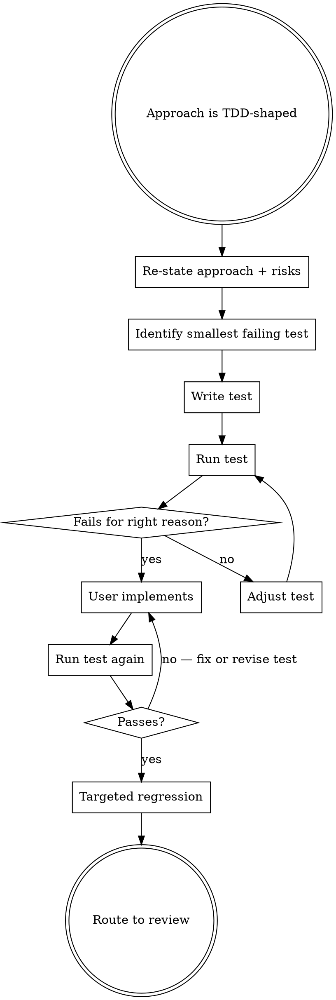

# Implementing with TDD

## The Iron Law
RED PHASE FIRST. NO PRODUCTION CODE BEFORE A FAILING TEST.

Tests that pass on first run prove nothing. A test that has never failed has never tested anything.

## When to Use

`qa-deciding-approach` routes here when the approach is one of:

- `tdd-scaffold` (greenfield-ish behaviour being added)
- `regression-first` (bug fix on existing code; reproduce as failing test first)
- `coverage-first-then-refactor` (behaviour-preserving refactor; characterization tests pin behaviour BEFORE the refactor)

For `strengthen-test-coverage` (mutation follow-up), route to `qa-strengthening-tests` instead — that has different discipline.

## Checklist
You MUST create a TodoWrite item per checklist item and complete in order:

1. Re-state the approach (tdd-scaffold / regression-first / coverage-first-then-refactor) and the named risks from prep.
2. Identify the SMALLEST test that fails for the right reason. For regression-first: the test reproduces the bug. For tdd-scaffold: the test asserts the new behaviour. For coverage-first-then-refactor: the test pins existing behaviour.
3. Write the failing test. Use the host's edit tool — do NOT ask the user to write the test.
4. Run the test. CONFIRM IT FAILS for the expected reason (e.g. "function not defined", "assertion error: got X, expected Y"). A test that doesn't fail is NOT a red test.
5. Hand off to the user (or, if the user has asked you to also write production code, proceed). Say: "test is red — implement to make it green." Show the failing output.
6. After production code lands: run the test again. Confirm it passes for the right reason.
7. Run the targeted regression suite around the changed code. Confirm no green-to-red elsewhere.
8. Route to `qa-reviewing-before-merge` if the user wants verification before merge.

## Process Flow

## Red Flags

| Thought | Reality |
|---|---|
| "I'll write the test and the production code at the same time" | Iron Law violated. Tests must fail before code exists. |
| "Test passed on first run — must have already been implemented" | The test is wrong. It's not testing what you think it's testing. Adjust until you can see it fail. |
| "Failed with the wrong error (import error, syntax error)" | Not a red test. A red test fails on its assertion, not on a precondition. |
| "Regression check is overkill for a small change" | Targeted regression is cheap and catches nasty surprises. Run it. |
| "User asked for the test, not the prod code — I'll write both" | Confirm with user. The TDD discipline only works if the user owns the green-making step (or asks you to do it explicitly). |
| "Mutation testing here" | Wrong skill. Mutation follow-up is `qa-strengthening-tests`. This skill is about new behaviour or pinning behaviour. |

## Examples

### Good

User has a bug: "the discount stacks twice for VIP customers."
- Approach: regression-first.
- Smallest failing test: `test_vip_discount_does_not_stack(order_with_two_discounts)` asserting final price equals one-discount price.
- Run: AssertionError: got 80.0, expected 90.0 — confirmed red, reproducing the bug.
- User fixes the stacking logic.
- Run: PASS. Run targeted regression on `pricing/discount_calculator.py` neighbours: 47 tests, all green.
- Route to review.

### Bad

Same bug.
"Let me fix the stacking logic in `apply_discounts()` and add a test afterwards."
- Iron Law violated. No red phase, no proof the test catches the bug. The "test" added afterwards may pass without ever having failed.
