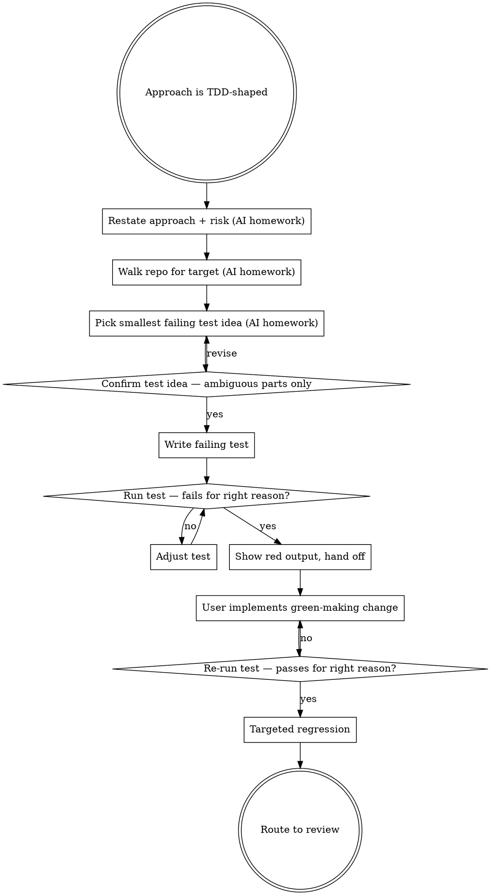

# Implementing with TDD

Help the user drive a change through TDD discipline by walking the cycle one step at a time, confirming the test idea before writing it, and proving the red phase happened before handing back the green-making step. The user has product context (what "wrong" looks like, what shape the API should take) the AI can't infer from code alone — surface it through questions, don't assume it.

**Announce at start:** *"I'm using qa-implementing-with-tdd to walk the red→green cycle with confirmation between phases."*

<HARD-GATE>
Do NOT write the failing test in the same turn you propose the test idea. Walk through risk → assertion shape → smallest failing test → confirm → write → run → show red. Tests written before the user agrees on what they're meant to catch are guesses, not red-phase evidence.
</HARD-GATE>

## The Iron Law

**RED PHASE FIRST. NO PRODUCTION CODE BEFORE A FAILING TEST.**

Tests that pass on first run prove nothing. A test that has never failed has never tested anything. The red phase is the proof — without it, what you wrote is a wishlist assertion, not a regression guard.

## Anti-Pattern: "I'll Just Write Both and Save a Turn"

"I'll write the test and the prod fix together, then we'll have a green commit." That is not TDD — that is post-hoc test-shaped scaffolding. The red phase is non-negotiable: it proves the test catches the bug, it proves the production change is what made it pass, and it proves the test will fail again if the regression returns. Skip red and you've shipped a tautology.

## When to Use

`qa-deciding-approach` routes here when the approach is one of:

- `tdd-scaffold` (greenfield-ish behaviour being added)
- `regression-first` (bug fix on existing code; reproduce as failing test first)
- `coverage-first-then-refactor` (behaviour-preserving refactor; characterization tests pin behaviour BEFORE the refactor)

For `strengthen-test-coverage` (mutation follow-up), route to `qa-strengthening-tests` instead — that has different discipline (production code stays locked).

## Checklist

You MUST work through these in order. Steps 1–3 are AI-only homework (no user questions). The user's confirmation gates steps 4 onward.

1. **Re-state the approach and the named risk** *(no user question)* — restate which of the three TDD-shaped approaches we're in, and the named risk this cycle is targeting. Pull from the prep brief / earlier turns. If no risk was named yet, that is a prep gap — route to `qa-preparing-for-work` first.

2. **Walk the repo for the target** *(no user question)* — use the host's file tools. Find (a) the production file the change touches, (b) the matching test file (or where one belongs), (c) the existing test style (framework, fixtures, assertion library), (d) for regression-first: the failing path through the code that reproduces the bug. Don't ask the user "what test framework?" — read a sibling test file.

3. **Pick the smallest failing test idea** *(no user question)* — name (a) the function/class under test, (b) the input that triggers the risk, (c) the assertion that distinguishes broken from fixed. Tautology check: if the assertion just re-states the production code, it's wrong — pick an observable outcome instead.

4. **Confirm the test idea, only for the AMBIGUOUS parts** — present a short paragraph: *"approach is regression-first; risk is the discount-stacking bug; smallest failing test will call `apply_discounts(order_with_vip_and_promo)` and assert `order.total == 90.0` (one discount applied, not two). Existing tests live in `pricing/test_discount_calculator.py` using pytest + dataclasses."* Then ask ONE focused question for what code couldn't answer (e.g. *"is 90.0 the correct expected value, or does the VIP discount stack with promo but not with itself?"*). If the test idea is unambiguous, skip the question and move to step 5.

5. **Write the failing test** — use the host's edit tool. Do NOT ask the user to write it. Use the same framework and fixture style the sibling tests use.

6. **Run the test and SHOW THE RED OUTPUT** — capture the actual failure (assertion text, expected vs. got, line number). A test that errors on import or syntax is NOT a red test — that's a precondition failure. Adjust until you see a real assertion failure for the right reason. Surface the red output to the user verbatim — *"test is red: `AssertionError: assert 80.0 == 90.0` at `test_discount_calculator.py:47`"*.

7. **Hand off to the user** — say: *"red phase confirmed. Implement to make it green; I'll re-run when you're ready. If you'd like me to also write the production code, say so."* Wait for the user.

8. **Re-run after green-making change** — run the test again. Confirm it passes for the right reason (not because the assertion was weakened). If it fails: surface the new failure, don't try a second production change without the user.

9. **Run targeted regression** — run the test suite around the changed code (the changed file's test module + its closest siblings). Surface pass/fail counts. Confirm no green-to-red elsewhere.

10. **Route to review** — offer to hand off to `qa-reviewing-before-merge` for the merge verdict. Don't claim "safe to merge" from this skill — that's the next skill's job.

## Process Flow

## Key Principles

- **Explore before you ask.** Test framework, fixture style, assertion library, sibling test conventions — read them. Don't ask the user "do you use pytest or unittest?" — the repo answers that.
- **One primary question per turn.** Batching multiple questions overwhelms the user. Ask the most important one; the next follows after their answer.
- **The red phase is evidence, not ceremony.** A test that fails on import / syntax / fixture is not red. Show the actual assertion failure with expected vs. got.
- **Don't bundle red and green.** Even if the user said "do the whole thing", show red first, then write the prod code, then show green. The red phase IS the proof.
- **Anchor the test idea in observable behaviour.** "Assert `order.total == 90.0`" is observable. "Assert `_internal_discount_state == ...`" is not — that's testing implementation, not behaviour.
- **Tautology check before writing.** If the assertion is just re-stating the production code (`assert add(2,3) == 2+3`), the test will pass on the broken code too. Pick an outcome the bug actually changes.

## Red Flags — STOP and rework

| Thought | Reality |
|---|---|
| "I'll write the test AND the production code in one turn" | Iron Law violated. Red phase first, separately, with evidence shown. |
| "Test passed on first run — must have already been implemented correctly" | The test is wrong. It's not testing what you think. Tighten the assertion until you can see it fail. |
| "Failed with import error / syntax error / fixture error — that counts as red" | Not red. A red test fails on its assertion, not on a precondition. |
| "I'll ask the user what test framework they use" | Read a sibling test file. The repo answers that. |
| "Regression check is overkill for a small change" | Targeted regression is cheap and catches nasty surprises. Run it. |
| "I'll write the test idea AND write the test in the same message" | Walk through. Test idea → confirm → write → run. The confirmation gate is what catches misaligned assertions. |
| "Assertion: `assert add(2,3) == 2+3`" | Tautology. The broken code passes this too. Pick an outcome the bug changes. |
| "Mutation testing fits here" | Wrong skill. Mutation follow-up is `qa-strengthening-tests`. |
| "User asked for the test, not prod code — I'll write both anyway" | Confirm. The TDD discipline only works if the user owns the green-making step (or asks explicitly). |
| "I'll surface 'Approach: regression-first' / 'Classification: X' / 'Per the checklist' in the output" | Internal scaffolding. Burns tokens, adds noise. Translate to natural English when useful; keep file:line citations the user can verify. |

## Examples

### Good (explore first, confirm test idea, then write)

> **User:** "Fix the VIP-double-discount bug regression-first."
>
> **AI (steps 1–3, internal — no user question):** confirms approach=regression-first; risk=VIP customers see two discounts stack; walks repo, finds `pricing/discount_calculator.py:apply_discounts()` and `pricing/test_discount_calculator.py` using pytest + `Order` dataclass fixtures; smallest failing test idea: call `apply_discounts(order)` where `order.customer_tier=VIP` and a promo discount is also active, assert `order.total == 90.0` (one discount, not two stacked).
>
> **AI (step 4, confirm):** *"For the VIP-discount-stacking bug: prod logic at `pricing/discount_calculator.py:apply_discounts()`, tests in `pricing/test_discount_calculator.py` (pytest + `Order` fixtures). Smallest failing test will call `apply_discounts(order_with_vip_and_promo)` and assert `order.total == 90.0`. **Is 90.0 right — does VIP stack with promo but not with itself, or does VIP override promo entirely?**"*
>
> **User:** *"VIP should override promo entirely — only the larger discount applies."*
>
> **AI (step 5):** writes the test asserting `order.total == 90.0` (VIP-only discount).
>
> **AI (step 6):** runs the test. Captures: `AssertionError: assert 80.0 == 90.0` at `test_discount_calculator.py:47`. Surfaces verbatim.
>
> **AI (step 7):** *"Red phase confirmed — test fails with `assert 80.0 == 90.0`, which is the stacking bug reproducing. Implement so VIP-tier customers get only the larger discount applied. Say when ready and I'll re-run."*

### Bad (write test and prod fix together)

> **User:** "Fix the VIP-double-discount bug regression-first."
>
> **AI:** edits `apply_discounts()` to short-circuit when `customer_tier=VIP`, edits the test file to add an assertion, runs the whole suite, reports green.
>
> Iron Law violated. No red phase, no proof the test catches the bug. The "test" added afterwards may pass on the broken code too — it never failed.

### Bad (asking what's in the code)

> **User:** "Fix the VIP-double-discount bug regression-first."
>
> **AI:** *"Before I can write the test: (1) which test framework do you use? (2) where do the discount tests live? (3) what's the fixture pattern? (4) is `Order` a dataclass or an ORM model?"*
>
> All four questions are answerable by reading the repo. The AI should have explored first and surfaced what it found, then asked only the genuinely-ambiguous *"is 90.0 the right expected value?"* question.

## Next skill in the chain

When green is confirmed and the targeted regression passes → `qa-reviewing-before-merge` to deliver the safe-to-merge verdict against fresh evidence.

If this task is part of a multi-task rollout dispatched by `qa-executing-qa-rollout` → `qa-finishing-qa-work` instead, to capture the evidence and produce the PR-ready summary.
