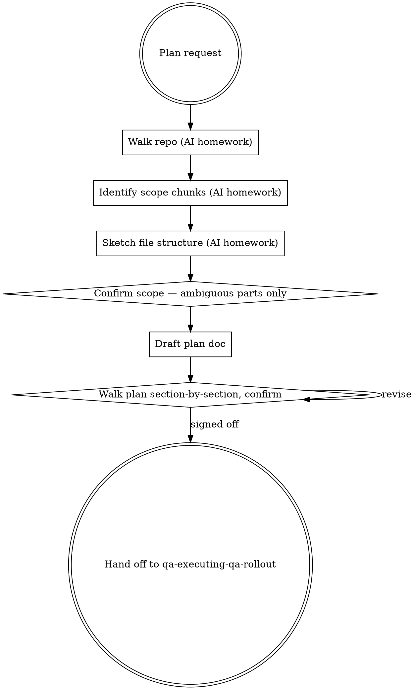

# Planning a QA rollout

Help the user turn an amorphous QA ask ("we need test coverage for the new refund flow", "Phase 1 of the strategy") into a written plan a fresh agent or teammate could pick up and execute task-by-task — without you in the room.

**Announce at start:** *"I'm using qa-planning-qa-rollout to turn this into a bite-sized, dispatchable plan."*

<HARD-GATE>
Do NOT start scaffolding tests or dispatching subagents from this skill. This skill's only output is the written plan document. Execution happens in `qa-executing-qa-rollout` after the plan is signed off.
</HARD-GATE>

## The Iron Law

**NO EXECUTION FROM THE PLANNER. THE PLAN IS THE DELIVERABLE.**

A planner that writes tests is a planner that's stopped planning. The plan must stand alone — readable by someone who wasn't in the conversation, with enough specificity that a fresh subagent given just one task from the plan could execute it without coming back for clarification.

## When to Use

`qa-deciding-approach` routes here when:

- the work spans **3+ tasks** that can be done independently (otherwise: skip planning, route straight to `qa-implementing-with-tdd` or similar)
- the user said *"plan QA for this story"* / *"plan the test rollout"* / *"break this into tasks"* / *"prep this for subagent execution"*
- `sumo-qa-strategising` has produced a strategy and the user wants to act on Phase 1
- the work is going to be picked up by someone other than the planner (handoff)

For a single 30-minute QA task, planning is overhead — go straight to the matching skill.

## Checklist

You MUST work through these in order. Steps 1–3 are AI-only homework. Steps 4 onward are gated by user confirmation.

1. **Walk the repo for context** *(no user question)* — use the host's file tools. Find: the actual files the work touches, the test framework + fixture conventions, CI config, any sibling tests demonstrating local patterns. Don't ask the user what's in the repo.

2. **Identify the scope chunks** *(no user question)* — break the QA work into 3–10 chunks. Each chunk must be: (a) independent enough to hand to a fresh subagent, (b) sized for 10–30 minutes of work, (c) anchored to specific files or risks. NOT *"add unit tests"*. NOT *"write integration tests"*. YES *"write a property-based test for `pricing/calculator.py:apply_discounts` covering the VIP-discount stacking invariant"*.

3. **Sketch the file structure** *(no user question)* — for each chunk, name the file(s) it creates or modifies. New test files go where existing sibling tests live (read the convention, don't invent one).

4. **Confirm scope + structure** — present the chunks + file structure in one paragraph; ask the ONE focused question that exploration couldn't answer (e.g. *"Phase 1 says we cover billing/refund.py and billing/invoice.py — should `services/notifications/refund_notifier.py` be in scope too, or is that a separate consumer?"*). If exploration left nothing ambiguous, skip the question.

5. **Draft the plan document** — write it to `docs/qa/plans/YYYY-MM-DD-<feature-slug>.md`. Use the structure in **Plan Document Template** below. Tasks must be:
   - **Bite-sized:** 5–15 minutes each. Bigger means decompose. Smaller means combine.
   - **Independent:** task N must not depend on task N+1's output. If they're coupled, name the coupling explicitly so the executor knows to run them sequentially.
   - **Specified:** file paths, function names, expected assertion shapes, the named risk being covered. Not *"write a test for X"*; YES *"add `test_apply_discounts_vip_does_not_stack_with_promo` to `tests/pricing/test_discount_calculator.py`; assert `Order(tier=VIP, promo=BLACKFRIDAY10).apply_discounts().total == 90.00`"*.
   - **Discipline-labelled:** each task carries the approach tag from `qa-deciding-approach` (tdd-scaffold / regression-first / coverage-first-then-refactor / strengthen-test-coverage / verify-existing) so the executor knows which workflow to follow.

6. **Walk the plan section-by-section, confirm** — present file-structure → first 3 tasks → next 3 → residual. Each section gets a confirmation gate. Ask: *"do these tasks match how you'd shape them? add / remove / re-decompose?"* Don't dump the whole plan at once.

7. **Hand off** — when the plan is signed off, say: *"plan is at `docs/qa/plans/YYYY-MM-DD-<feature>.md`. Ready to dispatch subagents? `qa-executing-qa-rollout` reads this plan and runs each task in a fresh subagent with two-stage review. Or you/your team can pick it up task-by-task manually."* Do NOT start executing.

## Plan Document Template

Every plan ships with this header:

```markdown
# [Feature] QA Plan

> **For agentic execution:** Use `qa-executing-qa-rollout` to dispatch this plan task-by-task with two-stage review. Tasks use checkbox (`- [ ]`) syntax for tracking. Independent tasks (marked `[parallel]`) can be dispatched concurrently.

**Goal:** [One sentence — what the QA work delivers]

**Approach mix:** [tdd-scaffold / regression-first / strengthen-test-coverage / verify-existing — each task may use a different one]

**Files touched:**
- `path/to/production_file.py` — [why; no edits if the approach is strengthen-test-coverage or verify-existing]
- `tests/path/to/test_file.py` — [new tests added here]
- `tests/path/to/new_test_file.py` — [new file]

**Risks covered (anchored):**
- R1 — `production_file.py:47` — [specific risk in one sentence]
- R2 — `production_file.py:82` — [specific risk]
- ...

---

### Task 1: [Name] [parallel|sequential]

**Approach:** [regression-first / tdd-scaffold / strengthen-test-coverage / etc.]
**Risk covered:** R[n]
**Files:**
- Create: `tests/pricing/test_discount_stacking.py`
- Touch: none (production stays unchanged for strengthen / regression-first)

- [ ] Step 1: Read `pricing/discount_calculator.py:apply_discounts` and the closest sibling test for fixture conventions.
- [ ] Step 2: Write the failing test `test_apply_discounts_vip_does_not_stack_with_promo`. Assert `Order(tier=VIP, promo=BLACKFRIDAY10).apply_discounts().total == 90.00`.
- [ ] Step 3: Run pytest; confirm the test fails for the right reason (assertion, not import / fixture error).
- [ ] Step 4: Surface red output verbatim.

**Done when:** the test exists, runs, and fails with `AssertionError: assert 80.0 == 90.00`. (Or, if approach is strengthen-test-coverage, the test passes and kills the named mutant.)

---

### Task 2: ...
```

## Process Flow



## Key Principles

- **The plan must stand alone.** Imagine a teammate reading it tomorrow with no context. If they'd need to ask you a question, the plan is incomplete.
- **Bite-sized tasks > heroic tasks.** A 4-hour task is two 1-hour tasks pretending. A subagent given a 4-hour task will go off-piste.
- **Parallel by default.** Mark each task `[parallel]` or `[sequential]`. Default to parallel unless there's a real ordering dependency — most QA tasks are independent.
- **Discipline-labelled.** Each task carries its approach tag so the executor knows which workflow (TDD red→green, mutation-survivor walk, verify-existing, etc.) to follow.
- **One section per confirmation gate.** The user's correction on the scope shapes everything downstream. Don't dump the full plan and expect them to find the issue.
- **No execution from the planner.** The Iron Law is non-negotiable. If you write tests in this skill, you've broken the chain.

## Red Flags — STOP and rework

| Thought | Reality |
|---|---|
| "The plan is short — I'll just go ahead and start the first task" | Iron Law violated. Plan is the deliverable; execution is the next skill. |
| "Task: 'add tests for the refund flow'" | Generic. Decompose to file + function + expected assertion + risk covered. |
| "I'll list 12 tasks for thoroughness" | Probably 6 with overlap. Combine until each task is genuinely distinct. |
| "I'll mark everything as sequential to be safe" | Default to parallel. Each task should be independent enough to hand to a fresh subagent. Sequential is the exception with a stated reason. |
| "Each task is 'about an hour'" | Decompose. 5–15 minutes each. An hour = 4–8 tasks. |
| "I'll dump the whole plan in one message and ask 'looks good?'" | Single-shot. Walk section-by-section so the user catches mis-shaped tasks early. |
| "The plan doesn't need approach tags — the executor will figure out the right workflow per task" | The executor is a fresh subagent. It has no context. Tag every task. |

## Examples

### Good (walk → decompose → confirm → write)

> **User:** *"Plan Phase 1 of the strategy: cover the billing service's refund flow."*
>
> **AI (steps 1–3, internal):** walks `services/billing/`, finds `refund.py` and `invoice.py` and the existing `tests/billing/` directory using pytest + Decimal-based fixtures. Identifies 5 chunks (one per risk surface) + 1 chunk for test fixture extraction. Sketches the file structure: 4 new test files, 1 fixture-module addition, 0 production edits (approach mix is strengthen + regression-first, prod stays clean).
>
> **AI (step 4):** *"Walked `services/billing/`. The refund flow has 3 entrypoints: `refund.py:apply_refund`, `refund.py:apply_partial_refund` (new), and `invoice.py:reconcile_refund`. Tests live at `tests/billing/`, pytest + Decimal fixtures. Provisional plan: 5 risk-anchored tasks + 1 fixture-module task, all in `tests/billing/` (no production edits). **One thing to pin: the new `apply_partial_refund` path returns `RefundAmountInvalid` (422) where the old fall-through returned 500 — should we add a contract-test task to coordinate with the portal team, or is that out of scope for Phase 1?**"*
>
> **User:** *"Out of scope; portal team has their own ticket. Stay in billing."*
>
> **AI (step 5):** writes the plan to `docs/qa/plans/2026-05-12-billing-refund-coverage.md` with 6 bite-sized tasks (5 risk-anchored + 1 fixture-module), each tagged with its approach, file paths, expected assertions, and "done when" criteria. Marks tasks 1–5 `[parallel]` (each covers a distinct risk surface) and task 6 `[sequential]` (depends on the fixture module from task 1).
>
> **AI (step 6, walks section-by-section):** *"Plan written. Walking through it: **file structure** — 6 new test files in `tests/billing/`, plus a shared `tests/billing/conftest.py` for fixtures. **First 3 tasks**: …"* (one section at a time)
>
> **AI (step 7, after sign-off):** *"Plan is at `docs/qa/plans/2026-05-12-billing-refund-coverage.md`. Want me to dispatch via `qa-executing-qa-rollout`? It'll run tasks 1–5 in parallel subagents with two-stage review, then task 6 once 1's fixture is committed."*

### Bad (plan and execute in one go)

> **User:** *"Plan Phase 1 of the strategy."*
>
> **AI:** *"Sure! Phase 1 covers refund flow. Let me start writing the tests…"* edits `tests/billing/test_refund.py`.
>
> Iron Law violated. The plan never got written; execution started without a plan to dispatch from; no teammate could pick this up tomorrow.

## Next skill in the chain

When the plan is signed off → `qa-executing-qa-rollout` to dispatch subagents per task with two-stage review. If the user wants to execute manually, point them at the plan file and stop.
