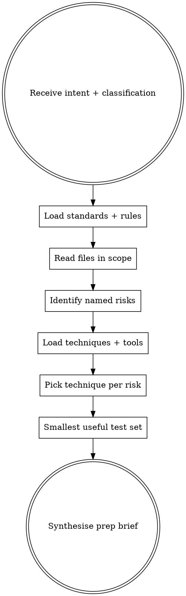

# Preparing for QA work

## The Iron Law
NO TEST IDEA WITHOUT A NAMED RISK.

Every test you propose ties to a specific risk you identified. Generic "add edge case tests", "test happy and sad paths", "check for null inputs" are senior-QA failure modes — they tell the user nothing they didn't already know.

## When to Use

User intents that trigger this skill:

- "plan QA for this story"
- "I'm starting work on X — what should I test?"
- "what could break with this change?"
- "QA prep for ticket ABC-123"

Distinct from `qa-creating-test-plan` (formal entry/exit criteria, phases, deliverables) and from `qa-deciding-approach` (which only picks the approach). This skill produces a risk-shaped prep brief: named risks + smallest useful test set + named techniques + specialty fits if relevant.

## Checklist
You MUST create a TodoWrite item per checklist item and complete in order:

1. Read the user's intent and target paths.
2. Call `sumo_qa_load_standards(classification=...)` and `sumo_qa_load_rules(classification=...)` using the classification the previous `qa-deciding-approach` step settled on.
3. Read the actual files in scope using the host's file tools. Do NOT ask the user for file content the host can read directly.
4. Identify 3-7 named risks. Each risk MUST be specific (not "input validation breaks" but "currency conversion at the GBP→USD boundary rounds incorrectly when the rate is supplied with >6 decimal places"). Anchor each in a file path or domain term from the user's words.
5. Call `sumo_qa_load_techniques()`. Pick one technique per named risk. Use the catalogue's wording.
6. Call `sumo_qa_load_specialty_tools()`. Pick tools that fit the actual risks — any quality improvement, not only non-functional. Empty list is acceptable.
7. Produce a smallest useful test set: 3-7 tests, each tied to a named risk. No generic "test happy path".
8. Output: conversational prose, sectioned (risks, tests, techniques, specialty tools, open assumptions). No JSON blob.

## Process Flow

## Red Flags

| Thought | Reality |
|---|---|
| "Add tests for edge cases" | What edge cases? Name them with specific values. |
| "Test happy path and sad path" | Generic. Every change has a happy path. Name the specific behaviour and the specific failure mode. |
| "I'll list 15 risks to be thorough" | 3-7 is the senior-QA bar. More means you're confabulating, not reasoning. |
| "I don't need to read the files — I can infer from the intent" | You can infer the SHAPE; you can't infer the actual data flow, domain terms, or edge cases without reading. |
| "The user didn't ask for techniques — I'll skip those" | Every named risk gets a named technique. The technique is what makes the test actionable. |
| "Mutation testing for a UI tweak" | Wrong tool fit. Pick from the catalogue based on the actual risk surface. |

## Examples

### Good

User: "I'm adding a refund endpoint to the payments service. What should I test?"
- Classification: `api_contract_change` + `business_logic_change`.
- Risks (anchored): (1) refund amount exceeds original charge (boundary risk on `amount` vs original `charge.amount`). (2) refund issued twice for the same charge (idempotency risk on `charge_id` parameter). (3) partial refund recorded but downstream ledger update fails (atomicity risk crossing payment-processor / internal-ledger boundary). (4) refund of an already-refunded charge isn't blocked (state-machine risk on `charge.status`).
- Techniques: (1) boundary value analysis. (2) state transition testing. (3) decision table. (4) state transition testing.
- Tools: Pact (consumer-driven contract test for the new endpoint shape) + Hypothesis (property-based test that idempotency holds across many input orderings).

### Bad

Same user.
"Test that the endpoint returns 200 on success. Test that it handles invalid amounts. Test edge cases. Test the happy path. Consider adding security testing."
- No named risks, no anchors, no specific values, generic technique calls, no specialty fits. Senior QA bar failed.
