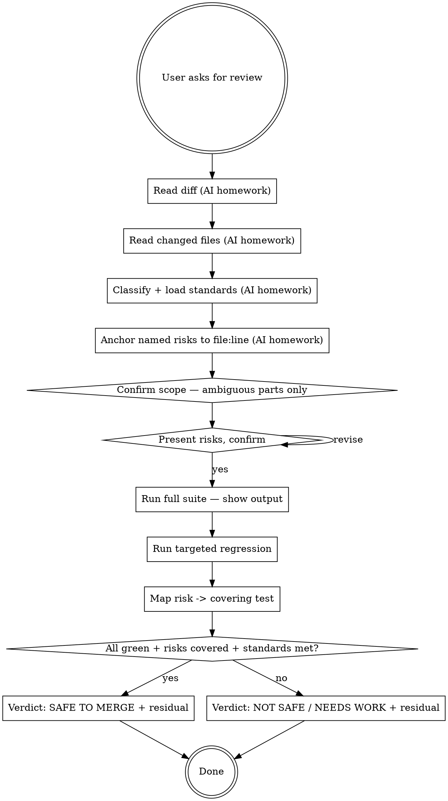

# Reviewing before merge

Help the user decide whether a change is safe to ship by walking the review one section at a time: explore the diff, surface what was found, name the risks, run the verification, deliver the verdict. The user has product context (was this a deliberate behaviour change? is this consumer used externally?) the AI can't infer from the diff alone — surface it through questions, don't assume it.

**Announce at start:** *"I'm using qa-reviewing-before-merge to read the diff, name the risks, run the suite, and deliver the verdict."*

<HARD-GATE>
Do NOT deliver a verdict before running tests in this turn. "CI was green earlier" is not fresh evidence. The Iron Law's only verdict source is the suite running RIGHT NOW against THIS diff, with the actual pass/fail counts surfaced.
</HARD-GATE>

## The Iron Law

**NEVER CLAIM SAFE-TO-MERGE WITHOUT FRESH VERIFICATION EVIDENCE.**

"Looks good to me" is not evidence. Tests passing in CI 2 days ago is not fresh. The verdict comes from running the suite right now and reading the actual diff. "All tests pass" is necessary but not sufficient — every named risk must also have a passing test covering it.

## Anti-Pattern: "This Diff Is Too Small To Need A Real Review"

A one-line config change. A typo fix in a comment. A renamed variable. Every formal review goes through this skill regardless of size. Small diffs are where unexamined assumptions ship as production defects ("it's just a config change" — and the config controls the feature flag that gates the new payment route). The review can be short for genuinely small work, but you MUST present each section and get confirmation before delivering a verdict.

## When to Use

User intents that trigger this skill:

- "review my changes"
- "is this safe to merge"
- "what could break with these changes"
- "code review please"
- "anything I missed in this diff"

`qa-deciding-approach` routes here for `verify-existing` approach (config-only / trivial). For larger reviews, this skill still runs but with broader scope.

## Checklist

You MUST work through these in order. Steps 1–4 are AI-only homework (no user questions). The user's confirmation gates steps 5 onward.

1. **Read the diff via the host's git tools** *(no user question)* — `git diff`, `git diff --staged`, or `git diff <base>...HEAD` depending on intent (uncommitted vs branch). Capture file list + line counts.

2. **Read the actual changed files** *(no user question)* — not just the diff hunks. Surrounding code matters for risk analysis (callers, fixtures, related logic). For each changed file: identify the public surface that moved.

3. **Classify and load applicable standards** *(no user question)* — call `sumo_qa_load_classifications()`, infer the classification(s), then `sumo_qa_load_standards(classification=...)` and `sumo_qa_load_rules(classification=...)`. Note which loaded rules apply to this diff.

4. **Identify named risks anchored to file:line** *(no user question)* — 3–7 risks, each citing a specific file + line + the domain meaning of the change. NOT generic ("edge cases", "untested paths"). Use the words from the user's intent + the actual code.

5. **Confirm scope + classification, only for the AMBIGUOUS parts** — present a short paragraph: *"3 files changed: `api/refund.py` (+38/-4), `domain/Refund.kt` (+12/-2), `tests/test_refund_api.py` (+25/-0). Classifies as `api_contract_change` + `business_logic_change` (refund-amount calculation moved). Loaded rules say: API change requires consumer contract bump."* Then ask ONE focused question for what the diff couldn't reveal (e.g. *"is this consumer external — do we need to coordinate the contract bump, or is it internal-only?"*). If exploration left nothing ambiguous, skip the question and move to step 6.

6. **Present named risks, ask after** — present the 3–7 risks anchored to file:line:
   *"R1: `api/refund.py:47` — new error path returns 500 instead of 422 for invalid-amount; consumer X depends on 4xx-vs-5xx for retry logic.*
   *R2: `domain/Refund.kt:18` — idempotency key derivation changed; double-refund possible on retry of a partially-completed call.*
   *…"*
   Ask: *"do these match how you'd describe the risks? add / remove / refine?"* Wait for the user.

7. **Run the test suite — show the actual output** — use the host's runner (`uv run pytest`, `npm test`, whatever the project uses). Surface: total / passed / failed / skipped / duration. If failures: name the failing tests. Do NOT proceed to verdict on partial output.

8. **Run targeted tests around the changed files** — e.g. `pytest tests/test_<changed_module>.py -v`. Confirm closest neighbours stay green. Surface the count.

9. **Map risk coverage** — for each named risk from step 6: cite the test that covers it (file + test name) or flag it as uncovered. A risk with no covering test is a SAFE-blocker.

10. **Deliver the verdict + residual concerns** — SAFE TO MERGE | NOT SAFE | NEEDS WORK with concrete evidence (test counts, risk coverage map, standards-rule citations). SAFE only if: (a) suite green right now, (b) every named risk has ≥1 passing covering test, (c) no loaded rule violated. Always list residual concerns even on SAFE — every change has some.

## Process Flow

## Key Principles

- **Explore before you ask.** The diff and the files answer most questions. Read them first. Ask only what the code doesn't reveal (product intent, downstream consumer status, business policy).
- **One section per turn.** Scope / risks / verdict are gated by confirmation. Don't dump the whole review in one message.
- **One primary question per turn.** Ask the most important one; the next follows after their answer.
- **Anchor every risk to file:line.** A risk without a citation is generic; rewrite it. The user's correction is what makes the review useful, and they can only correct what they can pin down.
- **Fresh evidence only.** Tests must run in this turn. "CI was green" is not fresh. Surface the actual counts.
- **SAFE requires three independent checks**: suite green, every named risk covered, no loaded rule violated. Two out of three is NOT SAFE.

## Red Flags — STOP and rework

| Thought | Reality |
|---|---|
| "Looks good to me, ship it" | Not evidence. Run the tests. |
| "CI was green an hour ago" | Not fresh. Run them now. |
| "Trivial change, no need to walk through sections" | The Iron Law doesn't have a trivial-change exemption. Walk through; the review can be short, but every section gets confirmation. |
| "I'll skip running tests — they're slow" | Then you can't claim safe-to-merge. Slow tests are still the verdict source. |
| "All tests pass, so SAFE" | Necessary, not sufficient. Each named risk must also have a covering test. |
| "No standards apply to this change" | Re-classify. Every change has at least one applicable classification with loaded rules. |
| "I'll list the risks AND deliver the verdict in one message" | Gate. The user's correction on the risks is what shapes the verdict. |
| "I'll ask the user which test framework / where tests live" | Read the repo. The framework and test layout are answered by sibling files. |
| "Residual concerns: none" | Every change has them. None = you didn't think about what could still go wrong. |
| "I'll surface 'Classification: api_contract_change' / 'Approach: verify-existing' in the output" | Internal scaffolding. Burns tokens, adds noise. Translate to natural English when useful; keep file:line citations and rule names the user can verify. |

## Examples

### Good (explore first, confirm scope, then risks, then verdict)

> **User:** "review my changes, is this safe to merge?"
>
> **AI (steps 1–4, internal — no user question):** `git diff main...HEAD --stat`: 3 files, 47 insertions, 12 deletions. Reads `api/refund.py`, `domain/Refund.kt`, `tests/test_refund_api.py`. Classifies as `api_contract_change` + `business_logic_change`. Loads applicable rules: `api_contract_change` rule says contract test must be updated on response-shape change.
>
> **AI (step 5, scope):** *"3 files changed: `api/refund.py` (+38/-4), `domain/Refund.kt` (+12/-2), `tests/test_refund_api.py` (+25/-0). API response shape moved and refund-amount calculation changed — the API-change rule requires the consumer contract test be bumped, and `tests/contracts/refund_v1.json` was NOT modified. **Is this consumer external (need coordination) or internal-only?**"*
>
> **User:** *"External — payments-service depends on it."*
>
> **AI (step 6, risks):** *"5 named risks: R1 `api/refund.py:47` — new error path returns 500 instead of 422 for invalid amount; payments-service retry logic depends on 4xx-vs-5xx semantics. R2 `domain/Refund.kt:18` — idempotency-key derivation changed; double-refund possible on retry of a partial call. R3 `api/refund.py:62` — currency conversion happens before validation, fractional-cent rounding can underflow refund amount. R4 contract file `tests/contracts/refund_v1.json` unchanged despite response-shape change (rule violation). R5 no test exercises the new 500-path. **Match how you'd describe them? add / remove / refine?**"*
>
> *(continues to tests run, risk-coverage map, verdict — one section per turn)*

### Bad (single-shot verdict)

> **User:** "review my changes, is this safe to merge?"
>
> **AI:** *"Looks straightforward — 3 files, mostly internal refactor. Should be fine to merge. Maybe run CI."*
>
> No fresh test evidence. No risk anchoring. No standards check. No classification. Iron Law violated.

### Bad (asking what's in the diff)

> **User:** "review my changes, is this safe to merge?"
>
> **AI:** *"Before I can review: (1) what branch are you on? (2) which files did you change? (3) what's the base branch? (4) what tests should I run?"*
>
> All four answerable from `git status`, `git diff`, `git log`, `pyproject.toml` / `package.json`. The AI should have explored first.

## Next skill in the chain

When the verdict is delivered (SAFE / NOT SAFE / NEEDS WORK) with fresh evidence + risk-coverage map → `qa-finishing-qa-work` to capture the evidence and produce the PR-ready summary the user can paste into a description or release note.
