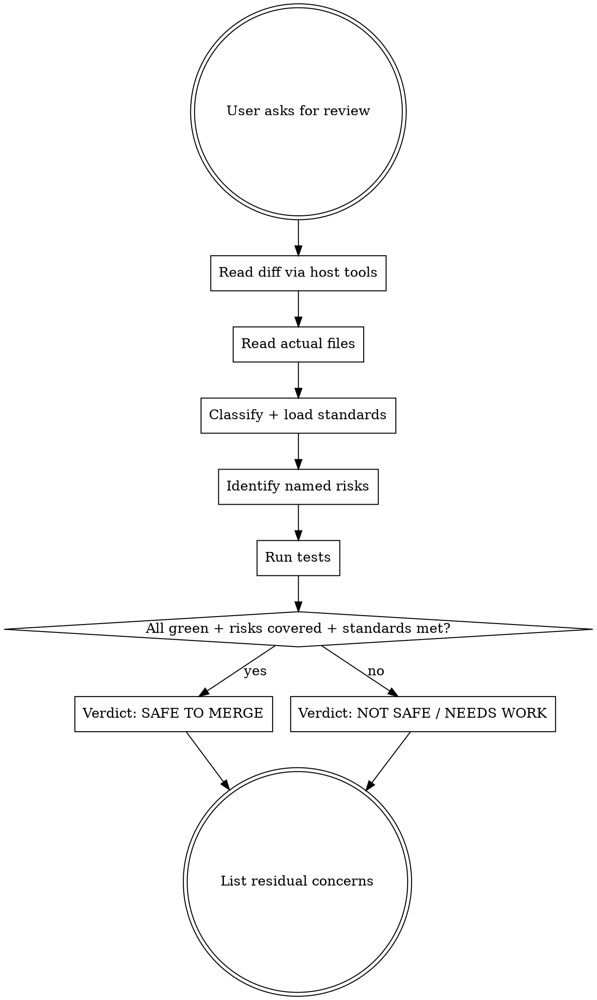

# Reviewing before merge

## The Iron Law
NEVER CLAIM SAFE-TO-MERGE WITHOUT FRESH VERIFICATION EVIDENCE.

"Looks good to me" is not evidence. Tests passing in CI 2 days ago is not fresh. The verdict comes from running the suite right now and reading the actual diff.

## When to Use

User intents that trigger this skill:

- "review my changes"
- "is this safe to merge"
- "what could break with these changes"
- "code review please"
- "anything I missed in this diff"

`qa-deciding-approach` routes here for `verify-existing` approach (config-only / trivial). For larger reviews, this skill still runs but with broader scope.

## Checklist
You MUST create a TodoWrite item per checklist item and complete in order:

1. Use the host's git/file tools to read the current diff (`git diff`, `git diff --staged`, or `git diff <base>...HEAD` depending on the user's intent — uncommitted vs branch).
2. Identify the actual files changed. Read each one (not just the diff hunk — the surrounding code matters).
3. Call `sumo_qa_load_classifications()` and infer the classification(s) of the change. Cite words/paths internally.
4. Call `sumo_qa_load_standards(classification=...)` and `sumo_qa_load_rules(classification=...)`. Apply the team's loaded standards.
5. Identify 3-7 named risks specific to THIS diff. Anchor each in a file and line.
6. Run the test suite. Use the host's test runner (likely `uv run pytest` for Python; whatever the project uses). Capture the actual output — number passed, failed, skipped.
7. Run targeted tests for the changed files if the project supports it (e.g. `pytest tests/test_<changed_module>.py`).
8. Surface the verdict: SAFE TO MERGE | NOT SAFE | NEEDS WORK with concrete evidence. SAFE only if (a) tests are green right now, (b) no named risk lacks coverage, (c) no team standard or rule is violated.
9. List residual concerns even if verdict is SAFE.

## Process Flow

## Red Flags

| Thought | Reality |
|---|---|
| "Looks good to me, ship it" | Not evidence. Run the tests. |
| "CI was green an hour ago" | Not fresh. Run them now. |
| "Trivial change, no need to review carefully" | Trivial changes break prod regularly. The Iron Law doesn't have a trivial-change exemption. |
| "I'll skip running tests — they're slow" | Then you can't claim safe-to-merge. Slow tests are still the verdict source. |
| "All tests pass, so safe to merge" | Tests passing is necessary, not sufficient. Named risks must also have coverage. |
| "No standards apply to this change" | Re-classify. Every change has at least one applicable classification with loaded rules. |

## Examples

### Good

User: "review my changes, is this safe to merge?"
- `git diff main...HEAD --stat`: 3 files, 47 insertions, 12 deletions.
- Read the 3 files. Classification: `business_logic_change` + `api_contract_change`.
- Loaded rules say: API change requires contract test update. Looked — contract test not updated.
- Risks: (1) consumer X depends on the old response shape (cited file path); (2) idempotency on retry not preserved by new error path.
- Ran tests: 268 passed, 2 failed in `tests/test_api_contract.py`.
- Verdict: NOT SAFE. Fix contract tests; verify consumer X compatibility; address idempotency risk.

### Bad

Same diff.
"Looks straightforward — should be fine to merge. Maybe run the tests in CI."
- No fresh test evidence. No risk anchoring. No standards check. Iron Law violated.
