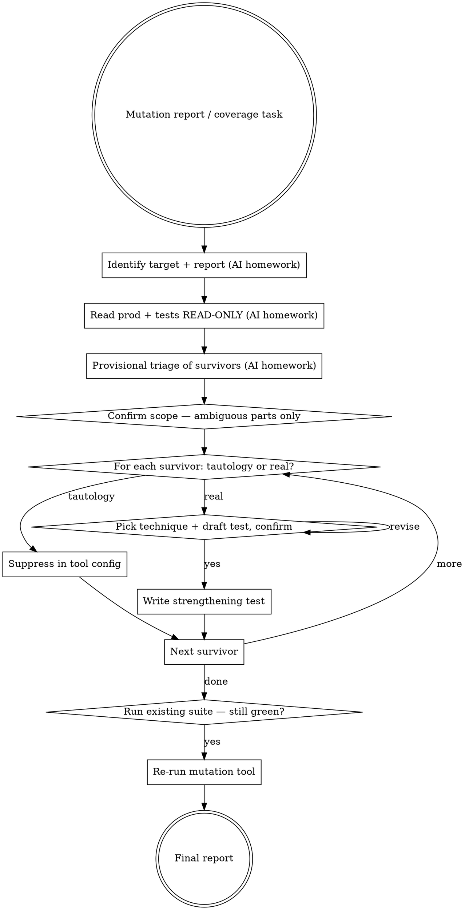

# Strengthening tests

Help the user kill weak assertions and surviving mutants by walking each survivor one at a time: triage tautology vs real, pick a technique, draft the strengthening test, confirm. The user has judgement context (is this mutant "real" given how the code is consumed in practice?) the AI can't infer from the report alone — surface it through questions, don't assume it.

<HARD-GATE>
Do NOT touch production code in this skill. Ever. If a mutant survives because the production code is wrong, that is a separate `regression-first` task — STOP this flow and route to `qa-implementing-with-tdd`. The Iron Law has no exceptions for "while I'm in here".
</HARD-GATE>

## The Iron Law

**PRODUCTION CODE STAYS UNCHANGED.**

Only test code moves. Equivalent mutants get suppressed in tool config — not "killed" by tautological tests that re-state the production code. A test that asserts the production logic verbatim passes on the broken code too; it's not a strengthening, it's a re-write of the bug.

## Anti-Pattern: "Just Tweak The Production Code So The Test Catches It"

"This mutant survives because the production code is hard to test — I'll refactor the function so the test can hit the boundary." That is not strengthening — that's `coverage-first-then-refactor` wearing the wrong hat. The moment production code moves, you've stopped strengthening tests and started changing behaviour (or risk-of-behaviour). If the production code genuinely needs to change, STOP, route to `qa-implementing-with-tdd` with `regression-first`, and resume strengthening after.

## When to Use

`qa-deciding-approach` routes here for `strengthen-test-coverage`. User intents:

- "raise coverage on module X"
- "Pitest shows N surviving mutants — kill them"
- "Stryker / mutmut surfaced weak assertions"
- "strengthen the tests on the order calculator"

Production code is locked. The job is to make the EXISTING tests stronger.

## Checklist

You MUST work through these in order. Steps 1–3 are AI-only homework (no user questions). The user's confirmation gates steps 4 onward, and steps 5–7 repeat per surviving mutant.

1. **Identify the target and the report** *(no user question)* — re-read the user's intent. Identify the target module/file (e.g. `pricing/discount_calculator.py`). If the user supplied a mutation-testing report path or pasted output, parse it; otherwise note the report is missing.

2. **Read prod + test files** *(no user question, READ-ONLY on prod)* — use the host's file tools. Read the production file (do NOT edit it) and the matching test file. Note the existing test style (framework, fixtures, parameterise vs separate tests).

3. **Triage the survivor list** *(no user question)* — for each surviving mutant in the report, classify provisionally: (a) likely **tautological / equivalent** (e.g. `i++` → `i--` in a loop whose only externally-observable result is the final value, and the final value is already asserted); (b) likely **real** (the assertion gap is meaningful — e.g. boundary mutated from `>` to `>=` and no test exercises the boundary). This is AI-side first; the user gates the call in step 5.

4. **Confirm target + report scope, only for the AMBIGUOUS parts** — present what you found: *"target is `pricing/discount_calculator.py` (24 LOC, 9 branches). Existing tests: `pricing/test_discount_calculator.py` (12 tests, parameterised pytest). Pitest report shows 8 surviving mutants; provisional triage: 3 look equivalent, 5 look real."* Then ask ONE focused question for what wasn't clear (e.g. *"any mutants you'd hand-classify before I walk through them, or shall I go survivor-by-survivor?"*). If the scope is unambiguous, move to step 5.

5. **Walk one mutant at a time — confirm tautology vs real** — for each survivor, present:
   *"Mutant M3: line 47, `if threshold > 100` → `if threshold >= 100`. No existing test hits exactly 100. Calling this REAL — kill with boundary-value test. Agree, or is this equivalent given how `threshold` is constructed upstream?"*
   Wait for confirmation. If user says equivalent → step 6; if real → step 7.

6. **Suppress equivalent mutants in tool config** — show the exact config edit (e.g. `pitest.xml` `mutators` exclusion or `# pragma: no mutate` comment). Cite the mutant ID and a one-line rationale ("equivalent: loop-counter mutation with no observable effect; final-value assertion already covers"). Move to the next mutant.

7. **Pick a technique + draft the strengthening test, confirm before writing** — call `sumo_qa_load_techniques()` if not loaded. Pick ONE from the catalogue per real mutant (often boundary-value analysis for `>` / `>=` mutations; decision-table for branch-condition mutations; property-based for invariant mutations). Present:
   *"Mutant M3 → boundary-value analysis. New test `test_discount_threshold_exactly_at_boundary`: `apply_discount(amount=100.00)` should return X (not Y). Agree before I write?"*
   Wait for confirmation, then write. Use the host's edit tool. Match the existing test style.

8. **After all survivors are processed, run the existing suite** — confirm it's still green. Your changes are additive — any pre-existing test going red means you accidentally touched a shared fixture. Surface the count.

9. **Re-run the mutation tool (if user can)** — confirm the survivor count dropped by the number of real mutants addressed. Surface the new count + which survivors remain (and why — likely the equivalents that are now suppressed).

10. **Final report** — list: strengthening tests added (file + name + technique), equivalent mutants suppressed (config file + mutant ID + rationale), new survivor count, residual concerns.

## Process Flow

## Key Principles

- **Explore before you ask.** Read the production file, the test file, and the report. Don't ask "what testing framework?" — the test file shows you.
- **One mutant per turn.** Walking survivor-by-survivor lets the user catch a misclassification before you write 5 wrong tests. Batching all survivors into one message is a single-shot dump.
- **One primary question per turn.** Ask the most important one; the next follows.
- **Tautology check is mandatory.** Before drafting any strengthening test, prove the assertion isn't a re-statement of the production code. Pick an observable outcome the mutant actually changes.
- **Equivalent mutants get suppressed, not tested.** A tautological test passes on the broken code too — it's not a strengthening, it's a false-confidence generator. Suppress in tool config with a one-line rationale.
- **The catalogue picks the technique, not your instincts.** `sumo_qa_load_techniques()` is authoritative — pick from it. Boundary-value for `>` / `>=`; decision-table for compound conditions; property-based for invariants. No catalogue match → flag as gap.

## Red Flags — STOP and rework

| Thought | Reality |
|---|---|
| "I'll tweak the prod code to make the mutant easier to kill" | Iron Law violated. Production code stays still. Route to `qa-implementing-with-tdd` if behaviour needs to change. |
| "Write a test that asserts the exact code: `assert x == y + 1 if condition else y`" | Tautology. Re-stating the production logic. Suppress the mutant in tool config instead. |
| "All surviving mutants need a test" | No. Equivalent mutants are noise; suppressing them is correct. Only real mutants get tests. |
| "Coverage went from 85% to 92% — done" | Line coverage isn't assertion strength. The right measure is "did the mutation survivor count drop?" |
| "I'll add property-based testing for everything" | Pick from the catalogue based on the actual mutant. Property-based fits invariants, not all mutants. |
| "I'll process all 8 survivors in one message to save turns" | Single-shot dump. Walk one mutant at a time — the user's correction on M3 may change how you classify M4. |
| "I'll ask the user which test framework / fixture style" | Read the test file. The repo answers that. |
| "Equivalent mutants: suppress all of them silently" | Each suppression needs a one-line rationale in the config. Otherwise the next reviewer can't tell whether you suppressed a real one. |
| "I'll surface 'Approach: strengthen-test-coverage' / 'Technique: boundary-value-analysis' as labels in the output" | Internal scaffolding. Burns tokens. Translate to natural English ("strengthen with a boundary-value test at exactly 100"); keep file:line citations and mutant IDs the user can verify. |

## Examples

### Good (explore first, walk one mutant at a time)

> **User:** "Pitest report shows 8 surviving mutants on `discount_calculator.py`."
>
> **AI (steps 1–3, internal — no user question):** reads `pricing/discount_calculator.py` (24 LOC) and `pricing/test_discount_calculator.py` (12 parametrised pytest cases). Parses report. Provisional triage: 3 look equivalent (loop-counter mutations whose observable result is already asserted), 5 look real (3 boundary mutations, 1 conditional flip, 1 arithmetic mutation).
>
> **AI (step 4, scope):** *"Target is `pricing/discount_calculator.py` (24 LOC, 9 branches). Tests at `pricing/test_discount_calculator.py` use pytest + parametrise. Report shows 8 survivors; provisional triage: 3 equivalent, 5 real. **Want me to walk through them one at a time, or have you already classified any by hand?**"*
>
> **User:** *"Walk through them."*
>
> **AI (step 5, mutant 1):** *"M1: `discount_calculator.py:23`, `i++` → `i--` in the discount-loop. The loop's only observable result is the final cumulative discount, which `test_cumulative_discount` already asserts. Calling this **equivalent** — final-value assertion covers it. Agree, or do you want the loop-counter mutation tested explicitly?"*
>
> *(user confirms equivalent → step 6 suppresses in `pitest.xml` with rationale; AI moves to M2)*
>
> **AI (step 5, mutant 4):** *"M4: `discount_calculator.py:47`, `threshold > 100` → `threshold >= 100`. No existing test hits `threshold == 100`. Calling this **real** — strengthen with boundary-value. Agree?"*
>
> **AI (step 7):** *"M4 → boundary-value analysis. New test `test_discount_threshold_exactly_at_boundary`: `apply_discount(amount=100.00)` should return 0 (below threshold by the `>` rule). Confirm before I write?"*
>
> *(continues one mutant at a time; final report at step 10)*

### Bad (touch production code)

> **User:** "Pitest report shows 8 surviving mutants on `discount_calculator.py`."
>
> **AI:** *"I'll refactor `apply_discounts` to extract the threshold check into its own function so the test can target it directly."*
>
> Iron Law violated. Production code moved. This is now `regression-first`, not strengthen-test-coverage. STOP and route.

### Bad (single-shot dump of all 8 mutants)

> **User:** "Pitest report shows 8 surviving mutants on `discount_calculator.py`."
>
> **AI:** writes 8 strengthening tests, edits `pitest.xml` for 3 suppressions, runs the suite, reports done — all in one message.
>
> No tautology check per mutant. No user confirmation on the classify-as-real call. The 3 "real" mutants the AI tested may include 1 that the user knows is equivalent given upstream type constraints — and now there's a test asserting the production logic verbatim.
