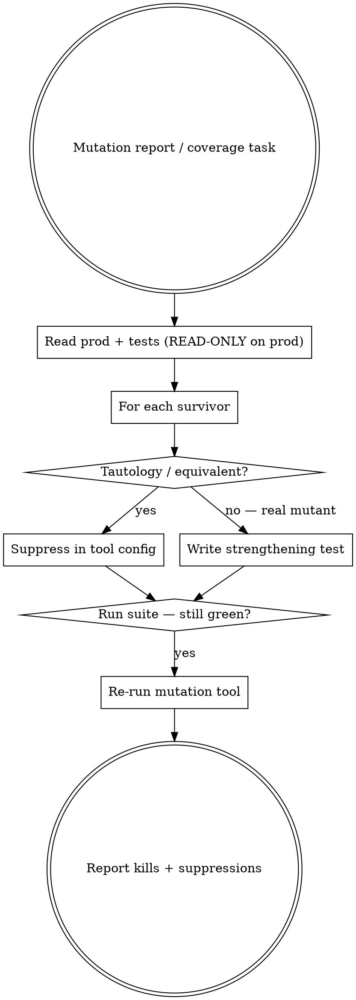

# Strengthening tests

## The Iron Law
PRODUCTION CODE STAYS UNCHANGED.

Only test code moves. Equivalent mutants get suppressed in tool config — not "killed" by tautological tests that re-state the production code. If a mutant survives because the production code is wrong, that's a separate `regression-first` task, not this one.

## When to Use

`qa-deciding-approach` routes here for `strengthen-test-coverage`. User intents:

- "raise coverage on module X"
- "Pitest shows N surviving mutants — kill them"
- "Stryker / mutmut surfaced weak assertions"
- "strengthen the tests on the order calculator"

Production code is locked. The job is to make the EXISTING tests stronger.

## Checklist
You MUST create a TodoWrite item per checklist item and complete in order:

1. Read the user's intent. Identify the target module/file.
2. Read the existing test file and the production file. Do NOT edit the production file.
3. If user supplied a mutation-testing report: read it. Identify which mutants survived.
4. For each surviving mutant: ask "would killing this be a meaningful assertion, or just a tautology?" If tautology (e.g. mutation changed `+` to `-` in an addition that's already covered by an assertion on the result), it's an EQUIVALENT mutant — suppress in tool config, don't write a test.
5. For genuine surviving mutants: write a strengthening test that asserts the behaviour the mutant violates. ONE new test per real mutant.
6. Call `sumo_qa_load_techniques()`. Pick the technique that fits each strengthening test (often boundary value analysis or decision table).
7. Run the existing test suite. CONFIRM IT'S STILL GREEN — your changes are additive only.
8. If user is running a mutation tool: re-run it. Confirm survivor count dropped by the number of real mutants you addressed.
9. Output: a list of strengthening tests added + a list of equivalent mutants suppressed in config + the new survivor count.

## Process Flow

## Red Flags

| Thought | Reality |
|---|---|
| "I'll tweak the prod code to make the mutant easier to kill" | Iron Law violated. Production code stays still. |
| "Write a test that asserts the exact code: `assert x == y + 1 if condition else y`" | Tautology. Re-stating the production logic. Suppress the mutant in tool config instead. |
| "All surviving mutants need a test" | No. Equivalent mutants are noise; suppressing them is correct. Only real mutants get tests. |
| "Coverage went from 85% to 92% — done" | Line coverage isn't assertion strength. The right measure is "did the mutation survivor count drop?" |
| "I'll add property-based testing for everything" | Pick from the catalogue based on the actual mutant. Property-based fits some risks, not all. |

## Examples

### Good

User: "Pitest report shows 8 surviving mutants on `discount_calculator.py`."
- Read prod (no edits) and the existing test file.
- Of the 8 mutants: 3 are tautological (e.g. mutated `i++` to `i--` in a loop that's checked by the final-value assertion). Suppress in `pitest.xml` `mutators` exclusion.
- 5 are real (e.g. mutated `>` to `>=` on a discount-threshold check — the existing tests don't cover the boundary).
- Add 5 boundary-value strengthening tests.
- Run existing suite: still green (additive change).
- Re-run Pitest: survivors dropped from 8 to 0.

### Bad

Same user.
"I'll edit `discount_calculator.py` to make the logic clearer, then add tests."
- Iron Law violated. Production code changes turn this into `regression-first`, not strengthen-test-coverage.
