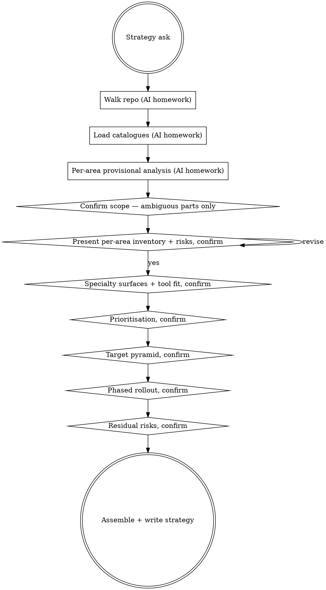

# Strategising sumo-qa work

Help the user produce a risk-prioritised, repo-anchored QA strategy by walking the strategy one section at a time: inventory the actual repo, surface per-area risks, fit specialty tools, prioritise, design the pyramid, phase the rollout. The user has org context (team size, release cadence, regulatory pressure, current pain points) the AI can't infer from code alone — surface it through questions, don't assume it.

**Announce at start:** *"I'm using sumo-qa-strategising to walk the repo, name risks per area, and design a phased rollout."*

<HARD-GATE>
Do NOT emit a strategy in one message. Walk the sections one at a time: inventory → risks → tools → prioritisation → pyramid → rollout → residual. A strategy dumped in one turn is generic consulting; a strategy built collaboratively is implementable.
</HARD-GATE>

## The Iron Law

**WALK THE REPO FIRST.**

No repo-wide plan without using the host's file tools to map the actual codebase. Strategy advice that doesn't anchor to specific service names, module paths, and existing test directories is generic consulting nonsense — the user already knows "add more unit tests" is an option.

## Anti-Pattern: "I Already Know What Good Looks Like — Skip The Walk"

Test-pyramid lectures, "use the catalogue", "aim for 80% coverage" — those are templates, not strategy. The whole point of this skill is that the strategy is shaped to THIS repo's risk surface, not a generic one. Skipping the walk means recommending Pact contracts on a repo with no external consumers, or Hypothesis on a CRUD-heavy API where boundary-value tests fit better. The walk is what makes the strategy land.

## When to Use

`qa-deciding-approach` routes here on `strategy-orchestration`. User intents:

- "design our QA strategy"
- "audit our test coverage"
- "design our test pyramid"
- "where should we invest QA effort first"
- "rollout our QA approach to other services"
- "minimum viable QA setup for a new service"

NOT for single-change asks. If the user says "review my changes" or "create a test plan for X" → wrong skill.

## Checklist

You MUST work through these in order. Steps 1–3 are AI-only homework (no user questions). The user's confirmation gates steps 4 onward.

1. **Walk the repo** *(no user question)* — use the host's file tools. Inventory: services / top-level modules / test directories / CI config / coverage reports if present. Note: which languages, which frameworks, where the seams are (HTTP routes, message handlers, scheduled jobs, UI surfaces, DB migrations).

2. **Load the catalogues** *(no user question)* — call `sumo_qa_load_principles()`, `sumo_qa_load_classifications()`, `sumo_qa_load_specialty_tools()`. Internal only; don't dump them raw.

3. **Per-area provisional analysis** *(no user question)* — for each major area: classify it (which of the 10 classifications dominate? which are entirely absent?), estimate the existing coverage shape (unit-heavy / integration-heavy / e2e-heavy / no tests), provisionally name 2–3 risks anchored to file paths or framework constructs.

4. **Confirm scope + inventory, only for the AMBIGUOUS parts** — present what you found: *"Walked the repo: 12 top-level modules under `services/`, 4 deployable services (auth, billing, search, notifications). Test directories sit alongside each. CI runs `make test` which fans out to per-service pytest. No coverage report file detected. **Are all 4 services in scope for this strategy, or just the ones we own — and is there a service I missed?**"* If exploration left nothing ambiguous, skip the question and move to step 5.

5. **Present per-area inventory + provisional risks, confirm** — present a compact table or list, one row per area: classification(s), current coverage shape, top 2–3 named risks each citing a path or framework construct. NOT generic ("edge cases"). Ask: *"do these inventories + risk calls match the team's lived experience? add / remove / re-anchor?"* Wait for the user.

6. **Identify specialty surfaces + tool fit, confirm** — for each confirmed area, name the specialty surface(s) visible in the code (HTTP endpoints → contract / DAST candidates, pure-function logic → mutation / property-based candidates, async events → schema-fuzzing candidates, UI → browser / a11y candidates, perf-critical paths → load-test candidates). For each surface, recommend the best-fit tool from your knowledge of the ecosystem anchored to the user's stack. `sumo_qa_load_specialty_tools()` is a category-fit primer, not a brand whitelist — recommend whatever genuinely fits, even if not listed. Verify with web search if you're unsure a tool still exists or has been renamed. The tool is just the means to coverage — for Phase 1 picks, offer to install and set the tool up yourself (package manager / framework CLI / config / MCP — whichever path is shortest) and seed the first tests against the highest-risk area. Empty list is acceptable per area. Ask: *"any of these I should drop or add? if you want, I can install [tool] and seed the first tests on [area] now."*

7. **Propose prioritisation, confirm** — rank areas by `risk × current-coverage-gap`. High risk + low coverage = Phase 1. Low risk + good coverage = leave alone. Cite ISTQB Principle 2 (exhaustive testing is impossible — prioritise). Ask: *"does this priority ordering match where you'd invest first?"*

8. **Design target pyramid shape, confirm** — propose the rough mix per area: unit / component / integration / contract / e2e / performance / security / a11y. Scaled to actual risk surface, not uniform. Ask: *"does this pyramid shape look right, or should we shift weight?"*

9. **Propose phased rollout, confirm** — propose 2–4 phases, each with: area scope, deliverables, "minimum viable" QA setup, gates at the end of each phase. NOT a calendar — a sequence with named gates. Ask: *"phase shape look right? anything to split or merge?"*

10. **Residual risks accepted, confirm** — every strategy has them. Name 2–4 risks NOT being addressed and why (out of scope, accepted cost, mitigated elsewhere, deferred to a later phase). Ask: *"is this honest? add anything?"*

11. **Final strategy document** — assemble the confirmed sections into one document (inventory, prioritisation, specialty fit, target pyramid, phased rollout, residual risks). Offer to write to a file (e.g. `docs/qa-strategy.md`) or surface inline. Confirm with the user before writing.

## Process Flow

## Key Principles

- **Explore before you ask.** Service names, language, framework, test directory layout — read them. Don't ask the user to enumerate their own repo. Ask only what code can't reveal (team size, release cadence, pain points, regulatory pressure).
- **One section per turn.** Inventory / risks / specialty / pyramid / rollout / residual are gated by confirmation. The user's correction on the inventory shapes everything downstream.
- **One primary question per turn.** Ask the most important one; the next follows after their answer.
- **Anchor every risk to a path or construct.** A risk that doesn't cite `services/billing/calculator.py` or "no contract test under `tests/contracts/`" is generic; rewrite it.
- **The pyramid is risk-shaped, not uniform.** Different areas need different mixes. Recommending "more unit tests everywhere" is what a junior consultant says.
- **Tool brands are training-primary; the catalogue is a category-fit primer.** Recommend tools that genuinely fit THIS repo's stack — don't restrict yourself to the names in `specialty_tools.md`. Verify with web search if you're unsure a tool still exists or has been renamed.
- **The tool is just the means to coverage — set it up, don't narrate setup.** Once a tool is chosen, offer to install and configure it yourself (package manager / framework CLI / config / MCP — whichever is shortest for that tool) and seed the first tests against the named risks. Confirm before installing dependencies; default to doing the actual work once confirmed.

## Red Flags — STOP and rework

| Thought | Reality |
|---|---|
| "I'll skip walking the repo — the user already described it" | Walk the repo. The user's description and the actual code rarely match. |
| "I'll ask the user to list their services / modules / test dirs" | Read them. The repo answers. Ask only what code can't show (team size, regulatory pressure, etc). |
| "Recommend more unit tests everywhere" | Generic. The target pyramid is risk-shaped, not uniform. Different areas need different mixes. |
| "Use Cypress / Playwright / Pact everywhere" | Pick by fit, not by familiarity. Match the tool to the actual specialty surface (visual UI / a11y / HTTP contract / mutation / property-based) — and recommend whatever genuinely fits the user's stack, not the first name you recall. |
| "I'll restrict tool recommendations to the names in `specialty_tools.md`" | The primer is a category check, not a brand whitelist. Recommend best-fit from your knowledge; verify with web search if uncertain about currency. |
| "Phase 1: add tests everywhere" | Phases are risk-shaped. Phase 1 hits highest risk × biggest gap. |
| "Performance testing for the whole repo" | Only where performance is a quality characteristic at risk. Generic perf tests are theatre. |
| "Strategy is just 'aim for 80% coverage'" | Coverage % isn't a strategy. Risk-prioritised coverage IS a strategy. |
| "I'll present inventory + risks + tools + pyramid + rollout in one message" | Single-shot dump. Iron Law violated. Walk one section at a time. |
| "Residual risks: none" | Every strategy has them. None = you didn't think about what's NOT covered. |
| "Generic recommendation: introduce a QA Center of Excellence" | Anchor to this repo. CoE-shaped advice is irrelevant to a 4-service monorepo with 8 engineers. |
| "I'll surface 'Classification: api_contract_change-heavy' / 'Per the checklist' / 'Anchored to the repo I walked' as labels in the output" | Internal scaffolding. Burns tokens, adds noise. Translate to natural English ("orders is mostly API-contract work"); keep service names and path citations the user can verify. |

## Examples

### Good (explore first, walk one section at a time)

> **User:** "Design our QA strategy for the customer-platform monorepo."
>
> **AI (steps 1–3, internal — no user question):** walks `services/`, finds 4 services (auth, billing, search, notifications) under it; reads each service's `tests/` directory; sees CI runs `make test`. Loads catalogues. Provisional analysis: billing is pure-function-heavy with 12 unit tests, no mutation testing detected. Search has HTTP + integration tests but no contract test files (`tests/contracts/` absent). Notifications is event-driven with good unit tests, no e2e against real queue.
>
> **AI (step 4, scope):** *"Walked the repo: 4 deployable services (auth, billing, search, notifications) under `services/`. Each has its own `tests/` dir; CI runs `make test`. No coverage report file detected. Provisional shape: auth is mostly HTTP-contract work, billing is pure business logic, notifications is async event handling, search is HTTP + external integration. **Are all 4 in scope, or just the ones your team owns — and is there a service or shared lib I missed?**"*
>
> **User:** *"All 4. We own them all. There's also a `shared/` lib for domain models — include it."*
>
> **AI (step 5, per-area inventory + risks):** *"5 areas now (added shared). Top risks per area:*
> *— **shared/**: (a) `shared/Money.kt` rounding-mode default differs from upstream billing-engine assumption (no test pinning behaviour); (b) version drift across the 4 consumers.*
> *— **billing/**: 12 unit tests, no mutation testing. (a) `billing/calculator.py:apply_charges` has 8 branches, 0 mutation coverage; (b) currency-conversion order-of-operations not pinned by test.*
> *— **search/**: HTTP + integration tests, no `tests/contracts/`. (a) downstream-indexer response-shape drift; (b) retry idempotency on partial failure not exercised.*
> *— **notifications/**: event-driven, good unit, no e2e against real queue. (a) message-handler ordering when two consumers are scaled; (b) DLQ flow untested.*
> *— **auth/**: HTTP-heavy, contract tests present but stale (last touched 8 months ago).*
> ***Match how the team would describe these? add / remove / re-anchor?**"*
>
> *(continues through specialty fit, prioritisation, pyramid, rollout, residual — one section per turn)*

### Bad (single-shot strategy dump)

> **User:** "Design our QA strategy for the customer-platform monorepo."
>
> **AI:** *"Strategy: add more unit tests across all services. Aim for 80% coverage. Add Cypress for the UI. Phase 1: unit tests. Phase 2: integration. Phase 3: e2e."*
>
> No repo walk, no risk anchoring, no specialty fit per surface, no per-area phases. Iron Law violated.

### Bad (asking the user to describe the repo)

> **User:** "Design our QA strategy for the customer-platform monorepo."
>
> **AI:** *"Before I can plan: (1) what services do you have? (2) what languages? (3) where do tests live? (4) do you have CI? (5) what frameworks?"*
>
> All five answerable by walking the repo. The AI should have explored first and surfaced what it found, then asked only the genuinely-ambiguous *"are all 4 services in scope?"* question.

## Next skill in the chain

When the strategy is signed off → `qa-planning-qa-rollout` to turn Phase 1 into bite-sized, dispatchable tasks, then `qa-executing-qa-rollout` to run them with two-stage review per task.
