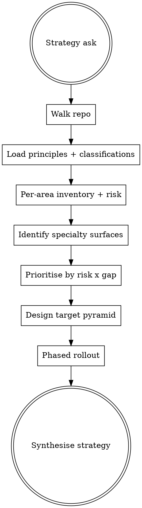

# Strategising sumo-qa work

## The Iron Law
WALK THE REPO FIRST.

No repo-wide plan without using the host's file tools to map the actual codebase. Strategy advice that doesn't anchor to the actual repo is generic consulting nonsense.

## When to Use

`qa-deciding-approach` routes here on `strategy-orchestration`. User intents:

- "design our QA strategy"
- "audit our test coverage"
- "design our test pyramid"
- "where should we invest QA effort first"
- "rollout our QA approach to other services"
- "minimum viable QA setup for a new service"

NOT for single-change asks. If the user says "review my changes" or "create a test plan for X" → wrong skill.

## Checklist
You MUST create a TodoWrite item per checklist item and complete in order:

1. Walk the repo with the host's file tools. Inventory: services / modules / test directories / CI config / coverage reports if any.
2. Call `sumo_qa_load_principles()` and `sumo_qa_load_classifications()`. Read both.
3. For each major area: classify it (which of the 10 classifications dominate? which classifications are entirely absent?), estimate current coverage shape (unit-heavy / integration-heavy / e2e-heavy / no tests), name the top 2-3 risks.
4. Call `sumo_qa_load_specialty_tools()`. Identify which specialty surfaces exist in the repo (HTTP endpoints → DAST candidates, pure-function logic → mutation/property-based candidates, async events → contract candidates, etc.).
5. Prioritise: rank areas by risk × current-coverage-gap. High risk + low coverage = invest first. Low risk + good coverage = leave alone.
6. Design the target pyramid shape: how many unit / component / integration / e2e / contract / performance / security tests, scaled to the actual risk surface. Reference ISTQB Principle 2 (exhaustive testing is impossible — prioritise).
7. Produce a phased rollout: which areas first, what's the "minimum viable" QA setup for each, what gates land at each phase.
8. Output: prose strategy document, sectioned (inventory, prioritisation, target pyramid, phased rollout, residual risks). No JSON blob.

## Process Flow

## Red Flags

| Thought | Reality |
|---|---|
| "I'll skip walking the repo — the user already described it" | Walk the repo. The user's description and the actual code rarely match. |
| "Recommend more unit tests everywhere" | Generic. The target pyramid is risk-shaped, not uniform. Different areas need different mixes. |
| "Use Cypress for everything frontend" | Pick from the catalogue per actual surface. Pure-frontend visual → Playwright; a11y → axe-core; cross-app journey → Cypress. |
| "Rollout phase 1: add tests everywhere" | Phases are risk-shaped. Phase 1 hits highest risk × biggest gap, not "everywhere". |
| "Performance testing for the whole repo" | Only where performance is a quality characteristic at risk. Generic perf tests are theatre. |
| "Strategy is just 'aim for 80% coverage'" | Coverage % isn't a strategy. Risk-prioritised coverage IS a strategy. |

## Examples

### Good

User: "design our QA strategy for the order-service monorepo."
- Walked repo: 12 modules, 4 services. Inventory: orders (HTTP), pricing (pure-function-heavy), fulfilment (event-driven), payments (HTTP + critical-path).
- Risks: pricing has no mutation testing (high risk × low coverage → Phase 1 invest). Payments has good integration coverage but no contract tests with downstream processor (high risk × medium coverage → Phase 2). Fulfilment has good unit tests but no end-to-end against real queue (medium risk × medium coverage → Phase 3).
- Target pyramid: heavy unit + property-based on pricing; Pact contracts on payments + downstream; k6 perf on orders (≥200 RPS expected); axe-core on the order-status UI.
- Phased rollout: Phase 1 (3 weeks) = Pitest on pricing + property-based with Hypothesis. Phase 2 (4 weeks) = Pact on payments. Phase 3 (3 weeks) = Schemathesis on fulfilment queue contracts + k6 baseline on orders.
- Residual: real-money-end-to-end stays manual (cost too high to automate).

### Bad

Same user.
"Add more unit tests across all services. Aim for 80% coverage. Maybe add Cypress."
- No repo walk, no risk anchoring, no specialty fit, no phased rollout. Iron Law violated.
