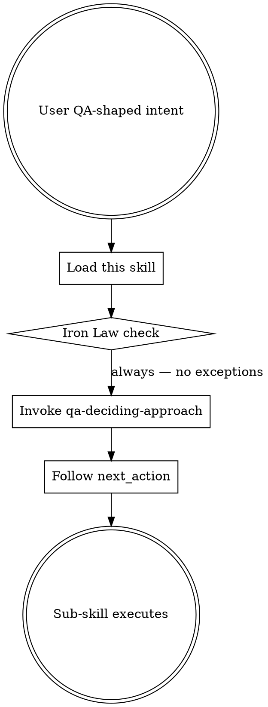

# Using sumo-qa

## The Iron Law
NO QA WORK WITHOUT FIRST DECIDING THE APPROACH.

You may not produce test ideas, scaffolds, plans, reviews, or strategies without first invoking `qa-deciding-approach`. Skipping the approach decision routes wrong-shaped output to the user.

## When to Use

This skill is the entry router for every QA-shaped request. Any of these intents triggers it:

- "review my changes / is this safe to merge"
- "how should I test X"
- "create a test plan for X"
- "plan QA for this story"
- "scaffold the failing tests for X"
- "what test data do I need"
- "audit our test coverage"
- "design our QA strategy"

It does not produce QA output itself. Its job is to enforce the Iron Law, set up global discipline that every sub-skill inherits, then route to `qa-deciding-approach`.

## Global discipline (inherited by every sub-skill)

### Knowledge authority hierarchy

The right authority depends on what kind of knowledge you're invoking. Stable concepts and tool brand picks are NOT the same shape of question.

**Stable concepts** — test design techniques (boundary value, decision table, property-based, mutation), ISTQB principles, change classifications, QA approaches:

1. **Loaded knowledge files** (`sumo_qa_load_techniques`, `_principles`, `_classifications`, `_approaches`). Authoritative.
2. **Training data** — fallback only when the catalogue is silent. Flag when used: *"This isn't in the loaded catalogue, but…"*
3. **"I don't know"** — acceptable. Don't invent techniques or principles.

**Tool brand picks** — Pitest vs Stryker vs mutmut, Playwright vs Cypress, k6 vs Locust, what MCP server exists for which tool:

1. **Training data anchored to the user's stack** is primary. Recommend the best fit for THIS change, not from a list.
2. **`sumo_qa_load_specialty_tools()`** is a **category-fit primer** — when does mutation testing apply, when does DAST apply, when does property-based fit. Use it to confirm the CATEGORY fits the risk, not as a brand whitelist.
3. **Web search** — verify currency when a tool may have changed names, deprecated, or been replaced since the training cutoff. Citation required.
4. **"I don't know"** — acceptable. Don't invent tool names.

### Setting up the recommended tool

sumo-qa's job is **analysis** — classify the change, identify risks, pick the technique and tool category. The tool itself is just the means to coverage. Once a tool is chosen, you should **set it up and write the tests against the actual change**, not walk the user through commands.

The path to "tests are running" varies by tool:

- **Package manager** (most common): `npm install --save-dev cypress`, `pip install hypothesis`, Maven/Gradle dependency edit, etc. — then run the framework's init / scaffold step.
- **Framework CLI**: `npx cypress open`, `pytest --co`, `playwright codegen`, etc.
- **Config file edits**: `pitest.xml`, `cypress.config.ts`, `pact.config.json`.
- **MCP server install** *(when one exists and makes setup easier)*: useful for tools whose MCP unlocks AI-driven authoring (some browser-automation tools). Don't bias toward MCP-having tools — pick by fit, then use whichever setup path is shortest.

**Always confirm before running an install** (lockfile churn / dependency surface is a real concern), but **default to doing the work yourself once confirmed**: run the install, write the config, scaffold the framework, write the first tests against the named risks. *"Want me to install Cypress, scaffold the config, and write a smoke test for the new checkout flow?"* — not *"Here are the steps for setting up Cypress…"*.

Verify the tool actually exists / hasn't been renamed before naming it. Web-search when uncertain.

### Internal reasoning vs user output

Reason internally with citations (which words in intent, which file paths, which catalogue entries grounded the inference). The user-facing output is the WORK, not a description of how you arrived at it. Every line of meta-commentary burns tokens and dilutes signal.

**Keep in output:**
- The actual finding (risks named, files cited, verdicts delivered)
- File:line citations the user can verify (`api/refund.py:47`)
- The current question or confirmation gate
- Rule references translated to natural English ("the API-change rule requires a contract test bump")

**Strip from output (token waste + noise):**
- Internal taxonomy labels: "Classification: business_logic_change", "Approach: regression-first"
- Method commentary: "Anchored to the code I read", "Following the skill's flow", "Per the checklist"
- Quality self-defense: "Each risk cites a file or domain term, not generic edge cases"
- Step / phase trace: "Now in step 4", "Working through the checklist"
- Re-stating what the user just said back to them

When a classification or approach is genuinely useful for the user to know, translate to natural English: not *"Classification: business_logic_change"* but *"this is a behaviour change in the pricing logic"*. The taxonomy is your scaffolding; the meaning belongs in the message.

### Specialty + tool fit

sumo-qa decides WHAT testing is needed and where. The tool fills the gap. When a risk genuinely needs a specialty tool, pick the **best fit from your training-data knowledge of the ecosystem**, anchored to the user's actual stack. The `specialty_tools.md` primer is a category check (does mutation testing actually apply here? does DAST apply to this surface?), not a brand whitelist — don't restrict yourself to the names in it.

Pick by fit, not by familiarity. Empty selection is acceptable when nothing genuinely fits — most changes are well-served by plain unit + a small integration test.

Once a tool is chosen, **set it up** (see "Setting up the recommended tool" above): install via the project's package manager, init the framework, scaffold the config, write the first tests against the named risks. Confirm with the user before installing dependencies; default to doing the actual work once confirmed.

## Checklist
You MUST create a TodoWrite item per checklist item and complete in order:

1. Read the user's intent verbatim.
2. Load and re-read this Iron Law to anchor the response.
3. Invoke the `qa-deciding-approach` skill immediately. Do NOT answer the user before the approach is decided.
4. After `qa-deciding-approach` returns, follow its `next_action` (route to the named sub-skill or stop).
5. Apply the global discipline (knowledge authority, internal-only citations, specialty+tool fit) for every sub-skill that runs.

## Process Flow

## Red Flags

| Thought | Reality |
|---|---|
| "I already know what they want — let me just answer" | Iron Law violated. Approach decision is non-negotiable. |
| "This question is too simple to need the approach skill" | Simple intents still need shape (no-tests-recommended is a valid approach). Skip the decision and you skip the safety net. |
| "I'll cite the principles myself from training data" | Loaded catalogue is authoritative. Use `sumo_qa_load_principles()`. |
| "Let me echo the citation reasoning in the answer for transparency" | Citations belong to internal scratch, not user output. They burn tokens. |
| "I'll surface 'Classification: X' / 'Approach: Y' / 'Anchored to evidence' in the output" | Internal scaffolding. Burns tokens, adds noise. Translate to natural English; keep file:line citations the user can verify. |
| "Specialty tools are only for non-functional surfaces" | Wrong. Mutation tools, property-based libraries, contract frameworks all fit functional surfaces too. Pick the best fit for the user's stack from your training-data knowledge; use `specialty_tools.md` to confirm the category applies. |

## Examples

### Good
User: "review my changes". Skill response (internal): load Iron Law, invoke `qa-deciding-approach`, get `verify-existing` or `regression-first`, route to `qa-reviewing-before-merge`. User sees the routed skill's output, not the routing trace.

### Bad
User: "review my changes". Skill response: "Sure! Looking at your diff, the main concerns are …" — skipping the approach decision, going straight to review. Iron Law violated. The reviewer might be the wrong shape for the change (e.g. a docs-only change doesn't need a code review skill).
