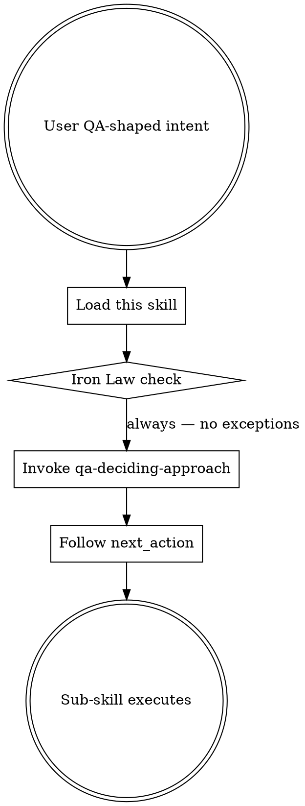

# Using sumo-qa

## The Iron Law
NO QA WORK WITHOUT FIRST DECIDING THE APPROACH.

You may not produce test ideas, scaffolds, plans, reviews, or strategies without first invoking `qa-deciding-approach`. Skipping the approach decision routes wrong-shaped output to the user.

## When to Use

This skill is the entry router for every QA-shaped request. Any of these intents triggers it:

- "review my changes / is this safe to merge"
- "how should I test X"
- "create a test plan for X"
- "plan QA for this story"
- "scaffold the failing tests for X"
- "what test data do I need"
- "audit our test coverage"
- "design our QA strategy"

It does not produce QA output itself. Its job is to enforce the Iron Law, set up global discipline that every sub-skill inherits, then route to `qa-deciding-approach`.

## Global discipline (inherited by every sub-skill)

### Knowledge authority hierarchy

Source priority — NEVER skip a level without flagging it:

1. **Loaded knowledge files** (`sumo_qa_load_*` tools). Authoritative. Pick from these without blending in training-data recall.
2. **Training data** — fallback only when the catalogue is silent. When used, explicitly flag: "This isn't in the loaded catalogue, but my training data suggests …"
3. **Web search** — fallback when training is uncertain or the topic is post-training-cutoff. Citation required.
4. **"I don't know"** — the only acceptable answer when 1, 2 and 3 all fail. Never invent a technique, tool, principle, or specialty fit that doesn't exist in any of those three sources.

### Internal reasoning vs user output

Reason internally with citations (which words in intent, which file paths, which catalogue entries grounded the inference). Do NOT echo the citation rationale in the user-facing output unless asked. Citations belong to `SUMO_QA_DEBUG_DIR` capture, not to chat output.

### Specialty + tool fit

When recommending a specialty tool, pick from `sumo_qa_load_specialty_tools()`. The fit applies to any quality improvement — Pitest on pure functions, Hypothesis for property-based tests, Pact for REST contracts, OWASP ZAP for HTTP DAST, axe-core for a11y. Empty selection is acceptable when nothing genuinely fits.

## Checklist
You MUST create a TodoWrite item per checklist item and complete in order:

1. Read the user's intent verbatim.
2. Load and re-read this Iron Law to anchor the response.
3. Invoke the `qa-deciding-approach` skill immediately. Do NOT answer the user before the approach is decided.
4. After `qa-deciding-approach` returns, follow its `next_action` (route to the named sub-skill or stop).
5. Apply the global discipline (knowledge authority, internal-only citations, specialty+tool fit) for every sub-skill that runs.

## Process Flow

## Red Flags

| Thought | Reality |
|---|---|
| "I already know what they want — let me just answer" | Iron Law violated. Approach decision is non-negotiable. |
| "This question is too simple to need the approach skill" | Simple intents still need shape (no-tests-recommended is a valid approach). Skip the decision and you skip the safety net. |
| "I'll cite the principles myself from training data" | Loaded catalogue is authoritative. Use `sumo_qa_load_principles()`. |
| "Let me echo the citation reasoning in the answer for transparency" | Citations belong to debug capture, not user output. They burn tokens. |
| "Specialty tools are only for non-functional surfaces" | Wrong. Pitest, Hypothesis, Pact all fit functional surfaces. Pick from the catalogue. |

## Examples

### Good
User: "review my changes". Skill response (internal): load Iron Law, invoke `qa-deciding-approach`, get `verify-existing` or `regression-first`, route to `qa-reviewing-before-merge`. User sees the routed skill's output, not the routing trace.

### Bad
User: "review my changes". Skill response: "Sure! Looking at your diff, the main concerns are …" — skipping the approach decision, going straight to review. Iron Law violated. The reviewer might be the wrong shape for the change (e.g. a docs-only change doesn't need a code review skill).
