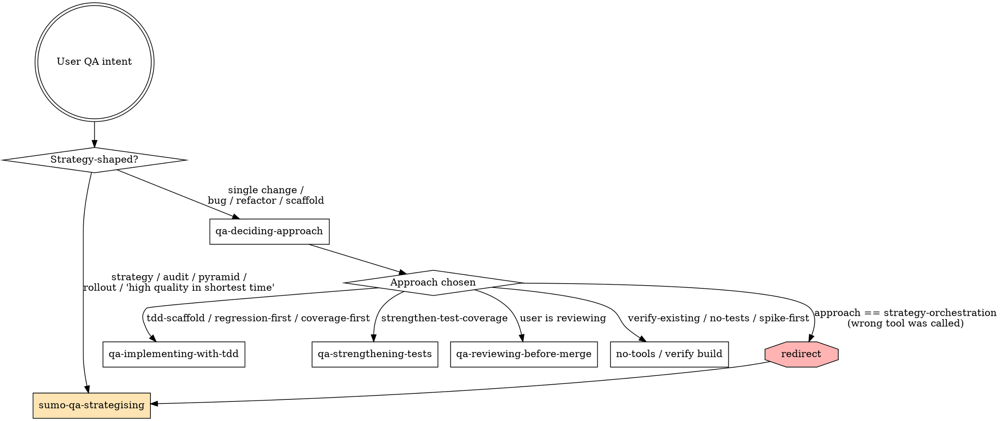

<EXTREMELY-IMPORTANT>
If you think there is even a 1% chance the user is asking about QA, testing, code review, bug fixes, refactors, or anything that affects production-confidence, you ABSOLUTELY MUST follow this skill — do not jump straight to scaffolding tests, doing a code review, or proposing fixes.

The QA shift-left MCP enforces a discipline: **decide first, then plan, then act, then verify**. Skipping the decision step produces wrong-shaped work — TDD scaffolds for a config tweak, generic plans for a hotfix, walls of advice when the right answer is "no tests, just verify the build".
</EXTREMELY-IMPORTANT>

## The Iron Laws (TWO of them — pick the right one for the intent shape)

There are two intent shapes. Use the matching law:

### Law 1 — Strategy / repo-wide / policy asks → `sumo-qa-strategising` FIRST

```
WHEN THE USER ASKS ABOUT TESTING STRATEGY, COVERAGE AUDIT, REPO-WIDE QA POLICY,
OR ROLL-OUT — LOAD `sumo-qa-strategising` IMMEDIATELY. DO NOT CALL sumo_qa_decide_approach.
```

Strategy-shaped phrases:
- "test strategy" / "QA strategy" / "testing strategy"
- "audit our coverage" / "audit our tests"
- "design a QA strategy from scratch"
- "across the test pyramid" / "all test layers"
- "deliver high quality software in the shortest time" / "lowest bug count"
- "rollout to other services" / "broader stack"
- "where should we invest QA effort"
- "what's the minimum viable QA setup"

For these, **`sumo_qa_decide_approach` is the wrong tool** — it returns a per-change verdict and you'll hand the user a single approach when they asked for a whole strategy. The `sumo-qa-strategising` skill walks the repo with your file tools, identifies priority areas, then chains `sumo_qa_decide_approach` PER AREA.

### Law 2 — Single-change asks → `qa-deciding-approach` FIRST

```
WHEN THE USER ASKS ABOUT A SPECIFIC CHANGE, BUG, REFACTOR, OR PIECE OF WORK —
ALWAYS CALL sumo_qa_decide_approach BEFORE ANY OTHER QA TOOL.
```

Single-change-shaped phrases:
- "review my changes" / "is this safe to merge"
- "fix the bug where ..."
- "refactor the order pipeline"
- "add a new endpoint that ..."
- "scaffold tests for ..."
- "kill the surviving mutants on X" (single class / module)

For these, do NOT call `sumo_qa_scaffold_tests`, `sumo_qa_create_test_plan`, `sumo_qa_review_local_change`, or `sumo_qa_prepare_for_work` first. The approach decision tells you which of those is the right one — sometimes none of them. `sumo_qa_decide_approach` AI-reasons over QA principles + your team's loaded standards + the change shape, and may pick a canonical approach **or invent a new one**.

### Safety net

If you mistakenly call `sumo_qa_decide_approach` on a strategy-shaped ask, the AI-sampling path inside that tool reasons over the intent and returns `approach: "strategy-orchestration"` with `next_action: null`. **Respect that redirect** — do not start scaffolding; load `sumo-qa-strategising` instead.

If the host has not approved MCP sampling for sumo-qa, the tool falls back to a deterministic per-change default. That fallback **does not** phrase-match for strategy — it deliberately stays dumb so language drift doesn't silently route real strategy asks to TDD scaffolding. When you see the user asking for a "test strategy / audit / pyramid / rollout", load `sumo-qa-strategising` directly rather than relying on `sumo_qa_decide_approach`.

## Sub-skills (load the relevant one and follow it)

| Sub-skill | When to use |
|---|---|
| `sumo-qa-strategising` | **Open-ended, repo-wide asks** — "analyse and implement a test strategy", "audit our coverage", "design our QA strategy from scratch", "where should we invest QA effort first". Walks the repo with your own file tools, then chains the MCP tools per priority area. |
| `qa-deciding-approach` | **Always first for a single change.** Pick the right QA approach for the change shape. Returns one of: `tdd-scaffold`, `regression-first`, `coverage-first-then-refactor`, `strengthen-test-coverage`, `verify-existing`, `no-tests-recommended`, `spike-first-then-tests` — or an AI-invented variant. |
| `qa-implementing-with-tdd` | After `tdd-scaffold` or `regression-first` or `coverage-first-then-refactor` is chosen. Plan → scaffold → write red tests → user implements → green → review. |
| `qa-strengthening-tests` | After `strengthen-test-coverage` is chosen. Mutation-testing follow-up, raise-coverage tasks, kill weak assertions. **Production code stays unchanged**; one strengthening test per real mutant; equivalent mutants get suppressed in config, not chased. |
| `qa-reviewing-before-merge` | When the user says "review my changes / is this safe to merge?". Use AFTER implementation, before merge. |
| `qa-finding-test-data` | When the user asks about test data — "what data do I need", "find me a known-good record", "is this entry still valid". |

## Decision flow



## Red Flags — STOP and re-route

| Thought | Reality |
|---------|---------|
| User asked for a "test strategy" / "audit" / "rollout" — I'll call sumo_qa_decide_approach | **NO.** Strategy asks → load `sumo-qa-strategising` IMMEDIATELY. sumo_qa_decide_approach is per-change; for a strategy ask it returns wrong-shaped output. |
| The decider returned `strategy-orchestration` but I'll act on the alternative | The decider is telling you the user asked for a strategy. Load sumo-qa-strategising. |
| "I'll just call sumo_qa_scaffold_tests, this is clearly TDD" | Decide first. The change might be a config tweak or a docs change. |
| "The user said 'test it' so I'll write tests" | "Test it" can mean reproduce-the-bug, audit-coverage, or verify-existing. Decide first. |
| "I'll skip sumo_qa_decide_approach because the prompt says scaffold" | Approach is a precondition, not an alternative. The prompt body is a starting hint, not a license to skip discipline. |
| "sumo_qa_decide_approach takes a tool round-trip; I'll save it" | The tool is deterministic and fast. Skipping it is what produces wrong-shaped work. |
| "I'll write the tests AND the production code in one go" | TDD red phase exists for a reason — see `qa-implementing-with-tdd`. |
| "I'll merge after the tests pass; review can wait" | Pre-merge review catches what running tests does not — see `qa-reviewing-before-merge`. |
| Strategising is "too slow" — I'll just dump generic advice | The user asked for a strategy. They want the analysis you'd skip. The whole point of the skill is taking the time to walk the repo first. |

## Why this matters

The point of the QA MCP is to remove the failure mode where the host model:
- writes scaffolding for trivial changes,
- writes generic test plans without naming techniques,
- claims "looks fine to merge" without checking missing test levels,
- waives evidence requirements when the user pushes back.

The skills enforce the **deterministic guardrails** the QA brain (`qa_*` MCP tools) produce. Tools without skills = JSON the model paraphrases. Skills + tools = the discipline of a senior QA who has done this 1,000 times.

## Final rule

```
First QA action on any QA intent → always qa-deciding-approach
After approach decision        → load the matching sub-skill
After sub-skill completes      → verify before claiming done
```

No exceptions.
